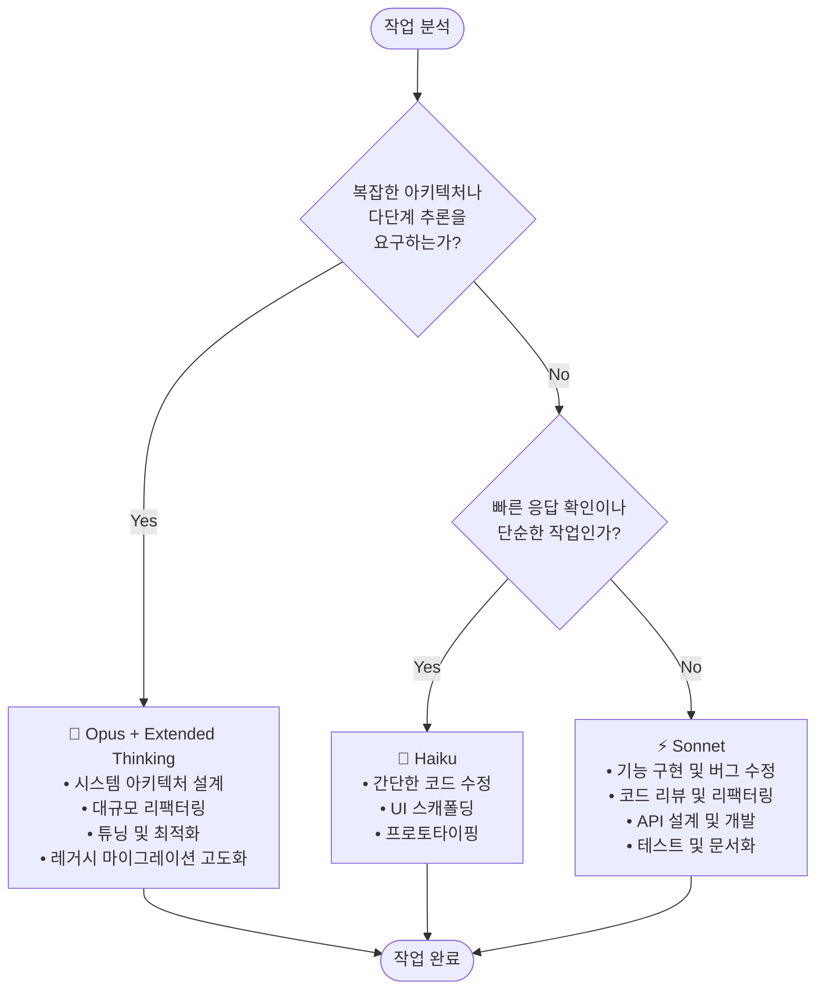

# 클로드 코드 마스터 북

> 책을 따라가며 핵심만 정리하는 Claude Code 완전 정복 가이드

---

## 📚 목차

- [2장. 클로드 코드 설치와 환경 구성](#2장-클로드-코드-설치와-환경-구성)
  - [2.0 사전 준비 — 필수 프로그램](#20-사전-준비--필수-프로그램)
  - [2.1 클로드 코드 설치하기](#21-클로드-코드-설치하기)
  - [2.2 클로드 모델 비교 — Opus / Sonnet / Haiku](#22-클로드-모델-비교--opus--sonnet--haiku)
  - [2.3 슬래시 커맨드 익히기](#23-슬래시-커맨드-익히기)
  - [2.4 프리픽스 키 — @ # !](#24-프리픽스-키---)
  - [2.5 위험 플래그 — --dangerously-skip-permissions](#25-위험-플래그----dangerously-skip-permissions)
  - [2.6 CLAUDE.md — 프로젝트 컨텍스트 설계](#26-claudemd--프로젝트-컨텍스트-설계)
  - [2.7 AGENTS.md — AI 에이전트 표준 문서](#27-agentsmd--ai-에이전트-표준-문서)
  - [2.8 Agent Skill — 맞춤 에이전트 만들기](#28-agent-skill--맞춤-에이전트-만들기)
  - [2.9 Hook — 행동 강제 자동화](#29-hook--행동-강제-자동화)

---

## 2장. 클로드 코드 설치와 환경 구성

### 2.0 사전 준비 — 필수 프로그램

클로드 코드를 설치하기 **전에** 개발 환경에 다음 두 가지가 준비되어 있어야 한다.

| 🔴 필수   | 버전                                       | 확인 명령어        |
| --------- | ------------------------------------------ | ------------------ |
| Node.js   | **v22.x 추천** (v20 미만이면 업그레이드)   | `node --version`   |
| Git       | v2.5x 이상                                 | `git --version`    |

> 💡 Node.js를 설치하면 `npm`도 함께 설치된다.

#### Node.js 설치

터미널에서 `node --version`을 먼저 확인하고, 없으면 공식 홈페이지의 **LTS(Long Term Support)** 버전을 받는다.

- 공식 사이트: <https://nodejs.org>

#### Git 설치 (OS별)

```bash
# macOS — Xcode Command Line Tools (Git 포함)
xcode-select --install

# macOS — Homebrew
brew install git

# Ubuntu/Debian
sudo apt update && sudo apt install git

# Windows — https://git-scm.com 에서 설치 파일 다운로드 또는 winget 사용
winget install --id Git.Git -e --source winget
```

#### Git 사용자 정보 설정 (최초 1회)

설치 직후 **반드시 1회** 실행.

```bash
git config --global user.name "Your Name"
git config --global user.email "your-email@example.com"
```

#### Homebrew 미리 설치 (macOS)

개발에 필요한 다른 유틸리티들도 대부분 Homebrew로 설치하므로 **미리 설치 권장**.

- 공식 사이트: <https://brew.sh/ko>

```bash
/bin/bash -c "$(curl -fsSL https://raw.githubusercontent.com/Homebrew/install/HEAD/install.sh)"
```

---

### 2.1 클로드 코드 설치하기

#### 2.1.1 맥(macOS)에서 설치하기

##### ✅ 방법 1 — 공식 설치 스크립트 (권장)

터미널에 아래 명령어를 입력하고 엔터.

```bash
curl -fsSL https://claude.ai/install.sh | bash
```

> 🟢 앤트로픽 공식 서버에서 설치 스크립트를 다운로드해 **자동 실행**한다. 가장 권장되는 방식.

###### 설치 완료 메시지 예시

```text
Setting up Claude Code...

✓ Claude Code successfully installed!

  Version: 2.1.7
  Location: ~/.local/bin/claude

  Next: Run claude --help to get started

✅ Installation complete!
```

##### ✅ 방법 2 — Homebrew로 설치

Homebrew가 이미 있다면 아래 한 줄로 설치 가능.

```bash
brew install --cask claude-code
```

##### 셸 설정 적용 (설치 후 PATH 반영)

설치 후 `claude` 명령어가 바로 인식되지 않으면 셸 설정을 다시 로드한다. **또는 새 터미널 창을 열면** 자동 적용된다.

```bash
# zsh 사용자 (macOS 기본)
source ~/.zshrc

# bash 사용자
source ~/.bashrc
```

##### 설치 확인

버전 번호가 출력되면 성공.

```bash
claude --version
# > 2.1.7 (클로드 코드)
```

---

#### 🎯 설치 플로우 요약

```text
1. Node.js (v22.x) 설치  ──┐
2. Git 설치 + user 설정  ──┤→  3. Homebrew 설치 (macOS 권장)
                          ─┘       │
                                    ▼
                         4. claude 설치 (공식 스크립트 or brew)
                                    │
                                    ▼
                         5. source ~/.zshrc (PATH 반영)
                                    │
                                    ▼
                         6. claude --version 으로 검증 ✅
```

#### ⚠️ 자주 하는 실수

- ❌ Node.js v20 미만으로 설치 → 호환성 문제 발생 가능. v22.x로 올릴 것
- ❌ 설치 후 바로 `claude` 실행했는데 "command not found" → 셸 재시작 또는 `source ~/.zshrc` 필요
- ❌ `git config` 건너뛰기 → 커밋 시 사용자 정보 오류 발생

---

### 2.2 클로드 모델 비교 — Opus / Sonnet / Haiku

클로드 코드는 **3종류의 모델**을 상황에 맞게 골라 쓸 수 있다. 비유하자면 이렇다.

> 🧠 **Opus** = 수석 아키텍트 (깊게 생각, 느리지만 정확)
> ⚡ **Sonnet** = 시니어 개발자 (균형 잡힌 일꾼, 기본값)
> 🏃 **Haiku** = 주니어 개발자 (빠르고 가볍다, 단순 작업용)

#### 2.2.1 모델 특성 한눈에 보기

| 구분        | 🧠 Opus                   | ⚡ Sonnet                 | 🏃 Haiku                  |
| ----------- | ------------------------- | ------------------------- | ------------------------- |
| 포지션      | 최상위 (플래그십)         | **기본값** (일상 개발)    | 경량/초고속               |
| 강점        | 복잡한 추론·장기 태스크   | 품질·속도 균형            | 빠른 응답·저비용          |
| 응답 속도   | 느림                      | 보통                      | 매우 빠름                 |
| 비용        | 높음 (💰x3)               | 중간 (💰x2)               | 낮음 (💰)                 |
| 컨텍스트    | 매우 김                   | 김                        | 보통                      |
| 언제 쓰나   | 설계·리팩터링·난이도 ↑    | 기본 사용 (대부분의 작업) | 단순 수정·반복 작업       |

> 💡 **기본 전략**: Sonnet을 기본값으로 쓰다가, 작업이 복잡해지면 Opus로 올리고, 단순 반복은 Haiku로 내린다.

#### 2.2.2 작업 유형별 권장 모델

| 모델    | 권장 상황                    | 예시                                          |
| ------- | ---------------------------- | --------------------------------------------- |
| Opus    | 복잡한 설계/분석/의사 결정   | 아키텍처 설계, 대규모 리팩터링, 레거시 작업   |
| Sonnet  | 일반 개발 (기본)             | 기능 구현, 버그 수정, API 설계, 테스트 작성   |
| Haiku   | 빠른 프로토타입/간단한 작업  | 간단한 수정, 구문 오류, 프로토타이핑          |

#### 2.2.3 ❌/✅ 언제 어떤 모델을 쓸까

##### 🧠 Opus를 써야 할 때

- ✅ 대규모 모놀리식 코드를 **마이크로서비스로 분리** 설계
- ✅ 10년 된 **레거시 시스템** 분석 후 마이그레이션 전략 수립
- ✅ 보안·성능·확장성을 모두 고려한 **아키텍처 트레이드오프** 의사결정
- ❌ 단순 오타 수정에 Opus 쓰는 것은 낭비 (비용·시간)

##### ⚡ Sonnet을 써야 할 때 (대부분의 경우)

- ✅ 새 기능 **구현** ("로그인 API 추가해줘")
- ✅ 버그 리포트 받아서 **원인 분석 + 수정**
- ✅ **테스트 코드** 작성, 리팩터링
- ✅ 일반적인 코드 리뷰
- 💡 뭘 쓸지 모르겠으면 **Sonnet이 정답**

##### 🏃 Haiku를 써야 할 때

- ✅ "이 변수명 camelCase로 바꿔줘" 같은 **간단 작업**
- ✅ 빠른 **프로토타이핑**, 짧은 반복 작업
- ✅ **자동화 스크립트**에서 대량 호출 (비용 최적화)
- ❌ 복잡한 리팩터링에 Haiku 쓰면 품질 떨어짐

#### 2.2.4 클로드 코드에서 모델 바꾸기

```bash
# 실행 시 모델 지정
claude --model claude-opus-4-7
claude --model claude-sonnet-4-6
claude --model claude-haiku-4-5

# 세션 중에 전환 (슬래시 커맨드)
/model
```

> 🟢 `/model` 명령은 대화 중 언제든 모델을 바꿀 수 있게 해준다.
> 설계 단계는 Opus로 → 구현은 Sonnet으로 전환하는 패턴이 실전에서 자주 쓰인다.

#### 2.2.5 Thinking 모드 활용 가이드

Claude 코드에는 **Thinking 모드**가 있다. 모델이 답을 내기 전에 **내부적으로 더 깊이 추론**하도록 하는 기능. `effort` 값으로 추론 깊이를 조절한다.

##### ✅ Thinking `effort high` 권장

- 복잡한 **아키텍처 결정**
- 여러 번 시도해도 안 풀리는 **어려운 디버깅**
- **다단계** 형태의 상세 구현
- 장기적 추론이 필요한 리팩터링 설계

##### ❌ Thinking 비활성화 권장

- 단순 **텍스트 변경** ("이 문자열 바꿔줘")
- 간단한 **문법 오류 수정**
- 단순 반복 작업

> ⚠️ **주의**: 단순한 작업에 높은 effort를 쓰면 **응답이 장황해지고 비용만 늘어난다**.
> 작업 복잡도에 맞춰 적절히 켜고 끄는 게 핵심.

| effort 수준 | 언제 쓰나                     | 비용/시간 |
| ----------- | ----------------------------- | --------- |
| off / low   | 일반 코드 수정·단순 질의      | 낮음      |
| medium      | 중간 난이도 구현·분석         | 보통      |
| **high**    | 아키텍처·난이도 높은 디버깅   | 높음      |

---

#### 2.2.6 모델 선택 의사결정 트리

**"뭘 써야 할지 모르겠다"** 싶을 때 이 흐름대로 질문 두 개만 던지면 된다.



##### 📌 처음 사용한다면 → **Sonnet**으로 시작

- 대부분의 개발 작업에서 **성능·비용·속도 균형**이 가장 좋음
- 쓰면서 작업 특성에 따라 Opus나 Haiku로 **유연하게 전환**
- 모델 선택에 **고정된 정답은 없다** — 프로젝트 단계·복잡도·응답 시간 요구에 맞춰 바꾸는 게 비용을 합리적으로 쓰는 길

> 💡 실전 패턴: **설계 단계 → Opus + Thinking high** / **구현 → Sonnet** / **잡일·프로토타입 → Haiku**

---

#### 🎯 핵심 요약

```text
  간단                                              복잡
  ←————————————————————————————————————————————————→
   Haiku         Sonnet (기본)              Opus
   (빠름/저렴)   (균형)                     (정확/고가)

  프로토타입    기능 구현·버그 수정·API    아키텍처·대규모 리팩터링
  구문 오류     테스트 작성                레거시 분석
```

**결정 공식:**

1. 복잡한 설계·다단계 추론이 필요? → **Opus (+ Thinking high)**
2. 아니라면 단순·빠른 작업? → **Haiku**
3. 둘 다 아니면 → **Sonnet** (기본값)

---

### 2.3 슬래시 커맨드 익히기

슬래시 커맨드는 `/` 로 시작하는 **특수 명령어**다. 클로드에게 자연어로 부탁하는 것과 달리, **클로드 코드 자체를 조작**할 때 쓴다.

> 💡 **핵심 비유**: 슬래시 커맨드 = 클로드 코드의 **리모컨 버튼** / 일반 대화 = 클로드에게 **말로 지시**

#### 2.3.1 반드시 외워야 할 핵심 5개

| 명령어       | 한 줄 요약                                                     | 언제 쓰나                              |
| ------------ | -------------------------------------------------------------- | -------------------------------------- |
| `/init`      | 프로젝트 분석 → `CLAUDE.md` 자동 생성                          | 새 프로젝트에 클로드 처음 붙일 때      |
| `/help`      | 사용 가능한 명령어·단축키 목록                                 | 뭐가 있는지 생각 안 날 때              |
| `/clear`     | **대화 기록 초기화** (컨텍스트 완전 리셋)                      | 주제 완전히 바뀔 때                    |
| `/compact`   | 지금까지 대화를 **요약 압축**해 컨텍스트 확보                  | 긴 세션에서 공간 부족할 때             |
| `/context`   | 현재 컨텍스트 **사용량을 색상 그리드**로 시각화                | 남은 용량 확인할 때                    |

---

##### 🔹 `/init` — 프로젝트 파악 + CLAUDE.md 생성

클로드가 현재 디렉토리의 코드를 스캔해서 **프로젝트 가이드 문서(`CLAUDE.md`)**를 자동 작성한다. 이후 세션마다 이 파일이 자동 로드돼서 클로드가 프로젝트를 빠르게 이해한다.

```bash
> /init
```

> ✅ **신규 프로젝트 첫 스텝**. 아키텍처·스택·주요 파일을 요약해줌
> 💡 생성 후 직접 수정해서 팀 컨벤션·금지사항을 추가하면 효과 극대화

---

##### 🔹 `/help` — 명령어 도움말

```bash
> /help
```

- 사용 가능한 슬래시 커맨드 전체 목록
- 단축키 (`Esc`, `Ctrl+C` 등)
- 권한 모드 설명

> 🟢 **외우기 싫을 때 바로 꺼내쓰는 치트시트**

---

##### 🔹 `/clear` — 대화 완전 초기화

```bash
> /clear
```

- 현재 세션의 **모든 대화 기록을 삭제**하고 새로 시작
- 컨텍스트가 깨끗해져서 토큰 비용 절감 + 이전 대화의 간섭 제거

**비교**:

- ❌ 주제가 바뀌었는데 그대로 이어 대화 → 이전 맥락이 답변에 섞여 꼬임
- ✅ 주제 전환 시점에 `/clear` → 클로드가 새 주제에 집중

---

##### 🔹 `/compact` — 대화 요약 압축

```bash
> /compact
> /compact 지금까지의 핵심만 남기고 코드 예제는 버려줘   # 지시문도 가능
```

- 긴 세션에서 **지금까지의 대화를 요약**해서 짧게 압축
- `/clear`와 차이: **핵심은 기억 유지**, 토큰만 줄임

| 구분      | `/clear`          | `/compact`                   |
| --------- | ----------------- | ---------------------------- |
| 기억      | ❌ 전부 삭제      | ✅ 요약해서 유지             |
| 용도      | 주제 전환         | 같은 주제 계속, 공간만 필요  |
| 위험도    | 중요 맥락 소실    | 디테일 일부 손실             |

> 💡 **실전 팁**: 긴 리팩터링 세션에서 컨텍스트가 80% 넘어가면 `/compact` 한 번 돌리고 계속 진행

---

##### 🔹 `/context` — 컨텍스트 사용량 시각화

```bash
> /context
```

- 현재 얼마나 많은 토큰을 쓰고 있는지 **색상 그리드**로 보여줌
- 시스템 프롬프트, CLAUDE.md, 대화, 도구 결과 등이 각각 얼마나 차지하는지 확인 가능

> 🟡 **언제 유용?** — 응답이 느려지거나 엉뚱해지면 `/context`로 상태 점검 후 `/compact` or `/clear` 결정

---

#### 2.3.2 자주 쓰는 추가 명령어

| 명령어              | 설명                                                                 |
| ------------------- | -------------------------------------------------------------------- |
| `/add-dir`          | 추가 작업 디렉토리 지정. 여러 폴더를 클로드가 접근하도록 경로 추가   |
| `/memory`           | `CLAUDE.md` 메모리 파일 편집. 프로젝트 정보 추가/수정                |
| `/model`            | AI 모델 선택/변경 — `/model sonnet` / `opus` / `haiku`               |
| `/review`           | 코드 리뷰 요청. 구현 완료 후 품질 점검용                             |
| `/rewind`           | 대화 및 코드 변경 되돌리기. 클로드 수정이 마음에 안 들 때 원복       |
| `/context`          | 컨텍스트 사용량을 색상 그리드로 시각화. 남은 용량 파악에 유용        |
| `/resume [세션]`    | 이전 대화 재개. 세션 ID/이름 지정 또는 선택 화면 열기                |
| `/rename <이름>`    | 현재 세션 이름 변경. 나중에 `/resume`으로 쉽게 찾기 위함             |
| `/exit`             | 종료                                                                 |
| `/pr-comments`      | 풀 리퀘스트 코멘트 확인. 코드 리뷰 피드백 빠른 확인용                |

---

#### 2.3.3 ❌/✅ 실전 시나리오

##### 📦 시나리오 1. 새 프로젝트 시작

```text
❌ 그냥 "이 프로젝트에 로그인 기능 추가해줘"
   → 클로드가 구조를 모른 채 추측으로 파일 생성

✅ cd 프로젝트/ → claude → /init → CLAUDE.md 확인/수정 → 작업 시작
   → 클로드가 아키텍처 이해한 상태로 작업
```

##### 🧹 시나리오 2. 긴 세션에서 맥락 꼬임

```text
❌ "이상하게 답변이 엉뚱해졌어"라며 계속 대화
   → 이전 맥락 간섭으로 점점 악화

✅ /context 로 상태 확인 → 80% 넘으면 /compact,
   주제가 완전히 바뀌었으면 /clear
```

##### 🔀 시나리오 3. 작업 난이도 변경

```text
❌ Sonnet으로 복잡한 아키텍처 설계까지 다 시도
   → 품질 아쉬움

✅ /model opus 로 전환해서 설계 → /model sonnet 으로 돌아와 구현
```

##### ↩️ 시나리오 4. 수정이 마음에 안 들 때

```text
❌ 손으로 Git reset / 파일 복구
   → 대화 맥락과 파일 상태가 어긋남

✅ /rewind 로 대화·코드 동시 원복
```

---

#### 🎯 슬래시 커맨드 핵심 요약

- **`/init`** = 프로젝트 첫 만남 → 반드시 실행
- **`/help`** = 기억 안 날 때 탈출구
- **`/clear` vs `/compact`** = 주제 전환이면 clear, 공간만 필요하면 compact
- **`/context`** = 응답 이상할 때 진단 도구
- **`/model`** = 난이도 따라 수시 전환
- **`/rewind`** = 수정 마음에 안 들 때 안전망

---

### 2.4 프리픽스 키 — `@` `#` `!`

프롬프트 **첫 글자**로 입력하면 특별한 모드로 전환되는 3가지 핵심 키.

> 🎯 **핵심 비유**
>
> - `@` = **첨부 핀** 📎 (파일/폴더를 대화에 꽂아넣기)
> - `#` = **메모 저장** 📝 (규칙·선호를 CLAUDE.md에 기록)
> - `!` = **터미널 점프** ⚡ (셸로 바로 명령 실행)

#### 2.4.1 한눈에 비교

| 키   | 용도                      | 대상                 | 예시                         |
| ---- | ------------------------- | -------------------- | ---------------------------- |
| `@`  | 파일/폴더 **참조 첨부**   | 코드 파일·디렉토리   | `@src/app.ts 이 파일 분석`   |
| `#`  | **메모리에 저장**         | `CLAUDE.md`          | `# 테스트는 vitest 사용`     |
| `!`  | **Bash 명령** 바로 실행   | 셸 (현재 디렉토리)   | `!git status`                |

---

#### 2.4.2 `@` — 파일·폴더 참조

타이핑 도중 `@`를 치면 **파일 자동완성 팝업**이 열린다. 선택한 파일 내용이 컨텍스트에 첨부된다.

```bash
# 단일 파일 참조
> @src/components/Login.tsx 여기 패스워드 검증 로직 추가해줘

# 여러 파일 참조
> @src/api/user.ts @src/api/auth.ts 두 파일의 의존성 정리해줘

# 폴더 통째로
> @src/utils 이 폴더 구조 요약해줘
```

✅ **이점**:

- 클로드가 **정확히 그 파일**을 읽고 시작 → 엉뚱한 추측 없음
- 경로 오타 방지 (자동완성)
- 토큰 낭비 없이 **필요한 파일만** 첨부

❌ **하지 말 것**:

- `@` 없이 "로그인 파일 고쳐줘" → 클로드가 파일을 찾느라 여러 번 탐색 (토큰·시간 낭비)
- `@node_modules` 같은 거대한 디렉토리 참조 → 컨텍스트 폭발

---

#### 2.4.3 `#` — 메모리에 기록

프롬프트를 `#`로 시작하면 그 내용을 **CLAUDE.md에 저장**할지 물어본다. 이후 세션에서 자동 로드됨.

```bash
> # 이 프로젝트는 pnpm을 사용한다. npm/yarn 명령어 쓰지 말 것
> # 테스트는 Vitest + Testing Library. Jest 관련 제안 금지
> # 커밋 메시지는 conventional commits 형식 준수
```

저장 위치 선택 프롬프트:

| 옵션                | 범위                                        |
| ------------------- | ------------------------------------------- |
| Project memory      | 현재 프로젝트 `./CLAUDE.md`                 |
| User memory         | 전역 `~/.claude/CLAUDE.md`                  |
| Project local       | 본인만 사용 `./CLAUDE.local.md` (gitignore) |

✅ **언제 쓰나**:

- "이 실수를 **두 번** 했다" → 즉시 `#`으로 박제
- 팀 컨벤션 / 프로젝트 특수 규칙
- 자주 쓰는 도구·패턴

> 💡 **팁**: 대화 중 클로드가 틀렸을 때 바로 `# 다음부터 X는 하지 말 것` 저장하면 재발 방지

---

#### 2.4.4 `!` — Bash 모드

프롬프트를 `!`로 시작하면 **셸 명령을 바로 실행**하고, 그 출력이 대화에 포함된다. 마치 터미널 창이 대화 안에 잠깐 열리는 느낌.

```bash
> !git status
> !npm test
> !ls -la src/
> !curl http://localhost:3000/health
```

✅ **이점**:

- 승인 프롬프트 없이 **내가 직접 실행** → 빠름
- 결과가 클로드 컨텍스트에 자동 들어감 → 이어서 "이 에러 고쳐줘" 가능
- 대화 흐름 끊지 않음

일반 지시와의 차이:

- ❌ `git status 해줘` → 클로드가 Bash 도구 호출 → 권한 승인 → 실행 (2~3단계)
- ✅ `!git status` → **1단계**로 즉시 실행

> ⚠️ `!`는 **본인이 실행 주체**라서 `--dangerously-skip-permissions` 없이도 곧바로 돈다. 위험한 명령(`rm -rf` 등)은 본인이 책임.

---

#### 2.4.5 🎯 프리픽스 조합 실전 패턴

```text
# 1) 파일 찍고 → 분석시키기
@src/auth/login.ts 이 함수의 보안 취약점 찾아줘

# 2) 에러 로그 찍고 → 원인 분석
!npm test
# 실패 로그 나오면 바로
@src/utils/parser.ts 위 테스트 실패 원인 분석

# 3) 학습된 교훈 저장
# API 응답 타입은 항상 zod 스키마로 검증한다
```

---

### 2.5 위험 플래그 — `--dangerously-skip-permissions`

클로드 코드는 **파일 쓰기·Bash 실행** 등 위험 작업마다 사용자에게 **권한을 물어본다**. 이 플래그는 그걸 **전부 건너뛴다**.

```bash
claude --dangerously-skip-permissions
# 별칭: 흔히 "YOLO 모드"라 부름
```

#### 2.5.1 무슨 일이 일어나나

| 일반 모드                                    | `--dangerously-skip-permissions`         |
| -------------------------------------------- | ---------------------------------------- |
| 파일 수정 전 확인 팝업                       | **즉시 수정**                            |
| `rm`, `curl` 등 셸 명령 승인 요청            | **묻지 않고 실행**                       |
| 외부 요청·패키지 설치 확인                   | **자동 실행**                            |
| 실수로 잘못된 명령 → 중단 가능               | **되돌릴 기회 없음**                     |

#### 2.5.2 ✅ 언제 써도 되나

- ✅ **일회용 Docker 컨테이너** 안에서 실험
- ✅ **격리된 VM / 원격 개발 환경** (샌드박스)
- ✅ **깃 워크트리**로 완전히 분리된 브랜치에서 대규모 자동화
- ✅ CI 환경의 **임시 러너**

#### 2.5.3 ❌ 절대 쓰면 안 되는 경우

- ❌ **실사용 로컬 머신** (중요 파일이 있는 홈 디렉토리)
- ❌ **프로덕션 서버** SSH 세션
- ❌ **미커밋 변경사항**이 많은 저장소
- ❌ **회사 자격증명·시크릿**이 있는 환경
- ❌ **공유 서버** (여러 사람이 쓰는 원격)

#### 2.5.4 ⚠️ 현실 위험 시나리오

```text
❌ 실제 발생한 사고 유형
─────────────────────────────────────────────
1. "데이터베이스 정리해줘" → DROP TABLE 실행됨
2. "이 파일 지워" → rm -rf 확장 해석으로 폴더 통째 삭제
3. "배포 설정 바꿔줘" → 프로덕션 env 덮어씀
4. "패키지 정리" → package.json 리셋 + 복구 불가

위 모든 상황에서 일반 모드였다면 "승인하시겠습니까?" 프롬프트에서
중단할 수 있었음.
```

#### 2.5.5 🛡️ 안전하게 쓰는 패턴

```bash
# 패턴 1: Docker 샌드박스
docker run -it --rm -v $(pwd):/workspace node:22 bash
# 컨테이너 안에서만 YOLO 모드 실행
claude --dangerously-skip-permissions

# 패턴 2: Git 워크트리로 격리
git worktree add ../project-experiment experiment-branch
cd ../project-experiment
claude --dangerously-skip-permissions
# 실험 후 문제없으면 병합, 망가지면 worktree 제거
```

#### 🎯 핵심 요약 — 프리픽스·위험 플래그

- `@` = 파일 **꽂아넣기** (컨텍스트 정확도 ↑)
- `#` = CLAUDE.md에 **규칙 박제** (재발 방지)
- `!` = 셸 **즉시 실행** (결과까지 대화에 포함)
- `--dangerously-skip-permissions` = 💀 **YOLO 모드** — 반드시 **격리된 환경**에서만

---

### 2.6 CLAUDE.md — 프로젝트 컨텍스트 설계

#### 2.6.1 CLAUDE.md가 왜 필요한가

클로드는 당신의 프로젝트를 **모른 채** 대화를 시작한다. 매번 "이 프로젝트는 TypeScript고 pnpm 쓰고…"라고 설명할 순 없다.

> 🎯 **비유**: CLAUDE.md = **새로 합류한 팀원에게 건네는 온보딩 문서**
> 세션마다 클로드는 이 문서를 먼저 읽고 대화를 시작한다.

- `/init` 명령어로 CLAUDE.md 파일을 **자동 생성**
- 마크다운 문법을 건강하고 순수 텍스트로 작성되므로, 사람이 편집 가능하며 클로드가 종속적이지 않아 어디서나 사용 가능
- **AI 에이전트가 잘 이해할 수 있는 문서 형태이기 때문에 마크다운을 이용한 구조화된 문서** 작성이 중요

#### 2.6.2 CLAUDE.md 파일의 역할

CLAUDE.md가 담을 내용:

- 🧱 **기술 스택**: 언어·프레임워크·라이브러리
- 📐 **코딩 컨벤션**: 네이밍·스타일 규칙
- 🚀 **실행 방법**: 빌드·테스트·배포 명령어
- 🚫 **선호/비선호 패턴**: "이런 식으로 짜지 마"
- 🗂️ **디렉토리 구조와 역할**

> 💡 로드되면 끝이 아니라, 클로드가 **지속 참조**한다. 초기 구조를 잘 잡으면 이후 작업 품질이 눈에 띄게 올라감.

#### 2.6.3 CLAUDE.md 3종류 — 파일 위치와 용도

| 유형            | 위치                         | 용도                  | 공유 여부             |
| --------------- | ---------------------------- | --------------------- | --------------------- |
| 프로젝트 메모리 | `[프로젝트]/CLAUDE.md`       | 팀 공유 프로젝트 설정 | 팀 전체 (git 커밋)    |
| 사용자 메모리   | `~/.claude/CLAUDE.md`        | 개인 전역 설정        | 본인만                |
| 프로젝트 로컬   | `[프로젝트]/CLAUDE.local.md` | 개인 프로젝트 설정    | 본인만 (`.gitignore`) |

> ⚠️ `CLAUDE.local.md` 같은 패턴은 **`.gitignore`에 추가** 필수. 개인 테스트 URL이나 센드박스 설정 등을 저장하기 딱.

##### 🏠 사용자 디렉토리 (`~/.claude/`) 전역 설정

모든 프로젝트에 공통으로 적용되는 설정으로, 여기에는 개인 코딩 스타일·선호 도구·공통 명령어 등을 저장한다.

```text
~/.claude/
├── CLAUDE.md          # 개인 전역 메모리
├── settings.json      # 사용자 설정
└── commands/          # 개인 커스텀 명령어
    └── my-review.md
```

- **`CLAUDE.md`** — 기술 스택·코딩 원칙·네이밍 규칙·커밋 규칙·선호/비선호 패턴
- **`settings.json`** — 툴러너·테마풀·TS strict 등 기계적 설정
- **`my-review.md`** — 타입/보안/성능 체크리스트 기반 리뷰

> 💡 회사·오픈소스·토이 프로젝트 어디서든 반복되는 **내 방식**을 여기에 모아두면 편함.

##### 🏢 프로젝트 디렉토리 (`[프로젝트]/.claude/`)

특정 프로젝트에만 적용되는 설정으로, 팀 전체가 공유하거나 개인이 활용할 수 있다.

```text
my-project/
├── CLAUDE.md                   # 프로젝트 개요 (기술 스택, API 명세)
└── .claude/
    ├── CLAUDE.md               # 상세 코딩 컨벤션
    ├── settings.json           # 팀 공유 설정 (Git 커밋 ✓)
    ├── settings.local.json     # 개인 설정 (Git 제외 ✗)
    ├── commands/
    │   ├── deploy.md           # Vercel 배포 명령어
    │   └── migrate.md          # Prisma 마이그레이션 명령어
    ├── agents/
    │   └── todo-crud.md        # TODO CRUD 구현 에이전트
    └── rules/
        ├── api-rules.md        # API 작업 시 자동 적용 규칙
        └── component-rules.md  # 컴포넌트 작업 시 자동 적용 규칙
```

#### 2.6.4 CLAUDE.md 로드 시점과 우선순위

##### 📥 세션 시작 시 자동 로드 순서

```text
1. ~/.claude/CLAUDE.md               → 사용자 전역 설정
2. /home/user/myproject/CLAUDE.md    → 프로젝트 설정
3. /home/user/myproject/CLAUDE.local.md → 개인 프로젝트 설정
```

##### 📎 파일 작업 시 조건부 로드

```text
.claude/rules/*.md  → paths 패턴과 일치하는 파일 작업 시 자동 부착
```

##### 🧩 중첩 CLAUDE.md 적용 우선순위

1. **나중에 로드된 설정이 이전 설정을 덮어씀**
2. **숫자가 클수록 우선순위가 높음**
3. 같은 항목이 충돌하면 **마지막에 로드된 값이 적용**

> 💡 전역(`~/.claude/`) → 프로젝트 → 개인 로컬 → 하위 폴더 순으로 갈수록 우선순위 높음. "더 구체적인 게 이긴다"가 원칙.

#### 2.6.5 효과적인 CLAUDE.md 작성법 — 포함할 6가지

좋은 CLAUDE.md는 다음 정보를 포함한다.

| # | 항목           | 내용                                                                      |
| - | -------------- | ------------------------------------------------------------------------- |
| 1 | 프로젝트 개요  | 한두 문장의 프로젝트 설명 · 주요 기능 · 목적                              |
| 2 | 기술 스택      | 사용 언어 · 프레임워크 · 주요 라이브러리                                  |
| 3 | 핵심 명령어    | 빌드 · 테스트 · 린트 · 개발 서버 실행 방법                                |
| 4 | 디렉토리 구조  | 주요 폴더의 역할 · 코드 배치 규칙                                         |
| 5 | 코딩 규칙      | 네이밍 컨벤션 · 스타일 가이드                                             |
| 6 | 금지/예외 규칙 | 파일 수정·삭제 관련 규칙 · DB 등 민감 조작 규칙 · 라이브러리 버전 업 규칙 |

##### 📏 분량 가이드

- **권장**: 50~200 라인
- 너무 길면 응답 품질이 오히려 떨어짐 (LLM의 지시 준수 신뢰도는 멀티턴에서 평균 **59% 저하**)
- README.md처럼 **핵심만** 간결하게 작성

##### ⚠️ 'Context, not enforcement'

> 앤트로픽 공식 문서도 명시: CLAUDE.md는 **로드되는 것이지 강제되는 것은 아니다.**
> 즉, 지시가 **반드시 준수된다는 보장은 없다**. 중요한 규칙은 Hook으로 강제하는 편이 안전.

#### 2.6.6 대규모 프로젝트 — 별도 파일로 분리 + `@import`

CLAUDE.md 길이가 200줄을 넘어가면 응답 품질이 떨어진다. 이땐 **섹션을 분리하고 `@import`로 참조**한다.

```markdown
# CLAUDE.md
프로젝트 개요와 핵심 규칙은 여기에.

## 상세 문서
- API 설계: @docs/api-spec.md
- Git 워크플로: @docs/git-workflow.md
```

> 💡 필요한 시점에 import된 파일만 추가로 컨텍스트에 들어온다 → 토큰 절약

#### 2.6.7 `.claude/rules/` — 경로 기반 자동 컨텍스트 활성화

디렉토리별로 **경로 기반 자동 컨텍스트 주입** 기능을 제공. CLAUDE.md는 프로젝트 전체에 적용되지만, `rules/` 파일은 **특정 파일·디렉토리에서 작업할 때만 자동 활성화**된다.

```text
my-project/
├── .claude/
│   ├── CLAUDE.md               # 프로젝트 전체 설정
│   └── rules/
│       ├── api-rules.md        # paths: "src/api/**/*.ts"
│       ├── frontend.md         # paths: "src/components/**/*.tsx"
│       ├── testing.md          # paths: "**/*.test.ts"
│       └── database.md         # paths: "src/models/**/*.ts"
├── src/
│   ├── api/
│   │   ├── users.ts            # → api-rules.md 자동 적용
│   │   └── products.ts         # → api-rules.md 자동 적용
│   ├── components/
│   │   ├── Button.tsx          # → frontend.md 자동 적용
│   │   └── Header.tsx          # → frontend.md 자동 적용
│   └── models/
│       └── User.ts             # → database.md 자동 적용
└── tests/
    └── api.test.ts             # → testing.md 자동 적용
```

##### 예시: `api-rules.md`

```markdown
---
paths:
  - "src/api/**/*.ts"
---

# API 개발 규칙

## 응답 형식
모든 API는 다음 형식으로 응답한다.

{
  "success": boolean,
  "data": any | null,
  "error": string | null
}

## 에러 처리
- 비즈니스 로직 에러: 400번대
- 서버 에러: 500번대
- 모든 에러는 AppError 클래스로 래핑

## 인증
- 인증 필요 라우트는 authMiddleware 적용 필수
- 권한 체크는 checkPermission 미들웨어 사용

## 유효성 검사
- 모든 입력은 zod 스키마로 검증
- 스키마 파일은 src/schemas/에 위치
```

→ 이 규칙은 `src/api/` 하위 TypeScript 파일 작업 시에만 **자동으로** 붙음.

#### 2.6.8 Glob 패턴 기본 문법

`paths`에 쓰이는 패턴 기본 문법.

| 패턴       | 설명                     | 예시                              |
| ---------- | ------------------------ | --------------------------------- |
| `*`        | 파일명의 모든 문자       | `*.ts` → 모든 .ts 파일            |
| `**`       | 모든 디렉토리 (재귀)     | `src/**/*.ts` → src 하위 모든 .ts |
| `?`        | 단일 문자                | `file?.ts` → file1.ts, fileA.ts   |
| `[abc]`    | 문자 집합                | `[tj]sx` → jsx, tsx               |
| `[a-z]`    | 문자 범위                | `file[0-9].ts` → file0.ts~9.ts    |
| `{a,b}`    | OR 패턴                  | `*.{ts,tsx}` → .ts 또는 .tsx      |
| `!`        | 제외                     | `!*.test.*` → 테스트 파일 제외    |

#### 2.6.9 팀/모노레포에서 쓰는 구조

팀 프로젝트에서는 **팀 공유용 / 개인용 / 모듈별** 구분으로 폭파된 구조에서도 단위마다 지침을 줄 수 있다.

```text
my-team-project/
├── CLAUDE.md                    # 팀 공유 설정 (Git 커밋)
├── CLAUDE.local.md              # 개인 설정 (Git 제외)
├── .claude/
│   ├── CLAUDE.md                # 프로젝트 지침 (선택)
│   └── rules/                   # 기본 설정과 중복
├── docs/
│   ├── api-spec.md              # @import로 참조
│   ├── git-workflow.md          # @import로 참조
│   └── coding-standards.md      # @import로 참조
├── packages/
│   ├── frontend/
│   │   └── CLAUDE.md            # 프런트엔드 전용 설정
│   └── backend/
│       └── CLAUDE.md            # 백엔드 전용 설정
└── src/
    ├── api/
    ├── components/
    └── models/
```

#### 2.6.10 점진적으로 발전시키기 (`#` 프리픽스 활용)

> 💡 **핵심**: CLAUDE.md는 **처음부터 완벽할 필요 없다**. `/init`으로 초기화 → 작업하면서 발전시키는 게 가장 효과적.

작업하다가 반복되는 지시가 있으면 `#`으로 즉시 추가:

```text
> # 이 프로젝트는 ESM 문법만 사용한다 (require 금지).
```

클로드가 "어느 파일에 저장할지" 물어본다 → Project / User / Local 선택 → 자동 기록. 세션 중 누적된 지침이 자연스럽게 CLAUDE.md에 쌓임.

##### ✅ 실전 축적 패턴

```text
1주차: /init → 기본 CLAUDE.md 생성 (50줄)
  ↓
작업 중 실수 발생 → # 금지 규칙 추가
  ↓
2~3주차: 반복되는 요청 → # 표준 패턴 저장
  ↓
1개월 후: 150줄 내외의 **프로젝트 맞춤 가이드** 완성
```

---

### 2.7 AGENTS.md — AI 에이전트 표준 문서

#### 2.7.1 왜 AGENTS.md가 등장했나

CLAUDE.md는 **클로드 코드 전용**이다. 다른 AI 도구는?

| 도구              | 읽는 파일                         |
| ----------------- | --------------------------------- |
| Claude Code       | `CLAUDE.md`                       |
| Cursor            | `.cursor/rules/`                  |
| GitHub Copilot    | `.github/copilot-instructions.md` |
| Gemini CLI        | `GEMINI.md`                       |

> 😵 같은 목적인데 **이름과 위치가 제각각**. 도구 바꿀 때마다 재작성?

이 문제를 풀기 위해 **2025년 8월 AGENTS.md 오픈 표준** 등장.

#### 2.7.2 AGENTS.md란

> **AGENTS.md는 에이전트를 위한 README.**
> AI 에이전트가 프로젝트에서 효과적으로 작업할 수 있도록 컨텍스트와 지침을 제공하는 전용 공간.
> — AGENTS.md 공식 사이트

- **공동 개발**: 구글·OpenAI·Factory·Sourcegraph·Cursor 등 AI 개발 생태계 협업
- **2025년 7월 공식화**, 현재 **6만 개 이상** 오픈소스 프로젝트 채택

#### 2.7.3 README.md vs AGENTS.md

| 파일         | 대상             | 목적                                       |
| ------------ | ---------------- | ------------------------------------------ |
| `README.md`  | 인간 개발자      | 프로젝트 소개, 기여 가이드, 빠른 시작      |
| `AGENTS.md`  | AI 코딩 에이전트 | 빌드·테스트 명령어, 코드 컨벤션, 작업 지침 |

#### 2.7.4 모노레포 구조 예시

```text
프로젝트 루트/
├── AGENTS.md                # 전체 프로젝트 공통 규칙
├── packages/
│   ├── web/
│   │   ├── AGENTS.md        # 웹 프런트엔드 전용 규칙
│   │   └── src/
│   └── api/
│       ├── AGENTS.md        # API 서버 전용 규칙
│       └── src/
└── shared/
    ├── AGENTS.md            # 공유 라이브러리 전용 규칙
    └── src/
```

#### 2.7.5 클로드 코드에서 AGENTS.md 활용하기

클로드 코드는 AGENTS.md를 **네이티브로 지원하지 않는다**. 두 가지 방식으로 연동.

##### ✅ 방법 1 — CLAUDE.md에서 참조 (권장)

AGENTS.md에 공용 지침을 쓰고, CLAUDE.md에서 import.

```markdown
<!-- AGENTS.md -->
# AGENTS.md
(모든 에이전트가 읽는 프로젝트 공통 지침)

## 빌드 및 실행 명령어
- 의존성 설치: pnpm install
- 개발 서버: pnpm dev
- 테스트 실행: pnpm test
...
```

```markdown
<!-- CLAUDE.md -->
# CLAUDE.md

## 프로젝트 지침
@AGENTS.md 를 반드시 읽고 지침을 따를 것.
```

##### ✅ 방법 2 — 심볼릭 링크

모든 에이전트가 **완전히 동일한** 지침을 써야 할 때.

```bash
# AGENTS.md를 원본으로, CLAUDE.md를 심볼릭 링크로 생성
ln -s AGENTS.md CLAUDE.md
```

- ✅ AGENTS.md 수정 시 CLAUDE.md 자동 반영
- ❌ 클로드 코드 전용 설정을 따로 추가하기 어려움

##### 🎯 언제 어떤 방식?

| 상황                                       | 추천 방식       |
| ------------------------------------------ | --------------- |
| 혼자 쓰거나 소수 프로젝트                  | CLAUDE.md만     |
| 팀에서 **같은 도구**만 사용                | 방법 2 (심링크) |
| **여러 AI 도구** (Claude, Cursor 등) 혼용  | 방법 1 (참조)   |
| 모노레포 / 대규모                          | 방법 1 (참조)   |

> 🗝️ **핵심 철학**: "도구가 바뀌어도 **프롬프트는 유지된다**"
> AGENTS.md를 본체로 두면 AI 도구 마이그레이션 시에도 지침이 안전하게 유지됨.

---

#### 🎯 CLAUDE.md / AGENTS.md 핵심 요약

- **CLAUDE.md** = 클로드 코드에게 주는 **온보딩 문서** — `/init`으로 시작, `#`으로 누적
- **3종류 파일**: 프로젝트(팀 공유) · 사용자(전역) · 로컬(개인 + gitignore)
- **로드 순서**: 전역 → 프로젝트 → 로컬 / 나중 로드가 덮어씀 / 더 구체적인 게 이긴다
- **분량**: 50~200줄. 넘으면 `@import`로 분리
- **`.claude/rules/`** = 경로 기반 자동 컨텍스트 (Glob 패턴으로 대상 파일 지정)
- **AGENTS.md** = 도구 독립적 표준. 여러 AI 도구 쓸 때는 CLAUDE.md에서 `@AGENTS.md` 참조 권장
- ⚠️ **Context ≠ Enforcement** — 로드된다고 반드시 지켜지진 않음. 핵심은 Hook으로 강제

---

### 2.8 Agent Skill — 맞춤 에이전트 만들기

CLAUDE.md가 **프로젝트 전체에 깔리는 지침**이라면, **Agent Skill**은 **특정 작업 전용 미니 에이전트**다.

> 🎯 **비유**: CLAUDE.md = 사내 위키 / Agent Skill = **특정 업무 전용 체크리스트를 든 담당자**
>
> - 코드 리뷰 담당자, API 설계 담당자, 테스트 작성 담당자 각각이 독립된 `.md` 파일

#### 2.8.1 Agent Skill이란

Skill은 **3가지 방식**으로 호출된다.

| 방식        | 설명                                                          |
| ----------- | ------------------------------------------------------------- |
| 자동 로드   | 클로드가 대화 맥락을 분석해 **스스로 필요하다 판단**하면 참조 |
| `@`멘션     | `@skill-name`으로 즉시 로드                                   |
| 슬래시 호출 | `/skill-name`으로 사용자가 직접 호출                          |

> 💡 `description` 필드가 잘 쓰여 있을수록 **자동 로드 정확도**가 올라간다.

#### 2.8.2 SKILL.md 파일 구조

SKILL.md는 **두 부분**으로 구성된다.

```markdown
---                                          ← 메타데이터 블록 (YAML Front Matter)
name: my-skill-name
description: 이 Skill이 무엇을 하고 언제 사용하는지 명확하게.
allowed-tools: Bash(npm run:*), Read, Write
---                                          ← 여기까지 메타데이터

# My Skill Name                              ← 여기부터 본문 지침
Skill의 목적과 핵심 원칙을 한두 문장으로.

## 이 Skill을 사용할 때
- 사용 케이스 1
- 사용 케이스 2
- 사용 케이스 3

## Instructions
[클로드가 따라야 할 구체적인 단계와 규칙]

## Examples
[실제 사용 예시]
```

##### 메타데이터 필드 구성

| 필드            | 필수 여부 | 설명                                                |
| --------------- | --------- | --------------------------------------------------- |
| `name`          | 필수      | Skill의 고유 이름. `/name`으로 직접 호출할 때 사용  |
| `description`   | 필수      | 용도 설명. **클로드가 자동 로드 여부 판단** 시 참조 |
| `allowed-tools` | 선택      | Skill이 사용할 수 있는 도구 제한 (보안용)           |

필드별 작성 규칙:

- **`name`**: 소문자와 하이픈만 사용 (`code-reviewer` ✅ / `Code_Reviewer` ❌)
- **`description`**: **구체적으로 쓸수록 정확하게 호출됨**. "언제 사용하는지"를 꼭 포함
- **`allowed-tools`**: 파일 읽기·쓰기·Bash가 필요하면 **반드시 명시**

> 📝 메타데이터를 감싸는 `---` 구문은 **Front Matter**라고 부르는 YAML 문법. 마크다운 파일 맨 앞에 메타데이터를 작성하는 표준 형식.

#### 2.8.3 실전 예시 — 코드 리뷰 Skill

```markdown
---
name: code-reviewer
description: 코드 리뷰 수행. PR 리뷰, 코드 품질 분석 요청 시 사용.
allowed-tools: Read, Grep, Glob
---

# 코드 리뷰 가이드

## 이 Skill을 사용할 때
- PR 리뷰 요청
- 코드 품질 분석
- 리팩터링 전 검토

## Instructions

### 적용 범위
이 Skill은 프로젝트 전체 코드에 적용됩니다:
- `frontend/src/**/*.{ts,tsx}`
- `backend/src/**/*.ts`

## 리뷰 관점

### 1. 코드 품질
- 타입 안정성 (any 사용 여부)
- 함수 길이 (30줄 이하 권장)
- 중복 코드 여부

### 2. 컨벤션 준수
- 네이밍 규칙 준수 여부
- 파일/폴더 구조 준수 여부

## 제한 사항
이 Skill은 읽기 전용입니다. 코드를 직접 수정하지 않고 피드백만 제공합니다.
```

> 🔒 이 Skill은 `Read`, `Grep`, `Glob`만 쓸 수 있어서 **코드를 절대 수정하지 못한다** → "리뷰만 해줘"라는 의도가 기술적으로 강제됨.

#### 2.8.4 Skill이 수행할 수 있는 4가지 작업 유형

##### 🗂️ 1. 파일 시스템 접근

파일 읽기·쓰기·수정 규칙과 패턴을 정의.

```markdown
## 파일 작업 규칙
- 새 컴포넌트는 src/components/{도메인}/{컴포넌트명}/ 폴더에 생성
- index.ts로 export하고, 테스트 파일은 __tests__ 폴더에 배치
- .env 파일은 절대 수정하지 않음
```

##### 🖥️ 2. 명령어 실행

특정 상황에서 실행해야 할 셸 명령어나 스크립트를 정의.

```markdown
## 테스트 실행 규칙
- 컴포넌트 수정 후 반드시 `npm test -- --related` 실행
- 타입 변경 시 `npm run type-check` 실행
- 커밋 전 `npm run lint:fix` 실행
```

##### 🌐 3. 웹 검색 및 문서 참조

최신 정보나 공식 문서 참조 지침.

```markdown
## 문서 참조 규칙
- AWS SDK 관련 질문은 공식 문서 확인
- 라이브러리 버전 호환성은 npm/GitHub에서 확인
- 보안 관련 구현은 OWASP 가이드라인 참조
```

##### 🔒 4. 권한 제어와 보안

`allowed-tools` 필드로 Skill이 쓸 수 있는 도구를 제한.

#### 2.8.5 권한 제어 — `allowed-tools`

##### 사용 가능한 도구 목록

| 도구    | 용도                     |
| ------- | ------------------------ |
| `Read`  | 파일 내용 읽기             |
| `Write` | 새 파일 생성               |
| `Edit`  | 기존 파일 수정             |
| `Grep`  | 파일 내용 검색             |
| `Glob`  | 파일 목록 조회 (패턴 매칭) |
| `Bash`  | 셸 명령어 실행             |

##### Skill 권한 모델 4단계

| 권한 모델     | 설정                      | 동작                            |
| ------------- | ------------------------- | ------------------------------- |
| 무제한        | `allowed-tools` 미설정    | 모든 도구 사용 (기본 권한 모델) |
| 읽기 전용     | `Read, Glob`              | 파일 읽기만 가능, 수정 불가     |
| 파일 수정     | `Read, Write, Edit`       | 코드 생성·수정                  |
| 파일 + 명령어 | `Read, Write, Edit, Bash` | 빌드·테스트 등 터미널 작업 실행 |

##### ⚠️ `Bash` 전체 허용은 위험 → 세부 제한

```yaml
# ❌ 위험 — Bash 전체 허용
allowed-tools: Read, Write, Edit, Grep, Glob, Bash

# ✅ 권장 — 필요한 명령만 화이트리스트
allowed-tools: Bash(npm run:*), Bash(git add:*), Bash(git commit:*), Read, Write

# ✅ 읽기 전용 리뷰 Skill
allowed-tools: Read, Grep, Glob

# ✅ 코드 수정 가능 (명령어는 불가)
allowed-tools: Read, Write, Edit, Grep, Glob
```

> 💡 `Bash(패턴:*)` 문법으로 특정 명령 접두어만 허용 가능. `rm -rf` 같은 위험 명령은 차단됨.

#### 2.8.6 Skill 저장 위치

| 위치                         | 범위          | 용도               |
| ---------------------------- | ------------- | ------------------ |
| `~/.claude/skills/`          | 모든 프로젝트 | 개인 워크플로      |
| `[프로젝트]/.claude/skills/` | 현재 프로젝트 | 팀 공유 (Git 커밋) |

```text
# 개인 Skill (모든 프로젝트에서 사용)
~/.claude/skills/
├── my-code-reviewer/
│   └── SKILL.md
└── my-commit-helper/
    └── SKILL.md

# 프로젝트 Skill (팀 공유)
my-project/.claude/skills/
├── api-designer/
│   └── SKILL.md
└── test-writer/
    └── SKILL.md
```

#### 2.8.7 설치된 Skill 확인 — `/skills`

```bash
> /skills
```

- 개인 Skill + 프로젝트 Skill + **설치된 플러그인의 Skill**까지 모두 확인
- 클로드 코드 CLI에서 가장 간단한 확인 방법

#### 2.8.8 Skill 저장소 4곳

매번 Skill을 직접 작성하긴 부담스럽다. 아래 저장소에서 **설치해서 쓰거나 참고**할 수 있다.

##### 1️⃣ 앤트로픽 공식 Skills 저장소

- 🔗 <https://github.com/anthropics/skills>
- ⭐ 10만+ Stars
- **공식 문서 Skill 포함**: Claude.ai 문서 생성(docx·pdf·pptx·xlsx) Skill 실제 코드 공개
- **다양한 예제**: 창작(아트·음악·디자인), 기술(웹 앱 테스트·MCP 서버 생성), 기업 업무
- **`./spec` 폴더**: Agent Skills 표준 명세서
- **`./template` 폴더**: Skill 작성 템플릿

설치:

```bash
# 1단계: 마켓플레이스 등록
/plugin marketplace add anthropics/skills

# 2단계: 문서 Skill 설치
/plugin install document-skills@anthropic-agent-skills

# 또는 예제 스킬 설치
/plugin install example-skills@anthropic-agent-skills
```

##### 2️⃣ skill.sh (Vercel)

- 🔗 <https://skills.sh>
- 9만+ Skills 등록
- **원커맨드 설치**: `npx skills add <owner/repo>`
- **멀티 에이전트 지원**: Claude · Cursor · Codex · Windsurf 등 17+ AI 도구
- **리더보드**: 설치 수 기준 인기 Skill 순위

##### 3️⃣ awesome-claude-skills (Composio)

- 🔗 <https://github.com/ComposioHQ/awesome-claude-skills>
- ⭐ 4만+ Stars
- **9개 카테고리**: 문서 처리, 개발 도구, 데이터 분석, 비즈니스 등
- **품질 검증**: 커뮤니티 검증된 실용 Skill 위주
- **외부 앱 연동**: Composio 연동 시 500+ 외부 앱에서 작업 수행

##### 4️⃣ SkillsMP

- 🔗 <https://skillsmp.com>
- 깃허브에 흩어진 Skill을 **한 곳에서 검색**
- 스마트 검색 + 필터링
- `marketplace.json` 기반 원커맨드 설치

공통 설치 패턴:

```bash
# 1단계: 마켓플레이스 등록
/plugin marketplace add [GitHub계정]/[저장소명]

# 2단계: 플러그인/스킬 설치
/plugin install [플러그인명]@[마켓플레이스명]
```

앤트로픽 공식 플러그인 예시 (마켓플레이스는 자동 등록):

```bash
# 공식 마켓플레이스 등록
/plugin marketplace add anthropics/claude-code

# PR 리뷰 툴킷 설치
/plugin install pr-review-toolkit@claude

# 프런트엔드 디자인 스킬 설치
/plugin install frontend-design@claude-code
```

---

#### 🎯 Agent Skill 핵심 요약

- **Skill = 특정 작업 전용 미니 에이전트** — SKILL.md 파일 하나로 정의
- **구조**: YAML Front Matter (메타데이터) + 본문 지침
- **3가지 호출**: 자동 로드(맥락 분석) / `@skill-name` / `/skill-name`
- **핵심 메타데이터 3필드**: `name`, `description`(자동 로드 판단), `allowed-tools`(보안)
- **권한 모델**: 무제한 → 읽기 전용 → 파일 수정 → 파일+명령어 (단계적)
- `Bash` 전체 허용 ❌ → `Bash(npm run:*)` 같은 **접두어 화이트리스트** ✅
- **위치**: `~/.claude/skills/` (개인) / `[프로젝트]/.claude/skills/` (팀)
- **확인**: `/skills` 명령어
- **저장소**: 앤트로픽 공식 · skill.sh · awesome-claude-skills · SkillsMP

##### CLAUDE.md vs Agent Skill 언제 어느 쪽?

| 구분      | CLAUDE.md         | Agent Skill                         |
| --------- | ----------------- | ----------------------------------- |
| 적용 범위 | 프로젝트 **전체** | **특정 작업** (코드 리뷰, API 설계) |
| 로드      | 세션마다 항상     | 맥락 기반 / 호출 시                 |
| 권한 제어 | 없음              | `allowed-tools`로 가능              |
| 분량      | 50~200줄          | 수십 줄~수백 줄 (작업별)            |
| 공유 단위 | 프로젝트·전역     | 프로젝트·전역·마켓플레이스          |

---

### 2.9 Hook — 행동 강제 자동화

> 💡 **한 줄 정의**
>
> Skill이 클로드에게 **"어떻게"** 작업할지 **가르친다면**,
> Hook은 **"언제"** 특정 작업이 **"항상"** 실행되도록 **보장**한다.

LLM은 지시 준수율이 100%가 아니다 (멀티턴에서 평균 **59% 저하**). 중요한 규칙은 **코드로 강제**해야 안전하다. Hook이 바로 그 역할.

#### 2.9.1 Hook이란

- 클로드 코드의 **특정 시점에 자동으로 실행**되는 사용자 정의 **셸 명령어**
- Git의 `pre-commit` / `post-commit` hook과 유사한 개념
- 클로드 코드는 AI 에이전트이기 때문에 동작의 규칙성 강제화가 중요함
- 대표 활용: **Prettier 포맷팅 / 린트 / 테스트 실행 / 위험 명령 차단 / 알림 발송**

#### 2.9.2 Hook 이벤트 종류 (9개)

| Hook 이벤트         | 실행 시점             | 주요 용도                              |
| ------------------- | --------------------- | -------------------------------------- |
| `PreToolUse`        | 도구 실행 **전**      | 명령어 차단, 입력 검증, 위험 작업 방지 |
| `PostToolUse`       | 도구 실행 **후**      | 코드 포맷팅, 린트, 결과 로깅           |
| `PermissionRequest` | 권한 요청 시          | 자동 승인/거부 처리                    |
| `UserPromptSubmit`  | 프롬프트 제출 시      | 프롬프트 검증, 컨텍스트 주입           |
| `Notification`      | 알림 발생 시          | 커스텀 알림, 외부 연동 발송            |
| `Stop`              | 응답 완료 시          | 완료 알림, 정리 작업                   |
| `SubagentStop`      | 서브에이전트 종료 시  | 서브태스크 완료 처리                   |
| `PreCompact`        | 컨텍스트 압축 전      | 핵심 작업 백업, 컨텍스트 보존          |
| `SessionStart`      | 세션 시작 시          | 환경 초기화, 컨텍스트 로드             |
| `SessionEnd`        | 세션 종료 시          | 정리 작업, 로그 저장                   |

#### 2.9.3 Hook 라이프사이클

```text
사용자: 프롬프트 제출
    ↓
┌────────────────────────────────┐
│ UserPromptSubmit               │  ← 프롬프트 검토·컨텍스트 주입·위험 차단
└────────────────────────────────┘
    ↓
Claude 처리 시작
    ↓
    ┌──────────────┐
    │ 도구 호출?    │
    └──────────────┘
    ↓ 예
┌────────────────────────────────┐
│ PreToolUse                     │  ← 도구 실행 전 검증·위험 명령 차단·입력 수정
└────────────────────────────────┘
    ↓
도구 실행
    ↓
┌────────────────────────────────┐
│ PostToolUse                    │  ← 코드 포맷팅·린트·결과 로깅
└────────────────────────────────┘
    ↓
추가 도구 필요? ─── 예 ──→ 다시 PreToolUse
    ↓ 아니오
Claude 응답 생성
    ↓
┌────────────────────────────────┐
│ Stop                           │  ← 완료 알림·정리·세션 통계
└────────────────────────────────┘
    ↓
사용자: 응답 수신
```

#### 2.9.4 설정 파일 위치

Hook은 `settings.json`에 **JSON 형식**으로 정의한다.

| 파일 위치                                 | 적용 범위       | 권장 용도                 |
| ----------------------------------------- | --------------- | ------------------------- |
| `~/.claude/settings.json`                 | 모든 프로젝트   | 개인 워크플로             |
| `[프로젝트]/.claude/settings.json`        | 현재 프로젝트   | 팀 공유 규칙 (Git 커밋)   |
| `[프로젝트]/.claude/settings.local.json`  | 현재 프로젝트   | 개인 설정 (Git 제외)      |

#### 2.9.5 Hook 기본 구조

```json
{
  "hooks": {
    "이벤트명": [
      {
        "matcher": "도구패턴",
        "hooks": [
          {
            "type": "command",
            "command": "실행할 명령어"
          }
        ]
      }
    ]
  }
}
```

##### `matcher` — 도구 이름 패턴

(`PreToolUse` / `PostToolUse` / `PermissionRequest`에서 사용)

| 패턴             | 의미                                  |
| ---------------- | ------------------------------------- |
| `"Bash"`         | 정확히 일치하는 Bash 도구에만 적용    |
| `"Edit\|Write"`  | Edit 또는 Write 도구에 적용           |
| `""` 또는 `"*"`  | 모든 도구에 적용 (와일드카드)         |
| `"mcp__memory_"` | memory MCP 서버의 모든 도구에 적용    |

> 💡 `matcher`는 대소문자를 구분. `"bash"`로 설정하면 `Bash` 도구와 매칭되지 않는다.

##### `type` / `command`

- `type`: Hook 실행 유형 (주로 `"command"`)
- `command`: 실행할 셸 명령어

---

#### 2.9.6 실전 1 — 작업 완료 시 소리 알림 (macOS)

긴 작업 돌려놓고 딴 일 하다가 완료되면 **소리로 알려주기**.

##### ① `terminal-notifier` 설치

```bash
brew install terminal-notifier

# 테스트
terminal-notifier -message "테스트 알림" -title "클로드 코드" -sound default
```

##### ② `~/.claude/settings.json`에 추가

```json
{
  "hooks": {
    "Stop": [
      {
        "hooks": [
          {
            "type": "command",
            "command": "terminal-notifier -message '작업이 완료되었습니다' -title '클로드 코드' -sound Glass"
          }
        ]
      }
    ],
    "Notification": [
      {
        "hooks": [
          {
            "type": "command",
            "command": "terminal-notifier -message '입력을 기다리고 있습니다' -title '클로드 코드' -sound Ping"
          }
        ]
      }
    ]
  }
}
```

> 🔔 **Stop** = 작업 완료 / **Notification** = 승인 기다리는 중. 서로 다른 사운드로 구분하면 편하다.

---

#### 2.9.7 실전 2 — Hook 활용 아이디어

프로젝트 루트의 `.claude/hooks/` 폴더에 스크립트를 두고 쓴다.

```bash
mkdir -p .claude/hooks
chmod +x .claude/hooks/*.sh
```

##### ① 자동 코드 포매팅 — `format-ts.sh`

파일 수정 후 자동으로 Prettier 실행.

```bash
#!/bin/bash
set -euo pipefail

# stdin에서 Hook 입력 읽기
INPUT=$(cat)
FILE_PATH=$(echo "$INPUT" | jq -r '.tool_input.file_path // empty')

# 파일 경로가 없으면 종료
[[ -z "$FILE_PATH" ]] && exit 0

# TypeScript/JavaScript 파일만 처리
if echo "$FILE_PATH" | grep -qE '\.(ts|tsx|js|jsx)$'; then
    # Prettier 실행 (실패해도 계속 진행)
    npx prettier --write "$FILE_PATH" 2>/dev/null || true
fi

exit 0
```

`settings.json` 연결:

```json
{
  "hooks": {
    "PostToolUse": [
      {
        "matcher": "Write|Edit",
        "hooks": [
          {
            "type": "command",
            "command": ".claude/hooks/format-ts.sh"
          }
        ]
      }
    ]
  }
}
```

##### ② 자동 린트 — `lint-ts.sh`

```bash
#!/bin/bash
set -euo pipefail

INPUT=$(cat)
FILE_PATH=$(echo "$INPUT" | jq -r '.tool_input.file_path // empty')

[[ -z "$FILE_PATH" ]] && exit 0

if echo "$FILE_PATH" | grep -qE '\.(ts|tsx|js|jsx)$'; then
    # ESLint 실행 (자동 수정 포함)
    RESULT=$(npx eslint --fix "$FILE_PATH" 2>&1) || true

    # 에러가 있으면 클로드에게 피드백
    if echo "$RESULT" | grep -q "error"; then
        echo "린트 에러 발견: $RESULT" >&2
        # PostToolUse는 exit 2로도 차단 불가 — stderr로 피드백만
    fi
fi

exit 0
```

##### ③ 테스트 자동 실행 — `test-ts.sh`

파일 수정 시 관련 테스트 자동 실행으로 회귀 조기 발견.

```bash
#!/bin/bash
set -euo pipefail

INPUT=$(cat)
FILE_PATH=$(echo "$INPUT" | jq -r '.tool_input.file_path // empty')

[[ -z "$FILE_PATH" ]] && exit 0

# TypeScript/JavaScript 소스 파일 변경 시
if echo "$FILE_PATH" | grep -qE '\.(ts|tsx|js|jsx)$'; then
    # 테스트 파일 자체가 아닌 경우만 실행
    if ! echo "$FILE_PATH" | grep -qE '\.(test|spec)\.(ts|tsx|js|jsx)$'; then
        npm test -- --findRelatedTests "$FILE_PATH" --passWithNoTests 2>/dev/null || true
    fi
fi

exit 0
```

##### ④ 위험 명령 차단 (Bash 스크립트)

`PreToolUse`에서 **`exit 2`로 도구 실행을 차단**할 수 있다.

```bash
#!/bin/bash
# .claude/hooks/block-dangerous.sh
set -euo pipefail

INPUT=$(cat)
TOOL_NAME=$(echo "$INPUT" | jq -r '.tool_name // empty')
COMMAND=$(echo "$INPUT" | jq -r '.tool_input.command // empty')
FILE_PATH=$(echo "$INPUT" | jq -r '.tool_input.file_path // empty')

# Bash 명령 검사 — 위험한 패턴 차단
if [[ "$TOOL_NAME" == "Bash" ]]; then
    # 차단할 위험 패턴
    DANGEROUS_PATTERNS=(
        'rm[[:space:]]+(-[rRf]+[[:space:]]+)?/([[:space:]]|$)'  # 루트 디렉토리 삭제
        'rm[[:space:]]+-[rRf]+[[:space:]]+~'                    # 홈 디렉토리 삭제
        'sudo'                                                  # 관리자 권한
        'chmod[[:space:]]+777'                                  # 과도한 권한
        '>[[:space:]]*/dev/sd[a-z]'                             # 디스크 직접 쓰기
        'dd[[:space:]]+if=.*of=/dev/'                           # 디스크 덮어쓰기
        'DROP[[:space:]]+(DATABASE|TABLE|SCHEMA)'               # DB 스키마 삭제
        'TRUNCATE[[:space:]]+TABLE'                             # 테이블 비우기
        'DELETE[[:space:]]+FROM[^W]*$'                          # WHERE 없는 DELETE
    )

    for pattern in "${DANGEROUS_PATTERNS[@]}"; do
        if echo "$COMMAND" | grep -qE "$pattern"; then
            echo "⛔ 차단됨: 위험한 명령어: $pattern" >&2
            echo "명령어: $COMMAND" >&2
            exit 2  # ← 클로드에게 차단 사실 전달
        fi
    done
fi

# 파일 편집 검사 — 보호할 파일 차단
if [[ "$TOOL_NAME" == "Edit" || "$TOOL_NAME" == "Write" ]]; then
    PROTECTED_FILES=(
        '\.env(\..*)?$'                # .env 환경 변수 파일
        '\.env\.local$'
        '\.git/.*'                      # Git 내부 파일
        'package-lock\.json$'           # 락 파일
        'yarn\.lock$'
        'pnpm-lock\.yaml$'
        '(^|/)\.ssh/'                   # SSH 키
        '(^|/)\.aws/'                   # AWS 자격 증명
        '(^|/)id_[rd]sa'                # SSH 개인 키
        'credentials'                   # 자격 증명 파일
    )

    for pattern in "${PROTECTED_FILES[@]}"; do
        if echo "$FILE_PATH" | grep -qE "$pattern"; then
            echo "⛔ 차단됨: 보호 파일 수정 불가: $FILE_PATH" >&2
            exit 2
        fi
    done
fi

exit 0
```

> ⚠️ **중요**: `exit 2`는 **`PreToolUse`에서만** 차단으로 동작. 다른 Hook에서는 비차단 오류로 처리됨.

##### ⑤ 슬랙 / 텔레그램 연동

작업 완료를 메신저로 받기.

```bash
#!/bin/bash
# .claude/hooks/notify-slack.sh
set -euo pipefail

SLACK_WEBHOOK_URL="${SLACK_WEBHOOK_URL:-}"

if [[ -z "$SLACK_WEBHOOK_URL" ]]; then
    exit 0  # 웹훅 URL 없으면 조용히 종료
fi

INPUT=$(cat)
SESSION_ID=$(echo "${INPUT:-{}}" | jq -r '.session_id // "unknown"' 2>/dev/null || echo "unknown")
PROJECT_DIR=$(basename "${CLAUDE_PROJECT_DIR:-$(pwd)}")

PAYLOAD=$(jq -n \
  --arg text "✅ 클로드 코드 작업 완료\n프로젝트: \`${PROJECT_DIR}\`\n세션: \`${SESSION_ID:0:8}\`" \
  '{blocks: [{type: "section", text: {type: "mrkdwn", text: $text}}]}')

curl -s -X POST "$SLACK_WEBHOOK_URL" \
    -H 'Content-Type: application/json' \
    -d "$PAYLOAD" 2>/dev/null || true

exit 0
```

```bash
#!/bin/bash
# .claude/hooks/notify-telegram.sh
set -euo pipefail

TELEGRAM_BOT_TOKEN="${TELEGRAM_BOT_TOKEN:-}"
TELEGRAM_CHAT_ID="${TELEGRAM_CHAT_ID:-}"

if [[ -z "$TELEGRAM_BOT_TOKEN" || -z "$TELEGRAM_CHAT_ID" ]]; then
    exit 0
fi

INPUT=$(cat)
PROJECT_DIR=$(basename "${CLAUDE_PROJECT_DIR:-$(pwd)}")
HOOK_EVENT=$(echo "$INPUT" | jq -r '.hook_event_name // "unknown"')

case "$HOOK_EVENT" in
    "Stop")
        MESSAGE="✅ 클로드 코드 작업 완료%0A프로젝트: ${PROJECT_DIR}"
        ;;
    "Notification")
        MESSAGE="🔔 클로드 코드가 입력을 기다리고 있습니다%0A프로젝트: ${PROJECT_DIR}"
        ;;
    *)
        MESSAGE="📢 클로드 코드 알림%0A이벤트: ${HOOK_EVENT}"
        ;;
esac

curl -s "https://api.telegram.org/bot${TELEGRAM_BOT_TOKEN}/sendMessage" \
    -d "chat_id=${TELEGRAM_CHAT_ID}" \
    -d "text=${MESSAGE}" \
    -d "parse_mode=HTML" 2>/dev/null || true

exit 0
```

##### 🎯 종합 예시 — `~/.claude/settings.json` (TypeScript 프로젝트용)

```json
{
  "hooks": {
    "PreToolUse": [
      {
        "matcher": "Bash|Edit|Write",
        "hooks": [
          {
            "type": "command",
            "command": "$CLAUDE_PROJECT_DIR/.claude/hooks/block-dangerous.sh",
            "timeout": 5
          }
        ]
      }
    ],
    "PostToolUse": [
      {
        "matcher": "Edit|Write",
        "hooks": [
          {
            "type": "command",
            "command": "$CLAUDE_PROJECT_DIR/.claude/hooks/format-ts.sh",
            "timeout": 30
          },
          {
            "type": "command",
            "command": "$CLAUDE_PROJECT_DIR/.claude/hooks/lint-ts.sh",
            "timeout": 30
          }
        ]
      }
    ],
    "Stop": [
      {
        "hooks": [
          {
            "type": "command",
            "command": "$CLAUDE_PROJECT_DIR/.claude/hooks/notify-slack.sh",
            "timeout": 10
          }
        ]
      }
    ],
    "Notification": [
      {
        "hooks": [
          {
            "type": "command",
            "command": "$CLAUDE_PROJECT_DIR/.claude/hooks/notify-telegram.sh",
            "timeout": 10
          }
        ]
      }
    ]
  }
}
```

> 💡 `$CLAUDE_PROJECT_DIR`는 현재 프로젝트 루트 경로가 담긴 환경 변수. 전역 설정에서 프로젝트별 스크립트를 참조할 때 유용.

---

#### 2.9.8 PreCompact Hook — 작업 흐름 이어가기

긴 세션에서 컨텍스트가 가득 차면 `/compact`가 실행되는데, 이때 **중요한 작업 내역이 요약 과정에서 손실**될 수 있다. IDE 크래시나 네트워크 문제로 세션이 중단되면 더 심각.

**PreCompact Hook**이 compact 직전에 자동으로 **handoff 문서**를 생성해 작업 컨텍스트를 보존한다.

설치 (공개 도구 활용):

```bash
git clone https://github.com/who96/claude-code-context-handoff.git
cd claude-code-context-handoff
./install.sh
```

##### Handoff 문서 작성 원칙

- ✅ **최근 문서 위주로 관리**: 오래된 handoff는 정리·아카이빙
- ✅ **에러 메시지·코드 컨텍스트 명확히**: "에러 발생" ❌ → 실제 에러 메시지 ✅
- ✅ **실패한 접근법 필수 기재**: 다음 세션에서 같은 시행착오 반복 방지
- ✅ **Auto Memory와 병행**:
  - Auto Memory (`~/.claude/projects/`) = **장기 지식**
  - PreCompact Handoff = **작업 상태 스냅샷**
  - 두 메커니즘은 **경쟁이 아니라 보완** 관계

---

#### 2.9.9 Hook 사용 시 주의사항

##### ① 종료 코드 이해하기 🔴 중요

Hook 스크립트의 `exit code`가 클로드 코드 동작을 결정한다.

| 종료 코드 | 의미    | 클로드 코드 동작                                              |
| --------- | ------- | ------------------------------------------------------------- |
| `0`       | 성공    | 정상 진행. stdout은 verbose 모드에서만 표시                   |
| `2`       | 차단    | **`PreToolUse`만** 해당. 도구 실행 차단 + stderr를 클로드에게 전달 → 클로드가 다시 시도 |
| 그 외     | 오류    | 비차단 오류. stderr가 verbose 모드에서 표시, 실행은 계속      |

##### ② 무한 루프 방지 🔴

- ✅ **안전**: `PostToolUse`에서 Prettier → 파일 변경 없음 → Hook 재트리거 안 됨
- ❌ **위험**: `Stop` Hook에서 `exit 2` → 클로드가 작업 완료 못 해서 **계속 재시도** → 무한 루프

##### ③ 성능 최적화

Hook은 응답 속도에 직접 영향 → **`timeout` 설정은 필수**.

```json
{
  "type": "command",
  "command": "...",
  "timeout": 30
}
```

##### ④ 보안 체크리스트

- 🔒 **입력값은 반드시 검증** — Hook에 들어오는 JSON은 잠재적으로 조작될 수 있음
- 🔒 **`[프로젝트]/.claude/settings.json`은 Git에 커밋됨** → 비밀값·토큰 하드코딩 금지
- 🔒 비밀값은 **환경 변수로** (`${SLACK_WEBHOOK_URL:-}` 패턴)

##### ⑤ 디버깅 방법

```bash
# 1. 디버그 모드로 실행 (Hook 실행 로그 확인)
claude --debug

# 2. Hook 설정 확인 (클로드 코드 내에서)
/hooks

# 3. 설정 파일 직접 확인
cat ~/.claude/settings.json | jq '.hooks'

# 4. Hook 스크립트 단독 테스트
echo '{"tool_name":"Bash","tool_input":{"command":"rm -rf /"}}' \
  | .claude/hooks/block-dangerous.sh
echo "Exit code: $?"   # 2면 차단 성공
```

> 💡 설정 파일을 직접 수정한 후에는 **클로드 코드 재시작** 또는 `/hooks`로 설정을 다시 로드해야 반영된다.

##### 🗺️ 도입 권장 순서

```text
1. 알림 Hook (Stop/Notification)   ← 안전, 부작용 없음
       ↓
2. 포매팅 Hook (PostToolUse)       ← 파일 수정, 빈도 높음
       ↓
3. 린트 Hook (PostToolUse)         ← 피드백 루프
       ↓
4. 보안 정책 Hook (PreToolUse)     ← exit 2 차단, 신중히
```

---

#### 🎯 Hook 핵심 요약

- **Skill = 가르친다 / Hook = 강제한다** — LLM 지시 준수율 59% 저하를 Hook이 보완
- **10개 이벤트**: Pre/PostToolUse, SessionStart/End, Stop, PreCompact 등
- **3단계 설정 위치**: `~/.claude/` (개인) / `[프로젝트]/.claude/` (팀) / `settings.local.json` (개인+로컬)
- **구조**: `hooks.이벤트명[].matcher + hooks[].command` — JSON
- **`matcher`**: `Bash` / `Edit|Write` / `*` / `mcp__server_`
- **`PreToolUse` + `exit 2`** = 유일하게 도구 실행을 **차단**할 수 있음
- **`timeout` 필수** — 응답 속도 방해 방지
- **`.claude/settings.json`은 Git 커밋됨** → 비밀값은 환경 변수로
- 도입 순서: **알림 → 포매팅 → 린트 → 보안 정책**
