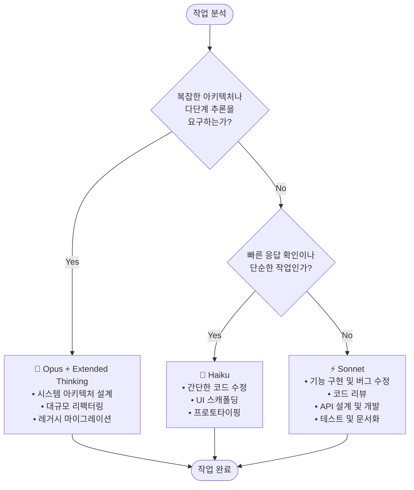

# 클로드 코드 완전 정복 — 기본 개념 & 활용

> Claude Code의 핵심 개념부터 일상 워크플로우까지, 매일 쓰는 기능들을 한 파일에 정리.
> Harness 기반 실전 운영은 → [claude-code-harness.md](./claude-code-harness.md)

---

## 📚 목차

- [1장. Claude Code 기초](#1장-claude-code-기초)
  - [1.1 Claude Code란?](#11-claude-code란)
  - [1.2 설치하기](#12-설치하기)
  - [1.3 핵심 개념 — 컨텍스트와 세션](#13-핵심-개념--컨텍스트와-세션)
  - [1.4 .gitignore 권장 항목](#14-gitignore-권장-항목)
- [2장. 명령어와 단축키](#2장-명령어와-단축키)
  - [2.1 프리픽스 키 — `@` `!` `#` `ESC`](#21-프리픽스-키----esc)
  - [2.2 슬래시 명령어 핵심](#22-슬래시-명령어-핵심)
- [3장. 모델 선택과 사고 모드](#3장-모델-선택과-사고-모드)
  - [3.1 Opus / Sonnet / Haiku 비교](#31-opus--sonnet--haiku-비교)
  - [3.2 Thinking 모드 — `think`/`ultrathink`](#32-thinking-모드--thinkultrathink)
  - [3.3 모델 선택 의사결정 트리](#33-모델-선택-의사결정-트리)
- [4장. 권한 관리](#4장-권한-관리)
  - [4.1 권한 3단계 — allow / ask / deny](#41-권한-3단계--allow--ask--deny)
  - [4.2 패턴 매칭과 실전 설정](#42-패턴-매칭과-실전-설정)
  - [4.3 권한 모드 (defaultMode)](#43-권한-모드-defaultmode)
  - [4.4 위험 플래그 — `--dangerously-skip-permissions`](#44-위험-플래그----dangerously-skip-permissions)
  - [4.5 settings.json 전체 구조](#45-settingsjson-전체-구조)
- [5장. 토큰과 컨텍스트 관리](#5장-토큰과-컨텍스트-관리)
  - [5.1 토큰 = 돈, 컨텍스트 윈도우 이해](#51-토큰--돈-컨텍스트-윈도우-이해)
  - [5.2 `/clear` vs `/compact` vs `/context`](#52-clear-vs-compact-vs-context)
  - [5.3 토큰 절약 5원칙](#53-토큰-절약-5원칙)
- [6장. CLAUDE.md & 메모리 시스템](#6장-claudemd--메모리-시스템)
  - [6.1 메모리 5종 한눈에](#61-메모리-5종-한눈에)
  - [6.2 CLAUDE.md 작성법](#62-claudemd-작성법)
  - [6.3 `.claude/rules/` — 규칙 분리](#63-claudrules--규칙-분리)
  - [6.4 `.claude/` 폴더 전체 구조](#64-claud-폴더-전체-구조)
  - [6.5 AGENTS.md — AI 도구 표준](#65-agentsmd--ai-도구-표준)
- [7장. 출력 스타일 커스터마이징](#7장-출력-스타일-커스터마이징)
- [8장. 확장 시스템 한눈에](#8장-확장-시스템-한눈에)
  - [8.1 5종 확장 도구 비교](#81-5종-확장-도구-비교)
  - [8.2 Agent Skill 기초](#82-agent-skill-기초)
  - [8.3 Subagent 기초](#83-subagent-기초)
  - [8.4 MCP 기초 — 외부 도구 연결](#84-mcp-기초--외부-도구-연결)
  - [8.5 Hooks 기초 — 자동화](#85-hooks-기초--자동화)
  - [8.6 Plugin & Marketplace 기초](#86-plugin--marketplace-기초)
- [9장. 커스텀 슬래시 명령어 만들기](#9장-커스텀-슬래시-명령어-만들기)
- [10장. AI 개발 워크플로우 — 탐색·계획·코딩·커밋](#10장-ai-개발-워크플로우--탐색계획코딩커밋)
- [11장. 메타프롬프트와 PRD](#11장-메타프롬프트와-prd)
- [12장. 트러블슈팅](#12장-트러블슈팅)
- [→ Harness로 넘어가기](#-harness로-넘어가기)

---

## 1장. Claude Code 기초

### 1.1 Claude Code란?

#### 비유로 이해하기

```text
웹 ChatGPT/Claude  =  카페에서 바리스타에게 주문하는 것
                      "아메리카노 하나요" → 받아서 마심 → 끝

Claude Code (CLI)  =  바리스타가 내 주방에 와서 일하는 것
                      내 냉장고(파일)를 열고, 내 도구(터미널)를 쓰고,
                      내 레시피(CLAUDE.md)를 따라 직접 요리함
```

#### 정의

**Claude Code** = Anthropic의 **CLI 기반 AI 코딩 도구**.
내 컴퓨터의 파일을 직접 읽고·쓰고, 터미널 명령어를 실행할 수 있다.

#### 웹 vs CLI 차이

| 항목 | 웹 (claude.ai) | CLI (Claude Code) |
| --- | --- | --- |
| 파일 접근 | ❌ 직접 불가 (복붙 필요) | ✅ 내 프로젝트 파일 직접 읽기/쓰기 |
| 터미널 명령 | ❌ 불가 | ✅ `npm run build`, `git commit` 등 직접 실행 |
| 프로젝트 이해 | ❌ 매번 설명 필요 | ✅ CLAUDE.md로 프로젝트 규칙 자동 이해 |
| 작업 연속성 | ❌ 대화마다 리셋 | ✅ 세션/메모리로 이어서 작업 |
| 도구 연결 | ❌ 불가 | ✅ MCP로 GitHub/Slack/DB 등 연결 |

> 💡 **왜 CLI인가?** 웹은 "대화"만 가능하지만, CLI는 "행동"이 가능. 코드 읽기 → 수정 → 테스트 → 커밋까지 Claude가 직접 한다.

---

### 1.2 설치하기

#### 사전 준비

| 🔴 필수 | 버전 | 확인 명령어 |
| --- | --- | --- |
| Node.js | v22.x 추천 (v20 미만이면 업그레이드) | `node --version` |
| Git | v2.5x 이상 | `git --version` |

#### 설치 (3가지 방법)

```bash
# 방법 1: 공식 설치 스크립트 (권장)
curl -fsSL https://claude.ai/install.sh | bash

# 방법 2: Homebrew (macOS)
brew install --cask claude-code

# 방법 3: npm (전역)
npm install -g @anthropic-ai/claude-code
```

#### 설치 후 확인

```bash
# PATH 반영
source ~/.zshrc        # zsh
# 또는 source ~/.bashrc

# 버전 확인
claude --version
# → 2.1.7 (클로드 코드)
```

#### 첫 실행

```bash
cd my-project          # 프로젝트 폴더로 이동
claude                 # Claude Code 시작
# 최초엔 브라우저로 Anthropic 로그인 1회 필요
```

#### Git 사용자 정보 (최초 1회)

```bash
git config --global user.name "Your Name"
git config --global user.email "your-email@example.com"
```

#### 줄바꿈 설정 — 터미널별

`Shift+Enter` 줄바꿈을 위해 1회 설정.

| 터미널 | 추가 설정 |
| --- | --- |
| iTerm2, WezTerm, Ghostty, Kitty | ✅ 기본 지원 |
| VS Code, Cursor | `/terminal-setup` 실행 |
| Alacritty, Zed, Warp | 터미널 키바인딩 직접 추가 |

```text
# Claude Code 안에서 (VS Code/Cursor)
/terminal-setup
```

#### `/init` 한국어로 시작하기

새 프로젝트에서 `/init` 실행할 때 한국어로 진행하는 패턴:

```bash
/init 프로젝트 초기화를 한국어로 진행해주세요.

다음 설정을 CLAUDE.md에 포함해주세요:

## 언어 및 커뮤니케이션 규칙
- **기본 응답 언어**: 한국어
- **코드 주석**: 한국어로 작성
- **커밋 메시지**: 한국어로 작성
- **문서화**: 한국어로 작성
- **변수명/함수명**: 영어 (코드 표준 준수)
```

> 💡 또는 한국어 설정은 `~/.claude/settings.json`에 `"language": "korean"`을 추가하면 시스템 레벨로 100% 적용됨. CLAUDE.md에 "한국어로 답해줘"라고 쓰는 것보다 안정적.

---

### 1.3 핵심 개념 — 컨텍스트와 세션

#### 컨텍스트(Context) = Claude의 작업 기억

```text
사람이 요리할 때 머릿속에 떠올리는 것들:
├── 지금 만드는 요리 (현재 작업)
├── 레시피 (CLAUDE.md)
├── 냉장고 재료 (프로젝트 파일들)
└── 아까 소금 넣었다는 기억 (이전 대화)

Claude의 컨텍스트도 동일:
├── 현재 대화 내용
├── CLAUDE.md 규칙
├── 읽은 파일들
└── 실행한 명령어 결과들
```

**핵심:**
- 컨텍스트엔 **용량 제한**이 있다 (= 컨텍스트 윈도우)
- 너무 많이 쌓이면 → 오래된 내용을 잊거나 응답 품질 저하
- AI 모델이 더 똑똑해져도 결국 우리가 할 일은 **컨텍스트를 효과적으로 관리하는 것**

#### 세션(Session) = 한 번의 대화

```text
세션 1: claude 실행 → 작업 → 종료
        (컨텍스트 사라짐)

세션 2: claude 실행 → 새 컨텍스트
        이전 세션 내용 모름 ❌
        하지만 /resume이나 claude --continue로 이어갈 수 있음 ✅
```

#### 세션 저장 메커니즘

세션은 **프로젝트 디렉토리 해시 기반**으로 `~/.claude/projects/`에 저장됨.

```text
~/.claude/projects/
└── -Users-buzz-my-project/         # 프로젝트 경로 해시
    ├── memory/                      # 자동 메모리 (Claude가 자동 기록)
    └── <session-id>.jsonl           # 세션 기록 파일
```

**중요:**
- 세션은 **프로젝트 디렉토리 단위**로 저장됨
- 다른 폴더에서 `claude -c` 하면 **그 폴더의 세션**이 열림 (지금 세션 ❌)
- 반드시 같은 프로젝트 폴더에서 실행해야 같은 세션 이어감

#### 세션 이어가기

```bash
# 가장 최근 세션 이어가기
claude --continue       # 또는 -c
claude -c

# 세션 목록에서 선택
claude --resume         # 또는 -r

# Claude Code 안에서
/resume

# 세션 이름 부여 (찾기 쉽게)
/rename auth-refactor
```

---

### 1.4 .gitignore 권장 항목

프로젝트 첫 세팅 시 반드시 추가:

```gitignore
# 환경 변수와 시크릿
.env
.env.*
secrets/
credentials/

# Claude Code 개인 설정 (나만 쓰는 것)
.claude/settings.local.json
CLAUDE.local.md

# 빌드 산출물
out/
dist/
build/
node_modules/

# OS / IDE
.DS_Store
.vscode/
.idea/
```

#### `.claude/`는 절대 `.gitignore`에 넣지 마라

| Git 공유 ✅ | Git 제외 ❌ |
| --- | --- |
| `CLAUDE.md` | `CLAUDE.local.md` |
| `.claude/settings.json` | `.claude/settings.local.json` |
| `.claude/rules/` | — |
| `.claude/skills/` | — |
| `.claude/hooks/` | — |
| `.claude/agents/` | — |
| `.claude/commands/` | — |
| `.mcp.json` | — |

> ⚠️ `.claude/` 폴더는 **팀 공유 자산**. 통째로 `.gitignore` 하면 팀원이 같은 환경 못 가짐.

---

## 2장. 명령어와 단축키

### 2.1 프리픽스 키 — `@` `!` `#` `ESC`

Claude Code 대화창에서 **첫 글자**로 입력하면 특별한 모드로 전환되는 키.

| 키 | 용도 | 비유 |
| --- | --- | --- |
| `@` | 파일/폴더 **참조 첨부** | 📎 첨부 핀 |
| `!` | **Bash 명령** 바로 실행 | ⚡ 터미널 점프 |
| `#` | **메모리에 저장** (CLAUDE.md) | 📝 메모 저장 |
| `ESC` | 작업 흐름 제어 | ⏸️ 일시정지 |

#### `@` — 파일·폴더 참조

```bash
# 단일 파일 참조 (자동완성 됨)
> @src/components/Login.tsx 패스워드 검증 로직 추가

# 여러 파일 동시 참조
> @src/api/user.ts @src/api/auth.ts 두 파일 의존성 정리

# 폴더 통째로
> @src/utils 이 폴더 구조 요약
```

✅ **이점:**
- 클로드가 **정확히 그 파일**을 읽고 시작 → 추측 없음
- 경로 오타 방지 (자동완성)
- 토큰 낭비 없이 **필요한 파일만** 첨부

❌ **하지 말 것:**
- `@` 없이 "로그인 파일 고쳐줘" → 클로드가 파일 찾느라 토큰·시간 낭비
- `@node_modules` 같은 거대 디렉토리 참조 → 컨텍스트 폭발

#### `!` — Bash 모드

```bash
> !git status
> !npm test
> !ls -la src/
> !curl http://localhost:3000/health
```

✅ **이점:**
- 승인 프롬프트 없이 **내가 직접 실행** → 빠름
- 결과가 클로드 컨텍스트에 자동 들어감 → 이어서 "이 에러 고쳐줘" 가능

> ⚠️ `!`는 **본인이 실행 주체**라 위험 명령(`rm -rf` 등)은 본인 책임.

#### `#` — 메모리 저장

```bash
> # 이 프로젝트는 pnpm을 사용한다. npm/yarn 명령어 쓰지 말 것
> # 테스트는 Vitest + Testing Library. Jest 관련 제안 금지
```

저장 위치 선택 프롬프트가 나옴:

| 옵션 | 범위 |
| --- | --- |
| Project memory | `./CLAUDE.md` (팀 공유, Git 커밋) |
| User memory | `~/.claude/CLAUDE.md` (개인 전역) |
| Project local | `./CLAUDE.local.md` (개인, gitignore) |

> 💡 **팁**: 같은 실수를 두 번 했다 싶으면 즉시 `#`으로 박제 → 재발 방지.

#### `ESC` — 작업 흐름 제어

```text
ESC 1번  =  현재 작업 중단 (세션은 유지)
            긴 작업 중간에 끊고 싶을 때
ESC 2번  =  이전 프롬프트로 돌아가기
            입력한 내용을 수정하고 싶을 때
```

---

### 2.2 슬래시 명령어 핵심

#### 매일 쓰는 핵심 5개

| 명령어 | 한 줄 요약 | 언제 쓰나 |
| --- | --- | --- |
| `/init` | 프로젝트 분석 → `CLAUDE.md` 자동 생성 | 새 프로젝트 첫 만남 |
| `/help` | 사용 가능한 명령어·단축키 목록 | 뭐가 있는지 생각 안 날 때 |
| `/clear` | **대화 기록 초기화** (컨텍스트 완전 리셋) | 주제 완전히 바뀔 때 |
| `/compact` | 지금까지 대화를 **요약 압축** | 긴 세션에서 공간 부족할 때 |
| `/context` | 현재 컨텍스트 **사용량 시각화** | 응답 이상하거나 느릴 때 |

#### `/init` — 프로젝트 첫 분석

```bash
> /init
# 또는 한국어로 진행
> /init 프로젝트 초기화를 한국어로 진행해주세요.
```

`CLAUDE.md`를 자동 생성. **신규 프로젝트 첫 스텝.** 생성 후 직접 다듬어 팀 컨벤션·금지사항 추가.

#### `/clear` vs `/compact`

| 구분 | `/clear` | `/compact` |
| --- | --- | --- |
| 기억 | ❌ 전부 삭제 | ✅ 요약해서 유지 |
| 용도 | 주제 전환 | 같은 주제, 공간만 필요 |
| 위험도 | 중요 맥락 소실 | 디테일 일부 손실 |

> 💡 **실전 팁**: 컨텍스트가 50% 넘어가면 `/compact`, 80% 넘으면 `/clear` 또는 새 세션 고려.

#### 그 외 자주 쓰는 명령어

| 명령어 | 설명 |
| --- | --- |
| `/model` | 모델 변경 (Opus/Sonnet/Haiku) |
| `/resume [세션]` | 이전 세션 재개 |
| `/rename <이름>` | 현재 세션 이름 변경 |
| `/status` | 현재 상태 (MCP, 권한, 프로젝트) |
| `/doctor` | 시스템 진단 |
| `/config` | 설정 GUI |
| `/permissions` | 권한 설정 확인/수정 |
| `/memory` | 메모리 파일 편집 |
| `/agents` | 사용 가능한 에이전트 목록 |
| `/skills` | 사용 가능한 스킬 목록 |
| `/hooks` | 등록된 Hook 목록 |
| `/plugin` | 플러그인 관리 |
| `/review` | 코드 리뷰 요청 |
| `/rewind` | 대화·코드 변경 되돌리기 |
| `/exit` | 종료 |

---

## 3장. 모델 선택과 사고 모드

### 3.1 Opus / Sonnet / Haiku 비교

| 구분 | 🧠 Opus | ⚡ Sonnet | 🏃 Haiku |
| --- | --- | --- | --- |
| 포지션 | 최상위 (플래그십) | **기본값** | 경량/초고속 |
| 강점 | 복잡한 추론·장기 태스크 | 품질·속도 균형 | 빠른 응답·저비용 |
| 비용 | 높음 💰💰💰 | 중간 💰💰 | 낮음 💰 |
| 컨텍스트 | 매우 김 | 김 | 보통 |

#### 작업 유형별 권장 모델

| 모델 | 권장 상황 | 예시 |
| --- | --- | --- |
| Opus | 복잡한 설계/분석/의사결정 | 아키텍처 설계, 대규모 리팩터링, 레거시 작업 |
| Sonnet | **일반 개발 (기본)** | 기능 구현, 버그 수정, API 설계, 테스트 작성 |
| Haiku | 빠른 프로토타입/간단한 작업 | 간단한 수정, 구문 오류, 프로토타이핑 |

#### 모델 변경 방법

```bash
# 실행 시 지정
claude --model claude-opus-4-7
claude --model claude-sonnet-4-6
claude --model claude-haiku-4-5

# 세션 중 전환
/model
```

> 💡 **실전 패턴**: 설계 단계는 Opus → 구현은 Sonnet → 단순 반복은 Haiku로 전환. 비용 최적화의 핵심.

---

### 3.2 Thinking 모드 — `think`/`ultrathink`

답을 내기 전 **내부적으로 더 깊이 추론**하도록 사고 예산을 늘리는 키워드.

| 레벨 | 효과 | 언제 쓰나 |
| --- | --- | --- |
| `think` | 기본 사고 | 간단한 작업 |
| `think hard` | 더 깊은 사고 | 중간 복잡도 |
| `think harder` | 매우 깊은 사고 | 복잡한 문제 |
| `ultrathink` | 최대 깊이 사고 | 아키텍처 결정 |

#### 사용 예시

```bash
# 간단한 기능
> 로그인 버튼 UI 개선 방법을 think 해서 계획 세워줘

# 복잡한 설계
> 마이크로서비스 아키텍처 전환 방안을 ultrathink로 3가지 옵션 비교 분석
```

#### Thinking 활성화 가이드

| 상황 | 권장 |
| --- | --- |
| 복잡한 아키텍처 결정 | ✅ effort high |
| 여러 번 시도해도 안 풀리는 디버깅 | ✅ effort high |
| 다단계 상세 구현 | ✅ effort high |
| 단순 텍스트 변경 | ❌ 비활성화 |
| 간단한 문법 오류 수정 | ❌ 비활성화 |

> ⚠️ 단순 작업에 높은 effort 쓰면 **응답이 장황해지고 비용만 늘어남**.

---

### 3.3 모델 선택 의사결정 트리



**결정 공식:**

1. 복잡한 설계·다단계 추론? → **Opus (+ Thinking high)**
2. 단순·빠른 작업? → **Haiku**
3. 둘 다 아니면 → **Sonnet** (기본값)

---

## 4장. 권한 관리

### 4.1 권한 3단계 — allow / ask / deny

#### 비유

```text
가사도우미를 부른 상황:
"거실·주방은 자유롭게 (allow)"
"서재는 물어보고 (ask)"
"금고는 절대 안 됨 (deny)"

Claude Code도 똑같이 어디까지 허용할지 정한다.
```

#### 구조

```json
{
  "permissions": {
    "allow": [...],   // ✅ 자동 허용
    "ask": [...],     // 🤔 물어봄
    "deny": [...]     // ❌ 무조건 차단
  }
}
```

#### 우선순위 (이거만 기억)

```text
deny (절대 차단)  >  allow (자동 허용)  >  ask (물어봄)  >  기본값(물어봄)

예: allow에 "Bash" + deny에 "Bash(rm:*)"
    → rm 명령은 차단됨 (deny가 이김)
```

---

### 4.2 패턴 매칭과 실전 설정

#### 패턴 문법

```text
*   = 이 레벨에서 아무거나 (단일 레벨)
**  = 하위 폴더 전부 (다중 레벨)
:*  = 뒤에 뭐가 오든 (명령 인수)
```

#### 실전 예시

```text
"Bash(npm run test:*)"
✅ npm run test:unit  ✅ npm run test:e2e
❌ npm run build

"Read(./src/**)"
✅ ./src/app.ts  ✅ ./src/components/Button.tsx
❌ ./config/db.ts
```

#### 1인 개발자 — 편하게

```json
{
  "permissions": {
    "allow": ["Bash(npm run *)", "Bash(git *)", "Bash(npx *)", "Read", "Write"],
    "deny": ["Bash(rm -rf *)", "Read(./.env*)", "Read(./secrets/**)"]
  }
}
```

#### 팀 프로젝트 — 안전하게

```json
{
  "permissions": {
    "allow": [
      "Bash(npm run lint)",
      "Bash(npm run test:*)",
      "Bash(git status)",
      "Bash(git diff)",
      "Read(./src/**)",
      "Write(./src/**)"
    ],
    "ask": [
      "Bash(git push:*)",
      "Bash(git commit:*)",
      "Write(./package.json)"
    ],
    "deny": [
      "Bash(curl:*)",
      "Bash(rm:*)",
      "Bash(npm publish:*)",
      "Read(./.env*)",
      "Read(./secrets/**)",
      "Write(./config/prod.*)"
    ]
  }
}
```

#### 설정 파일 위치 (우선순위순)

```text
1. .claude/settings.local.json   ← 가장 높음 (개인용, gitignore)
2. .claude/settings.json          ← 팀 공유 (Git 커밋)
3. ~/.claude/settings.json        ← 모든 프로젝트 공통
```

> 💡 **팀 리더 팁**: `.env`, `secrets/`는 deny에 **무조건** 넣어 팀원 실수로 시크릿 노출 방지.

---

### 4.3 권한 모드 (defaultMode)

| 모드 | 설명 | 쓰는 상황 |
| --- | --- | --- |
| `default` | 도구 처음 쓸 때 물어봄 | 일반 개발 (기본값) |
| `acceptEdits` | 파일 편집 자동 승인 | 신뢰할 수 있는 작업 |
| `plan` | 분석만 가능, 수정 불가 | 코드 리뷰, 계획 단계 |
| `bypassPermissions` | 모든 권한 건너뜀 | ⚠️ 격리된 환경에서만! |

---

### 4.4 위험 플래그 — `--dangerously-skip-permissions`

```bash
claude --dangerously-skip-permissions
# 흔히 "YOLO 모드"
```

권한 프롬프트를 **전부 건너뛴다**.

#### ✅ 써도 되는 환경

- Docker 컨테이너 안
- 격리된 VM / 원격 개발 환경
- Git 워크트리로 분리된 브랜치
- CI 환경의 임시 러너

#### ❌ 절대 쓰면 안 되는 환경

- 실사용 로컬 머신
- 프로덕션 서버 SSH
- 미커밋 변경사항이 많은 저장소
- 회사 자격증명·시크릿이 있는 환경

#### 안전 패턴

```bash
# Docker 샌드박스
docker run -it --rm -v $(pwd):/workspace node:22 bash
claude --dangerously-skip-permissions

# Git 워크트리로 격리
git worktree add ../project-experiment experiment-branch
cd ../project-experiment
claude --dangerously-skip-permissions
```

---

### 4.5 settings.json 전체 구조

지금까지 권한만 봤지만, `settings.json`은 **Claude Code의 모든 설정**이 담기는 통합 파일.

```json
{
  "$schema": "https://json.schemastore.org/claude-code-settings.json",
  "language": "korean",
  "permissions": {
    "defaultMode": "default",
    "allow": [...],
    "ask": [...],
    "deny": [...],
    "additionalDirectories": ["../shared-libs/"]
  },
  "hooks": {
    "PreToolUse": [...],
    "PostToolUse": [...],
    "Stop": [...],
    "Notification": [...]
  },
  "mcpServers": {
    "github": {
      "command": "npx",
      "args": ["-y", "@modelcontextprotocol/server-github"],
      "env": {
        "GITHUB_PERSONAL_ACCESS_TOKEN": "${GITHUB_TOKEN}"
      }
    }
  },
  "env": {
    "NODE_ENV": "development"
  }
}
```

#### 필드별 역할

| 필드 | 역할 | 자세한 곳 |
| --- | --- | --- |
| `$schema` | JSON 스키마 (자동완성/검증) | — |
| `language` | 응답 언어 (`korean`/`english`) | 1.2 한국어 설정 |
| `permissions` | 권한 설정 | 4장 |
| `hooks` | 자동화 훅 | 8.5 |
| `mcpServers` | 외부 도구 연결 | 8.4 |
| `env` | 환경 변수 | — |
| `additionalDirectories` | 추가 작업 디렉토리 (모노레포) | — |

#### `$schema` 활용

VS Code에서 `$schema` 필드를 넣으면 **자동완성 + 유효성 검사**가 동작. 오류 줄이는 데 큰 도움.

#### 환경 변수 활용

```json
"env": {
  "GITHUB_PERSONAL_ACCESS_TOKEN": "${GITHUB_TOKEN}"
}
```

→ 셸 환경 변수 (`.zshrc`의 `export GITHUB_TOKEN=...`)를 참조. 토큰을 git에 커밋하지 않으면서 팀과 설정 공유 가능.

---

## 5장. 토큰과 컨텍스트 관리

### 5.1 토큰 = 돈, 컨텍스트 윈도우 이해

#### 토큰

```text
"안녕하세요"  → 한국어 3~5 토큰 (비효율)
"Hello"      → 영어 1 토큰 (효율적)
"function"   → 코드 1 토큰

💰 토큰 = 돈. 토큰 절약 = 비용 절약.
```

#### 컨텍스트 윈도우 = Claude의 책상 크기

```text
┌──── 컨텍스트 윈도우 ────┐
│ ████████░░░░░░░░░░       │
│ 사용 중 ↑     ↑ 남은 공간 │
│                          │
│ 80% 넘으면  → Claude 불안정│
│ 꽉 차면     → 자동 삭제   │
└──────────────────────────┘
```

#### 토큰이 소비되는 곳

```text
입력 토큰 (내가 보내는 것):
├── 내 메시지
├── CLAUDE.md 내용  ← 매 요청마다 포함됨!
├── @로 참조한 파일들
├── 이전 대화 내역
└── 시스템 프롬프트

출력 토큰 (Claude가 응답):
├── 답변 텍스트
├── 생성한 코드
└── 도구 호출 결과
```

---

### 5.2 `/clear` vs `/compact` vs `/context`

#### `/clear` — 완전 초기화

```bash
/clear
# → 이전 대화 전부 삭제, 새 세션 시작
```

언제: 완전히 다른 작업 시작, Claude가 이상한 맥락에 빠짐, 처음부터 다시.

#### `/compact` — 요약 압축

```bash
/compact
/compact 핵심만 남기고 코드 예제는 버려줘    # 지시 가능
```

원본 500토큰 → 요약 100토큰. **중요한 정보는 유지, 불필요한 세부 제거.**

#### `/context` — 현재 컨텍스트 확인

```bash
/context
# → 시스템 프롬프트, CLAUDE.md, 대화, 도구 결과별 사용량 시각화
```

#### 사용량별 권장 액션

| 사용량 | 상태 | 권장 |
| --- | --- | --- |
| ~20% | 🟢 쾌적 | 계속 진행 |
| ~50% | 🟡 중간 | `/compact` 고려 |
| ~80% | 🔴 과부하 | `/clear` 또는 새 세션 |

> 💡 실전 기준: **20~30% 쯤에서 새로 시작**. 빨리 비울수록 좋다.

---

### 5.3 토큰 절약 5원칙

1. **큰 파일 통째로 보내지 마라** — `@file.ts:50-80` 처럼 라인 범위 지정
2. **작업 전환 시 `/compact`** — 작업 1 요약 후 작업 2 시작
3. **상황에 맞는 모델** — 간단=Haiku, 보통=Sonnet, 복잡=Opus
4. **CLAUDE.md 200줄 이하** — 매 요청마다 포함되니까 짧게
5. **긴 작업은 세션 나누기** — `claude --continue`로 이어가기

---

## 6장. CLAUDE.md & 메모리 시스템

### 6.1 메모리 5종 한눈에

| 종류 | 파일 위치 | 공유 | 누가 쓰나 |
| --- | --- | --- | --- |
| 유저 메모리 | `~/.claude/CLAUDE.md` | 나만 (전역) | 내가 직접 |
| 프로젝트 메모리 | `./CLAUDE.md` | 팀 (Git 공유) | 내가 직접 |
| 모듈형 규칙 | `./.claude/rules/*.md` | 팀 (Git 공유) | 내가 직접 |
| 로컬 메모리 | `./CLAUDE.local.md` | 나만 (gitignore) | 내가 직접 |
| 자동 메모리 | `~/.claude/projects/<id>/memory/` | 나만 | Claude 자동 |

#### 계층 구조 — 3단 상속

```text
USER     ~/.claude/CLAUDE.md         모든 프로젝트 공통
   ↓ 상속
PROJECT  ./CLAUDE.md                 이 프로젝트만 (Git 커밋)
   ↓ 상속
FOLDER   src/auth/CLAUDE.md          이 폴더만 (특수 규칙)
```

**원리: 하위가 상위를 덮어쓴다. 가장 좁은 범위가 우선.**

#### 한국어 응답 설정 — 올바른 방법

```text
❌ CLAUDE.md에: "한국어로 응답해줘"
   → 가끔 무시됨, 토큰 낭비

✅ ~/.claude/settings.json:
   {"language": "korean"}
   → 시스템 레벨, 100% 적용
```

---

### 6.2 CLAUDE.md 작성법

#### 작성 원칙

- 🔴 **200줄 이하** 유지 (60줄 권장) — 매 요청마다 컨텍스트에 포함됨
- 🔴 길어지면 `.claude/rules/`로 분리
- 🔴 "Context, not enforcement" — 로드는 되지만 강제는 안 됨. 중요 규칙은 Hook으로!

#### 포함할 6가지

| # | 항목 | 내용 |
| --- | --- | --- |
| 1 | 프로젝트 개요 | 한두 문장 설명 · 주요 기능 · 목적 |
| 2 | 기술 스택 | 언어 · 프레임워크 · 주요 라이브러리 |
| 3 | 핵심 명령어 | 빌드 · 테스트 · 린트 · 개발 서버 |
| 4 | 디렉토리 구조 | 주요 폴더 역할 · 코드 배치 규칙 |
| 5 | 코딩 규칙 | 네이밍 · 스타일 가이드 |
| 6 | 금지/예외 규칙 | 파일 수정 금지 · DB 등 민감 조작 |

#### 실전 템플릿 — Next.js 프로젝트

```markdown
# 프로젝트 규칙

## 기술 스택
- Next.js 15 (App Router)
- TypeScript 5
- Tailwind CSS, Prisma (PostgreSQL)
- Jest + React Testing Library

## 빌드 & 테스트
- 빌드: `npm run build`
- 테스트: `npm test`
- 린트: `npm run lint`

## 코딩 컨벤션
- 컴포넌트: PascalCase (LoginForm.tsx)
- 유틸 함수: camelCase (formatDate.ts)
- 상수: UPPER_SNAKE_CASE
- 서버 컴포넌트 기본, 클라이언트는 "use client" 명시

## 폴더 구조
- app/        — 라우트와 페이지
- components/ — 재사용 컴포넌트
- lib/        — 유틸리티

## 금지
- `any` 타입 사용 금지
- 인라인 스타일 금지 (Tailwind)
- `console.log` 커밋 금지
- API 키 하드코딩 금지 (.env)
```

#### 점진적 발전 (`#` 활용)

```text
1주차: /init → 기본 CLAUDE.md (50줄)
   ↓
작업 중 실수 → # 금지 규칙 추가
   ↓
1개월 후: 150줄 내외 프로젝트 맞춤 가이드 완성
```

---

### 6.3 `.claude/rules/` — 규칙 분리

#### 언제 분리하나

CLAUDE.md가 **200줄 넘을 것 같을 때.**

```text
프로젝트/
├── CLAUDE.md                  # 핵심만 (간결)
├── .claude/
│   ├── settings.json          # 권한·MCP 설정
│   └── rules/
│       ├── code-style.md      # 코드 스타일
│       ├── testing.md         # 테스트 규칙
│       └── security.md        # 보안 요구사항
```

#### glob 패턴 — 조건부 로드

규칙 파일 상단에 glob 지정 → 매칭 파일 작업 시만 자동 로드.

```markdown
---
glob: ["**/*.test.js", "**/*.spec.js"]
---

# 테스트 규칙
- Arrange-Act-Assert 패턴
- it('should ... when ...') 형식
- 실제 네트워크 호출 금지 (mock 사용)
```

> 💡 AI가 `src/utils/helper.ts` 편집 시 `security.md` 안 로드되고, `src/auth/login.ts` 편집 시 자동 로드. 규칙은 세밀해지는데 컨텍스트는 가벼워진다.

---

### 6.4 `.claude/` 폴더 전체 구조

지금까지 단편적으로 봤던 `rules/`, `skills/`, `hooks/`, `agents/`, `commands/`를 한눈에.

```text
프로젝트/
├── CLAUDE.md                   # 프로젝트 메모리 (Git 공유)
├── CLAUDE.local.md             # 개인 메모리 (gitignore)
├── AGENTS.md                   # AI 도구 표준 (선택)
├── .mcp.json                   # MCP 서버 정의 (Git 공유)
└── .claude/
    ├── settings.json           # 권한·Hooks·MCP·Env (Git 공유)
    ├── settings.local.json     # 개인 설정 (gitignore)
    ├── rules/                  # 모듈형 규칙 (glob 기반 자동 로드)
    │   ├── code-style.md
    │   ├── testing.md
    │   └── security.md
    ├── skills/                 # 반복 작업 레시피 (Agent Skill)
    │   └── code-reviewer/
    │       └── SKILL.md
    ├── hooks/                  # 셸 스크립트 (Hook 본체)
    │   ├── pre-bash.sh
    │   └── format-ts.sh
    ├── agents/                 # 서브에이전트 정의
    │   ├── code-reviewer.md
    │   └── security-reviewer.md
    ├── commands/               # 커스텀 슬래시 명령어
    │   ├── review.md
    │   └── feature.md
    └── output-styles/          # 출력 스타일
        └── teacher-kr.md
```

#### 전역 (모든 프로젝트)

```text
~/.claude/
├── CLAUDE.md                   # 유저 메모리
├── settings.json               # 유저 설정
├── projects/                   # 자동 메모리 (세션 기록)
│   └── -path-to-project/
│       └── memory/
└── (commands/, agents/, skills/, output-styles/)  # 동일 구조
```

#### 각 폴더별 역할 요약

| 폴더 | 무엇 | 자동 로드? | 호출 방법 |
| --- | --- | --- | --- |
| `rules/` | 작은 규칙 모음 | ✅ glob 매칭 시 | (자동) |
| `skills/` | 반복 작업 매뉴얼 | 🟡 자동/수동 | `@X` / `/X` / 자동 |
| `hooks/` | 자동 반응 스크립트 | ✅ 이벤트 발생 시 | settings.json에 등록 |
| `agents/` | 가상 팀원 | ❌ 호출 시 | `@agent-name` |
| `commands/` | 슬래시 명령어 | ❌ 호출 시 | `/command-name` |
| `output-styles/` | 말투 설정 | ❌ 선택 시 | `/output-style` |

---

### 6.5 AGENTS.md — AI 도구 표준

#### 왜 등장했나

각 AI 도구마다 읽는 파일이 다름:

| 도구 | 파일 |
| --- | --- |
| Claude Code | `CLAUDE.md` |
| Cursor | `.cursor/rules/` |
| GitHub Copilot | `.github/copilot-instructions.md` |
| Gemini CLI | `GEMINI.md` |

→ 2025년 8월 **AGENTS.md 오픈 표준** 등장 (구글·OpenAI·Factory·Cursor 공동).

#### 활용 방법 1 — `@import` (권장)

```markdown
<!-- AGENTS.md -->
# AGENTS.md
(모든 에이전트가 읽는 프로젝트 공통 지침)

## 빌드 명령
- pnpm install
- pnpm dev
- pnpm test
```

```markdown
<!-- CLAUDE.md -->
# CLAUDE.md
@AGENTS.md 를 반드시 읽고 지침을 따를 것.

## Claude Code 전용 추가 규칙
- ...
```

#### 활용 방법 2 — 심볼릭 링크

모든 에이전트가 **완전히 동일한** 지침을 써야 할 때.

```bash
# AGENTS.md를 원본으로, CLAUDE.md를 심볼릭 링크로
ln -s AGENTS.md CLAUDE.md
```

| 방법 | 장점 | 단점 |
| --- | --- | --- |
| `@import` | 클로드 코드 전용 설정 추가 가능 | AGENTS.md 두 번 로드 가능성 |
| 심볼릭 링크 | 완전 동일한 지침 보장 | 클로드 코드 전용 설정 추가 어려움 |

#### 언제 어떤 방식?

| 상황 | 추천 방식 |
| --- | --- |
| 혼자 쓰거나 소수 프로젝트 | CLAUDE.md만 |
| 팀에서 같은 도구만 사용 | 심볼릭 링크 |
| 여러 AI 도구 (Claude, Cursor 등) 혼용 | `@import` |
| 모노레포 / 대규모 | `@import` |

> 🗝️ **철학**: "도구가 바뀌어도 **프롬프트는 유지된다**". AGENTS.md를 본체로 두면 AI 도구 마이그레이션이 쉬워진다.

---

## 7장. 출력 스타일 커스터마이징

### 출력 스타일 = Claude의 말투 설정

```bash
# 기본 스타일 적용
/output-style concise         # 짧게
/output-style explanatory     # 설명 풍부

# 메뉴에서 선택
/output-style
```

### 나만의 스타일 만들기

저장 위치:
- 전역: `~/.claude/output-styles/이름.md`
- 프로젝트: `./.claude/output-styles/이름.md` (Git 공유)

#### 한국어 친절 선생님 스타일

```markdown
---
name: 한국어 선생님
description: 코드를 가르치듯 설명하는 한국어 스타일
keep-coding-instructions: true
---

# 한국어 선생님 스타일

당신은 친절한 프로그래밍 선생님입니다.

## 규칙
- 모든 응답은 한국어
- 새 개념은 일상 비유로 먼저 설명
- 어려운 부분은 "쉽게 말하면..."으로 풀기
- 반말 톤 ("~하자", "~이다")
```

#### `keep-coding-instructions` 핵심

| 값 | 의미 |
| --- | --- |
| `true` (권장) | Claude의 코딩 능력 그대로 + 내 스타일만 추가 |
| `false` | Claude의 코딩 능력 제거 + 내 스타일로 대체 |

> 🎯 개발자라면 **항상 `true`**.

---

## 8장. 확장 시스템 한눈에

> 지금까지는 **혼자 쓰는 Claude Code**. 진짜 힘은 **확장 시스템**에서 나온다.
> 이 장은 **개념 입문** — 깊은 활용은 [Harness](./claude-code-harness.md)에서.

### 8.1 5종 확장 도구 비교

```text
📋 Custom Commands  슬래시 명령어 자동화        /command-name
⚡ Skill            특정 작업 전용 매뉴얼        @skill-name
🤖 Subagent         가상 팀원 (컨텍스트 격리)   @agent-name
🔌 MCP              외부 도구 연결 (GitHub 등)   /status로 확인
🪝 Hooks            자동 반응 스크립트          settings.json
📦 Plugin           위 5가지를 묶어 배포          /plugin install
```

| 도구 | 한 줄 정의 | 위치 | 호출 |
| --- | --- | --- | --- |
| **Custom Command** | 자주 쓰는 프롬프트 단축 | `.claude/commands/X.md` | `/X` |
| **Skill** | 작업 전용 매뉴얼 (메타데이터 포함) | `.claude/skills/X/SKILL.md` | 자동/`/X`/`@X` |
| **Subagent** | 별도 컨텍스트의 가상 팀원 | `.claude/agents/X.md` | `@X` |
| **MCP** | 외부 도구 연결 프로토콜 | `.mcp.json` 또는 `settings.json` | (자동) |
| **Hooks** | 이벤트 자동 반응 | `settings.json` 의 `hooks` | (자동, 이벤트 시) |
| **Plugin** | 위 5가지를 묶은 패키지 | 마켓플레이스 | `/plugin install` |

> 💡 **Custom Command**는 가장 쉬워서 **9장에서 따로 다룬다**. 여기선 나머지 4종 + Plugin만 기초 소개.

---

### 8.2 Agent Skill 기초

**Skill = 특정 작업 전용 미니 에이전트**.

```markdown
---                                          ← 메타데이터 (YAML Front Matter)
name: code-reviewer
description: 코드 리뷰 수행. PR 리뷰, 코드 품질 분석 요청 시 사용.
allowed-tools: Read, Grep, Glob
---

# 코드 리뷰 가이드

## 이 Skill을 사용할 때
- PR 리뷰 요청
- 코드 품질 분석

## Instructions
[클로드가 따라야 할 단계와 규칙]
```

#### 메타데이터 3필드

| 필드 | 필수 | 설명 |
| --- | --- | --- |
| `name` | ✅ | Skill 고유 이름 (소문자+하이픈) |
| `description` | ✅ | 용도 설명 — **자동 로드 판단 시 참조** |
| `allowed-tools` | 선택 | 사용 가능 도구 제한 (보안용) |

#### 3가지 호출 방식

1. **자동 로드** — 클로드가 맥락 분석해서 필요하다고 판단하면 참조
2. **`@` 멘션** — `@code-reviewer`로 즉시 로드
3. **슬래시** — `/code-reviewer`로 사용자 직접 호출

#### 저장 위치

```text
~/.claude/skills/이름/SKILL.md       # 개인 (모든 프로젝트)
./.claude/skills/이름/SKILL.md       # 팀 공유 (Git 커밋)
```

#### 확인

```bash
/skills
```

→ 자세한 활용·권한 모델·저장소: [Harness 5.3](./claude-code-harness.md#53-스킬-agent-skill)

---

### 8.3 Subagent 기초

**Subagent = 가상 팀원**. 메인 컨텍스트 격리하고 위임.

#### 비유

```text
나 (메인 Claude):
  "로그인 만들어줘"
  → 기획·개발·리뷰·테스트 다 혼자 함
  → 컨텍스트 금방 꽉 참

메인 + 서브에이전트:
  "로그인 만들고, @code-reviewer로 리뷰 시켜"
  메인: 개발만
  code-reviewer: 리뷰만
  → 메인 컨텍스트 깨끗 유지!
```

#### 3대 장점

1. **컨텍스트 격리** — 메인 깨끗 유지
2. **전문화** — 역할별 최적화 프롬프트
3. **병렬 처리** — 동시 실행 가능

#### 만드는 법

```markdown
---
name: code-reviewer
description: 코드 작성 후 품질·보안 리뷰
tools: Read, Grep, Glob
---

# 코드 리뷰어

너는 10년차 시니어 개발자다.
...
```

#### 사용

```bash
"@code-reviewer 에이전트로 방금 작성한 코드 리뷰해줘"
```

#### 확인

```bash
/agents
```

→ 자세한 활용·실전 에이전트 5선·조합 패턴: [Harness 5.2](./claude-code-harness.md#52-서브에이전트--가상-팀원)

#### Skill vs Subagent — 헷갈리는 차이

| | Skill | Subagent |
| --- | --- | --- |
| 컨텍스트 | 메인과 공유 | **별도 컨텍스트** (격리) |
| 용도 | 작업 매뉴얼 | 위임 가능한 팀원 |
| 호출 | 자동/`/X`/`@X` | `@X` |
| 도구 제한 | `allowed-tools` | `tools` |

> 💡 둘은 점점 통합되는 추세. v2.1.3에서 내부 도구가 통합됨. 폴더 구조는 그대로 유지.

---

### 8.4 MCP 기초 — 외부 도구 연결

**MCP (Model Context Protocol)** = Claude에게 **외부 도구를 연결**해주는 표준 프로토콜.

#### 비유 — 스마트폰 앱 설치

```text
스마트폰 기본:    전화·문자·카메라
앱 설치 후:        배달·은행·내비게이션·...

Claude Code 기본: 파일·터미널·웹 검색
MCP 연결 후:       + GitHub·DB·Slack·Figma·Playwright·...
```

#### 설치 — CLI 한 줄

```bash
# 기본 패턴
claude mcp add <이름> <실행방식> --scope project

# 예: Context7 (최신 문서 주입)
claude mcp add --transport http context7 \
  https://mcp.context7.com/mcp --scope project

# 예: Playwright (브라우저 자동화)
claude mcp add playwright \
  npx @playwright/mcp@latest --scope project
```

#### 스코프 차이

| | `--scope project` | `--scope user` |
| --- | --- | --- |
| 저장 위치 | `.mcp.json` | `~/.claude/settings.json` |
| 공유 | Git 커밋 → 팀 공유 | 나만 |
| 적용 범위 | 이 프로젝트만 | 모든 프로젝트 |

#### 확인 / 진단

```bash
/status   # 연결된 MCP 목록
/doctor   # MCP 진단
```

#### 필수 MCP 4선 — 강의 추천

| MCP | 용도 |
| --- | --- |
| **Context7** | 최신 프레임워크 문서 주입 ("use context7") |
| **Playwright** | 브라우저 자동화 (UI 반복, E2E 테스트) |
| **Sequential Thinking** | 복잡한 문제 단계별 사고 |
| **ShadcnUI** | shadcn/ui 컴포넌트 자동 추가 |

#### 토큰 보안 — 환경 변수로

```json
{
  "mcpServers": {
    "github": {
      "command": "npx",
      "args": ["-y", "@modelcontextprotocol/server-github"],
      "env": {
        "GITHUB_PERSONAL_ACCESS_TOKEN": "${GITHUB_TOKEN}"
      }
    }
  }
}
```

```bash
# .zshrc에 토큰만 export
export GITHUB_TOKEN="ghp_..."
```

→ 자세한 활용·풀스택 세팅·MCP 찾기: [Harness 5.4](./claude-code-harness.md#54-mcp--외부-도구-연결)

---

### 8.5 Hooks 기초 — 자동화

**Hooks = Claude의 행동에 자동으로 반응하는 셸 스크립트**.

> 💡 **한 줄 정의**
>
> Skill이 클로드에게 **"어떻게"** 작업할지 가르친다면,
> Hook은 **"언제"** 특정 작업이 **"항상"** 실행되도록 보장한다.

#### 4가지 타입

| Hook | 발동 시점 | 용도 |
| --- | --- | --- |
| **PreToolUse** | 도구 사용 직전 | 위험 명령 차단 |
| **PostToolUse** | 도구 사용 직후 | 자동 포맷, 린트 |
| **Stop** | Claude 응답 종료 | 알림, 정리 |
| **Notification** | 알림 발생 | 데스크톱 알림 |

#### 기본 구조

```json
{
  "hooks": {
    "PostToolUse": [
      {
        "matcher": "Write|Edit",
        "hooks": [
          {
            "type": "command",
            "command": "npx prettier --write \"$CLAUDE_FILE_PATH\""
          }
        ]
      }
    ]
  }
}
```

#### 환경 변수

```text
$CLAUDE_FILE_PATH    파일 경로 (Write, Edit)
$CLAUDE_COMMAND      실행 명령어 (Bash)
$CLAUDE_TOOL_NAME    도구 이름
$CLAUDE_PROJECT_DIR  프로젝트 루트
```

#### 확인

```bash
/hooks
```

#### 핵심 원칙

> **"프롬프트로 요청하지 말고, Hook으로 강제하라"**.

LLM은 지시 준수율이 100%가 아니다 (멀티턴 평균 59% 저하). 중요한 규칙은 **코드로 강제**.

→ 자세한 활용·실전 Hook 5선·디버깅: [Harness 6.3](./claude-code-harness.md#63-hooks--행동-강제-자동화)

---

### 8.6 Plugin & Marketplace 기초

**Plugin = 위 5가지를 묶어 배포하는 패키지.**

#### 비유 — VS Code 확장팩

```text
VS Code 기본:        코드 편집기
확장팩 설치 후:       Prettier + ESLint + Git Lens + ...

Claude Code 기본:    CLI AI
플러그인 설치 후:     Skills + Commands + Agents + Hooks + MCP
```

#### 계층 정리

| 단위 | 비유 |
| --- | --- |
| Skill | 하나의 기능 |
| Plugin | 하나의 앱 |
| Marketplace | 앱스토어 |

#### 핵심 명령어

```bash
# 마켓플레이스 추가 (구독)
/plugin marketplace add <github-owner/repo>

# 플러그인 설치
/plugin install <plugin-name>@<marketplace-name>

# 관리 UI
/plugin

# 마켓플레이스 제거
/plugin marketplace remove <name>
```

#### 추천 시작 — find-skills

```bash
# 1. Vercel 스킬 마켓플레이스 추가
/plugin marketplace add vercel-labs/skills

# 2. find-skills 설치 (1.1M+ 설치, 다른 스킬 검색용)
/plugin install find-skills@vercel-labs

# 3. 사용
/find-skills react
/find-skills test
```

#### 인기 플러그인 / 마켓플레이스

| 이름 | 설명 |
| --- | --- |
| `vercel-labs/skills` (find-skills) | 스킬 검색·발견 (1.1M+ 설치) |
| `anthropics/skills` | 앤트로픽 공식 (10만+ Stars) |
| `team-attention/harness` | Harness 학습용 (`/check-harness`, `/scaffold`) |
| `team-attention/plugins-for-claude-natives` | 9개 실무 플러그인 (`session-wrap` 등) |
| `45ck/claude-sdlc-plugin` | SDLC 워크플로우 자동화 |
| `0xdesign/design-plugin` | 디자인 자동화 |

탐색: <https://claudemarketplaces.com> (4,200+ Skills)

→ 자세한 활용·팀 전용 플러그인: [Harness 7.2](./claude-code-harness.md#72-플러그인--마켓플레이스)

---

## 9장. 커스텀 슬래시 명령어 만들기

> 5종 확장 중 **가장 쉬운 것**. 파일 하나만 만들면 끝. 반복 작업 자동화의 첫걸음.

### 만드는 법

```text
파일 이름  =  명령어 이름
파일 내용  =  Claude에게 전달할 프롬프트
```

```bash
# 1. 폴더 생성
mkdir -p .claude/commands

# 2. 명령어 파일 작성
cat > .claude/commands/explain.md << 'EOF'
다음을 비전공자도 이해할 수 있게 한국어로 설명해줘: $ARGUMENTS

규칙:
- 일상 비유 먼저
- Step 1, 2, 3... 분해
- 반말 톤
EOF

# 3. 사용
/explain @src/auth/login.ts
```

그게 전부다.

### 저장 위치 = 범위

```text
전역:     ~/.claude/commands/    (모든 프로젝트)
프로젝트: ./.claude/commands/    (이 프로젝트, Git 공유)
```

### `$ARGUMENTS` 변수

명령어 뒤에 쓴 내용이 대입됨.

```bash
/greet 김 팀장
# 결과: "김 팀장 님, 안녕하세요!"
```

### 자주 쓰는 5선

#### `/review` — 코드 리뷰

```markdown
방금 작성한 코드를 시니어 개발자 관점에서 리뷰해줘.

체크 항목:
1. 버그/잠재적 오류
2. 성능 이슈
3. 보안 취약점
4. 가독성 (네이밍, 구조)
5. 테스트 커버리지

각 항목마다:
- 발견한 문제 (없으면 "없음")
- 개선 제안 (구체적 코드 예시)

마지막에 종합 점수 (10점 만점)와 한 줄 요약.
```

#### `/commit-kr` — 한국어 커밋

```markdown
스테이징된 변경사항으로 한국어 커밋 메시지 만들어줘.

형식:
- 타입: feat/fix/refactor/docs/test/chore
- 예: `feat: 사용자 로그인 기능 추가`

규칙:
- 제목 50자 이내
- 본문은 "왜"를 설명
- 이모지 금지

메시지 보여주고, OK 하면 커밋 실행.
```

#### `/feature` — 4단계 워크플로우 자동화

```markdown
다음 기능을 개발해줘: $ARGUMENTS

반드시 4단계 워크플로우로 진행:

## 1단계: 탐색
- 관련 파일 찾아 읽기
- 기존 패턴 파악
- 코드 작성 금지

## 2단계: 계획
- think hard로 구현 전략 수립
- docs/plans/에 저장

내 승인을 기다린다. "OK"하면 3단계 진행.

## 3단계: 코딩
- 계획대로 구현
- 각 단계마다 검증 (엣지 케이스)
- 테스트도 함께 작성

## 4단계: 커밋
- 한국어 커밋 메시지
- PR 생성 (이유/테스트 방법)
```

#### `/explain` — 코드 설명

```markdown
다음 파일/코드를 비전공자도 이해할 수 있게 설명해줘: $ARGUMENTS

설명 규칙:
1. 먼저 일상 비유로 이 코드가 "뭘 하는지" 설명
2. 주요 부분을 Step 1, 2, 3... 으로 분해
3. 각 라인이 왜 필요한지 설명
4. 응용할 만한 예시 한 가지 제시

한국어로, 친근한 톤(반말)으로.
```

#### `/debug` — 체계적 디버깅

```markdown
다음 문제를 체계적으로 디버깅해줘: $ARGUMENTS

진행 순서:
1. **증상 파악**: 정확히 어떤 현상이 발생하는가?
2. **재현 방법**: 어떻게 재현?
3. **로그/에러 확인**: 관련 로그 수집
4. **가설 3개 제시**: 원인 가능성 + 근거
5. **검증**: 각 가설을 어떻게 검증할지
6. **수정안**: 가장 유력한 원인의 수정 코드

절대 추측만으로 수정하지 말 것.
로그나 테스트로 원인 확인 후 수정.
```

### 조합 패턴 — 명령어 안에서 명령어 호출

```markdown
# .claude/commands/safe-commit.md
안전한 커밋 절차:

1. 먼저 /review 실행해서 코드 리뷰
2. 리뷰에서 CRITICAL 이슈가 있으면 → 중단
3. 없으면 /commit-kr 실행
4. git push
```

### 주의사항

```text
❌ 슬래시 명령어에 하면 안 되는 것:
- 비밀번호/토큰 하드코딩 (git에 올라감!)
- 너무 긴 프롬프트 (100줄 넘으면 유지보수 어려움)
- 너무 구체적인 파일 경로 (다른 프로젝트에서 재사용 불가)

✅ 좋은 슬래시 명령어:
- 한 가지 명확한 목적
- $ARGUMENTS로 유연하게
- 결과가 예측 가능
- 50줄 이내 권장
```

### 50줄 넘으면 → Skill로 마이그레이션

명령어가 점점 길어지고 참고 자료가 필요해지면 **Skill로 옮기는 것**이 정답:

```text
.claude/commands/review.md       (50줄)
        ↓ 확장
.claude/skills/review/
├── SKILL.md                      (메타데이터 + 본문)
├── references/owasp-top10.md     (참고 자료)
└── examples/sample-review.md
```

→ 자세한 Skill 만들기: [Harness 5.3](./claude-code-harness.md#53-스킬-agent-skill)

---

## 10장. AI 개발 워크플로우 — 탐색·계획·코딩·커밋

### 만능 4단계 공식

```text
┌─────────┐    ┌─────────┐    ┌─────────┐    ┌─────────┐
│ 1. 탐색  │ ─▶ │ 2. 계획  │ ─▶ │ 3. 코딩  │ ─▶ │ 4. 커밋  │
│ Explore │    │  Plan   │    │  Code   │    │ Commit  │
└─────────┘    └─────────┘    └─────────┘    └─────────┘
   파일 읽기     전략 수립        실제 구현       PR 생성
                "think"          검증 포함

⚠️ 1~2단계 빠지면 Claude가 바로 코딩에 뛰어들어 품질 떨어짐
```

### 1단계: 탐색

```bash
# ❌ 바로 코딩 요청 (추측으로 짬)
"로그인 기능 만들어줘"

# ✅ 탐색부터
"src/ 폴더 구조를 먼저 훑어봐.
로그인 관련 파일이 있으면 읽어봐.
아직 코드는 작성하지 마."
```

> 💡 **"아직 코드 작성하지 마"** 명시가 중요.

### 2단계: 계획 (`think` 키워드)

```bash
# 중간 난이도
"JWT 인증 리팩토링 방안을 think hard 한 후
단계별 계획을 제시해줘. 아직 구현 X."

# 복잡한 설계
"마이크로서비스 전환을 ultrathink로 3가지 옵션 비교 분석"

# 계획 저장
"위 계획을 docs/plans/auth-refactor.md 로 저장해줘"
```

### 3단계: 코딩 (검증하면서)

```bash
# ❌ 그냥 코딩
"위 계획대로 구현해줘"

# ✅ 검증하면서
"위 계획대로 구현하되, 각 단계마다 멈춰서
'이 부분 제대로 작동할까?'
'빠뜨린 건 없을까?'
확인하면서 진행해줘.
각 함수 만들 때마다 정상/엣지/에러 케이스 고려."
```

### 4단계: 커밋 & PR

```bash
"작업 내용을 커밋하고 PR을 생성해줘.
커밋 메시지는 한국어로,
PR 설명에 변경 이유, 테스트 방법, 스크린샷 포함.
README나 CHANGELOG 업데이트 필요하면 같이."
```

### UI 개발 전용 — 스크린샷 반복

```text
┌──────────────────────────────────────────────┐
│  1. 디자인 목표 제공 (이미지)                  │
│        ↓                                     │
│  2. Claude가 코드로 구현                      │
│        ↓                                     │
│  3. Claude가 스크린샷 찍어 확인 ←─┐            │
│        ↓                         │            │
│  4. 디자인과 비교, 차이 파악       │  반복!    │
│        ↓                         │            │
│  5. 코드 수정 ───────────────────┘            │
│        ↓                                     │
│  6. 목표 달성하면 커밋                        │
└──────────────────────────────────────────────┘
```

준비물: Playwright/Puppeteer MCP (Claude가 자기 결과를 "볼 수 있게").

> 💡 **반복의 힘**: 1차 60점 → 2차 80점 → 3차 95점. 첫 시도 완벽은 드물다. 2~3회 반복으로 결과 급상승.

---

## 11장. 메타프롬프트와 PRD

### 메타프롬프트 = 프롬프트를 만드는 프롬프트

```text
일반 프롬프트:    "로그인 기능 만들어줘" → 코드 생성
메타프롬프트:    "로그인 기능 만들기 위한 좋은 프롬프트 만들어줘"
                → 프롬프트 자체를 생성 → 그걸 쓰면 더 일관된 결과
```

### PRD & MVP

- **PRD** (Product Requirements Document) — 제품 요구사항 명세서
- **MVP** (Minimum Viable Product) — 핵심 가치만 검증할 수 있는 첫 버전

```text
PRD 전체:    [기능A][기능B][기능C][기능D][기능E]
MVP:         [기능A][기능B] ← 이것만으로도 가치 있음
                            나머지는 V2/V3로
```

### 좋은 메타프롬프트 패턴

```markdown
당신은 [역할]입니다.
[목적/맥락]을 위한
[원하는 결과물]을 작성하는 [메타프롬프트/프롬프트]를 생성해주세요.

제약:
- ...

출력 구조:
1. ...
2. ...
```

### 웹 서비스 MVP PRD 메타프롬프트

```markdown
당신은 PM 출신 시니어 개발자입니다.

다음 아이디어를 1인 개발자가 2주 안에 만들 수 있는 MVP PRD로
변환하는 프롬프트를 생성해주세요:

[아이디어]

생성될 프롬프트는 다음을 포함:
1. 한 줄 가치 제안
2. 핵심 사용자 (페르소나)
3. 핵심 사용자 시나리오 3개
4. MVP 기능 목록 (5개 이내)
5. 기술 스택 추천 (무료/저비용)
6. 데이터 모델 (3-5개 엔티티)
7. 마일스톤 (Week 1, Week 2)
8. V2/V3 확장 기능

마지막에 "이 PRD로 시작해도 될까요?" 확인 질문 포함.
```

### 슬래시 명령어로 등록

`.claude/commands/prd.md`:

```markdown
당신은 PM 출신 시니어 개발자입니다.

다음 아이디어를 1인 개발자가 2주 안에 만들 수 있는 MVP PRD로
변환하는 프롬프트를 생성해주세요:

$ARGUMENTS

(이하 위 메타프롬프트 동일)
```

사용:

```bash
/prd 노션 견적서를 PDF로 변환하는 웹뷰어
```

### PRD → 4단계 워크플로우 연결

```text
PRD = 0단계 (기획)
   ↓
1. 탐색  "위 PRD 기반 라이브러리·예시 조사"
2. 계획  "이 PRD 구현 위한 단계별 계획 think hard"
3. 코딩  "각 단계 검증하면서 구현"
4. 커밋  "작업 내용 커밋 + PR 생성"
```

---

## 12장. 트러블슈팅

뭔가 안 될 때 첫 번째로 칠 명령들.

### 12.1 `/doctor` — 시스템 진단

```bash
/doctor
```

확인 항목:
- Claude Code 버전
- 설정 파일 경로와 유효성 (`settings.json` 문법 오류 등)
- MCP 서버 연결 상태
- Hook 등록 상태
- 권한 설정 충돌

문제 발견되면 **해결 방법까지 제시**.

> 💡 **"Claude가 이상하게 동작할 때 가장 먼저 치는 명령어."**

---

### 12.2 `/status` — 현재 상태

```bash
/status
```

표시:
- 활성 MCP 서버 목록
- 권한 모드 (default / acceptEdits / plan / bypassPermissions)
- 프로젝트 경로
- 사용 중 모델
- 토큰 사용량

---

### 12.3 `claude --debug` — 디버그 모드

```bash
# Claude Code 실행 시 디버그 모드
claude --debug

# 또는 환경변수로
DEBUG=* claude
```

상세 로그 출력. **Hook이나 MCP 동작 추적**할 때 특히 유용.

---

### 12.4 흔한 문제와 해결

| 증상 | 원인 | 해결 |
| --- | --- | --- |
| `claude: command not found` | PATH 미반영 | `source ~/.zshrc` 또는 새 터미널 |
| MCP 서버 연결 안 됨 | 환경변수 미설정 | `.zshrc`에 토큰 export 추가 |
| Hook 작동 안 함 | 실행 권한 없음 | `chmod +x .claude/hooks/*.sh` |
| Hook 작동 안 함 (2) | settings.json 등록 안 함 | `/hooks`로 등록 확인 |
| 응답이 느려짐 | 컨텍스트 과부하 | `/context` 확인 → `/compact` |
| 설정이 적용 안 됨 | settings.json 문법 오류 | `/doctor`로 진단 |
| 설정이 적용 안 됨 (2) | 변경 후 재시작 안 함 | Claude Code 재시작 또는 `/hooks` 재로드 |
| Claude 응답이 이상함 | CLAUDE.md 충돌 | `> CLAUDE.md 분석해서 모순 찾아줘` |
| 같은 파일 두 번 작성 | 컨텍스트 꼬임 | `/clear` 후 다시 시작 |
| `/init` 후 한국어 안 됨 | language 설정 누락 | `~/.claude/settings.json`에 `"language": "korean"` |
| Skill이 호출 안 됨 | description이 모호 | description에 "언제 사용" 구체적으로 |

---

### 12.5 로그 확인 위치

```bash
# Claude Code 전체 로그
~/.claude/logs/

# Hook 실행 로그
~/.claude/logs/hooks.log

# 프로젝트별 자동 메모리 + 세션
~/.claude/projects/<프로젝트해시>/
```

#### Hook 단독 테스트

```bash
# Hook 스크립트가 제대로 동작하는지 단독 실행
echo '{"tool_name":"Bash","tool_input":{"command":"rm -rf /"}}' \
  | .claude/hooks/block-dangerous.sh
echo "Exit code: $?"   # 2면 차단 성공
```

---

### 12.6 셀프 진단 — Claude에게 시키기

CLAUDE.md / rules가 비대해졌다 싶을 때:

```text
> CLAUDE.md, .claude/rules/ 내용을 분석해서
  논리적으로 문제가 없는지,
  중복되거나 대치되는 내용은 없는지 분석해줘
```

의외로 많이 잡힘. **쌓는 것만큼 점검·정리도 중요**.

---

## 🎯 전체 핵심 요약

```text
┌────────────────────────────────────────────────────────────┐
│                                                            │
│  Claude Code = 내 컴퓨터에서 직접 일하는 AI 코딩 도구       │
│                                                            │
│  3대 프리픽스: @ (파일) / ! (Bash) / # (메모리)             │
│  핵심 5명령:   /init /help /clear /compact /context        │
│                                                            │
│  모델 선택:    Haiku ← Sonnet (기본) → Opus (+ ultrathink) │
│  사고 깊이:    think → think hard → ultrathink             │
│                                                            │
│  권한 우선순위:  deny > allow > ask > 기본값(물어봄)       │
│  반드시 deny:  .env, secrets/, rm, curl                    │
│                                                            │
│  토큰 절약:                                                 │
│  20% 쾌적 → 50% /compact → 80% /clear                       │
│                                                            │
│  CLAUDE.md = 프로젝트 매뉴얼 (60~200줄, 길면 .claude/rules/)│
│  AGENTS.md = AI 도구 표준 (CLAUDE.md에서 @import)          │
│                                                            │
│  확장 시스템 5종:                                           │
│  📋 Custom Command  📝 Skill  🤖 Subagent                  │
│  🔌 MCP            🪝 Hooks   📦 Plugin                    │
│                                                            │
│  4단계 워크플로우: 탐색 → 계획 → 코딩 → 커밋               │
│                                                            │
│  트러블슈팅: /doctor /status /context claude --debug       │
│                                                            │
└────────────────────────────────────────────────────────────┘
```

---

## → Harness로 넘어가기

여기까지 읽었으면 **Claude Code를 쓸 줄 아는 단계**.

Harness는 **잘 일하는 단계** — 위 도구들을 조합해서 AI가 혼자서도 잘 일할 수 있는 환경을 설계하는 것.

```text
이 책 (claude-code.md)        →  Claude Code를 "쓸 줄 알게"
다음 책 (claude-code-harness.md) →  Claude Code로 "잘 일하게"
```

다음 책에서 배우는 것:

- **Harness 6개 축** — 구조·맥락·계획·실행·검증·개선
- **확장 도구 깊이 활용** — Skills/Subagents/MCP/Hooks/Plugins 실전
- **30일 실전 가이드** — Day 0~30 단계별 도입
- **자가 진단 체크리스트** — 5축 35개 항목으로 성숙도 측정
- **Team Attention 도구 3종** — `harness`, `hoyeon`, `plugins-for-claude-natives`

→ [claude-code-harness.md](./claude-code-harness.md)로 이동

---

## 📖 참고

- [공식 문서 (한국어)](https://code.claude.com/docs/ko/overview)
- [Best Practice (Anthropic)](https://www.anthropic.com/engineering/claude-code-best-practices)
- [Claude Marketplaces 디렉토리](https://claudemarketplaces.com/)
