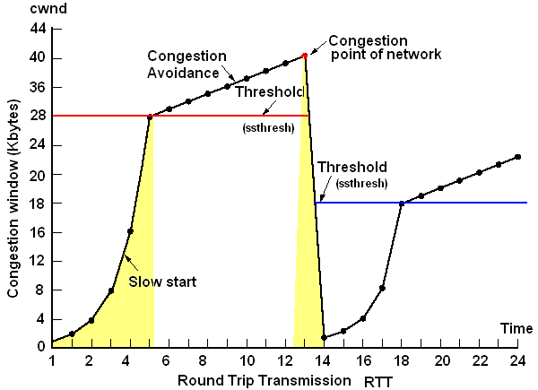

# 3회차(2026/09/10) - DB Connection Pooling과 Transaction

## 이번 수업의 핵심

이번 수업은 크게 두 부분으로 이어진다.

1. **Connection Pooling**: DB Connection을 어떻게 효율적으로 만들고 관리할 것인가?
2. **Transaction**: 빌린 Connection으로 실행하는 여러 SQL을 어떻게 하나의 작업으로 묶을 것인가?

수업의 앞부분은 **왜 실무에서 DB Connection Pool을 사용하는지** 이해하기 위한 흐름이다.

```text
Java 애플리케이션과 MySQL은 서로 다른 프로세스
→ Socket을 이용한 TCP 통신 필요
→ TCP 연결과 DB 인증에는 비용 발생
→ DriverManager로 매번 새 연결을 만들면 비용 반복
→ DataSource를 통해 Connection을 얻도록 추상화
→ HikariCP가 Connection들을 Pool로 관리
→ 연결을 재사용하고 최대 개수를 제한
→ Pool이 가득 차면 일정 시간만 기다리고 빠르게 실패
```

Connection Pooling의 목적은 두 가지다.

1. 생성 비용이 큰 DB Connection을 재사용한다.
2. DB가 감당할 수 있도록 동시 Connection 수를 제한한다.

후반부는 Pool에서 빌린 Connection 위에서 Transaction이 어떻게 동작하는지 배운다.

```text
HikariCP에서 Connection 대여
→ Transaction 시작
→ 같은 Connection으로 여러 SQL 실행
→ 성공하면 COMMIT, 실패하면 ROLLBACK
→ Connection을 Pool에 반납
```

---

## 1. 애플리케이션과 데이터베이스 통신

Java 애플리케이션과 MySQL은 서로 다른 프로세스다. 같은 컴퓨터에서 실행되더라도 각자 독립된 메모리 공간을 사용하기 때문에 통신 수단이 필요하다.

### IPC

IPC(Inter-Process Communication)는 **서로 다른 프로세스가 데이터를 주고받는 방법**이다.

대표적인 IPC 방식은 Socket, Pipe, Shared Memory, Message Queue 등이 있다. Java 서버와 원격 MySQL 서버는 일반적으로 Socket을 이용해 통신한다.

### TCP와 Socket

TCP는 데이터를 순서대로 전달하고, 손실을 감지하면 재전송하는 전송 계층 프로토콜이다.

Socket은 프로그램이 네트워크 데이터를 읽고 쓰는 통신 끝점이다.

TCP는 바이트를 전달한다. 인증 요청, SQL 실행 요청, 조회 결과 같은 데이터의 의미와 형식은 MySQL 프로토콜이 정하고, MySQL JDBC Driver가 이를 처리한다.

---

## 2. 새로운 TCP 연결의 비용

### TCP 3-way handshake

TCP는 데이터를 보내기 전에 연결을 맺는다.

```text
Client → Server: SYN
Client ← Server: SYN + ACK
Client → Server: ACK
```

이 과정에서 네트워크 왕복 시간이 필요하다. RTT(Round Trip Time)는 요청을 보낸 뒤 응답이 돌아오기까지 걸리는 시간이다.

DB 작업마다 새로운 Connection을 만들면 이 연결 과정도 반복된다.

### TCP Slow Start

TCP 연결이 생겼다고 처음부터 많은 데이터를 한꺼번에 보내지는 않는다. 새 연결은 네트워크가 감당할 수 있는 전송량을 모르기 때문이다.



TCP는 처음에 적은 데이터를 보내고, ACK가 정상적으로 돌아오면 Congestion Window(cwnd)를 빠르게 늘린다.

```text
적은 데이터 전송
→ ACK 정상 수신
→ cwnd 증가
→ 더 많은 데이터를 동시에 전송
```

cwnd는 ACK를 기다리는 동안 네트워크에 내보낼 수 있는 데이터 양의 한도다. 임계값에 도달하면 증가 속도를 낮추고 Congestion Avoidance 단계로 들어간다. 손실이나 혼잡을 감지하면 전송량을 다시 줄인다.

Slow Start는 Connection을 재사용하는 이유 중 하나지만, 짧은 DB 요청에서는 영향이 작을 수도 있다. Connection Pooling의 더 직접적인 이유는 TCP 연결, DB 인증, 세션 초기화 비용을 줄이고 DB Connection 수를 제한하는 것이다.

---

## 3. JDBC Driver와 DriverManager

JDBC(Java Database Connectivity)는 Java에서 관계형 데이터베이스를 사용하기 위한 표준 API다.

Java는 공통 인터페이스를 제공하고, 각 DB의 Driver가 그 인터페이스를 구현한다.

| 구성요소          | 종류              | 역할                               |
| ----------------- | ----------------- | ---------------------------------- |
| `Driver`          | Java의 인터페이스 | DB Driver가 구현할 연결 규칙       |
| `Connection`      | Java의 인터페이스 | 연결된 DB 세션을 사용하는 API      |
| `DriverManager`   | Java의 클래스     | URL에 맞는 Driver를 찾아 연결 요청 |
| MySQL Connector/J | MySQL JDBC Driver | JDBC를 구현하고 MySQL과 실제 통신  |

따라서 **DriverManager는 인터페이스가 아니라 클래스**다. 강사님의 설명에서 interface는 `Driver`, `Connection`, 뒤에서 나오는 `DataSource` 같은 JDBC 표준 인터페이스를 의미한다.

### DriverManager로 연결하기

```java
Connection connection = DriverManager.getConnection(
    "jdbc:mysql://localhost:3305/lesson",
    "root",
    "password"
);
```

실행 흐름은 다음과 같다.

```text
DriverManager.getConnection() 호출
→ jdbc:mysql URL을 처리할 수 있는 MySQL Driver 선택
→ TCP 연결
→ MySQL 인증과 세션 초기화
→ Connection 구현 객체 반환
```

`localhost`는 현재 컴퓨터, `3305`는 수업용 MySQL 포트, `lesson`은 사용할 데이터베이스 이름이다. 일반적인 MySQL 기본 포트는 3306이지만 수업 환경은 3305를 사용한다.

DriverManager를 직접 호출하면 보통 호출할 때마다 새로운 물리 Connection을 만든다. 사용 후 `close()`하면 연결을 종료한다. 이를 요청마다 반복하면 연결 생성 비용이 계속 발생한다.

직접 Pooling 로직을 만들 수도 있지만 연결 상태 검사, 동시성 제어, 반납, 누수 감지, timeout, 오래된 연결 교체까지 처리해야 한다. 실무에서는 직접 구현하지 않고 검증된 Connection Pool 라이브러리를 사용한다.

---

## 4. DataSource

`DataSource`는 **DB Connection을 얻는 방법을 추상화한 Java 표준 인터페이스**다.

```java
Connection connection = dataSource.getConnection();
```

애플리케이션은 Connection이 매번 새로 만들어지는지, Pool에서 대여되는지 알 필요 없이 DataSource에 요청한다.

```text
애플리케이션 → DataSource.getConnection() → Connection 반환
```

DataSource 자체가 Connection Pool인 것은 아니다. 구현체에 따라 새 Connection을 만들 수도 있고, 기존 Connection을 Pool에서 빌려줄 수도 있다.

DataSource를 사용하면 애플리케이션 코드와 Connection 생성 방식을 분리할 수 있다. 나중에 구현체나 설정이 바뀌어도 사용하는 코드는 대부분 그대로 유지된다.

---

## 5. Connection Pooling과 HikariCP

Pooling은 **생성 비용이 큰 자원을 일정 범위 안에서 관리하면서 빌려주고, 사용이 끝나면 돌려받아 재사용하는 방식**이다.

Connection Pool은 DB Connection을 관리한다.

```text
요청
→ Pool에서 Connection 대여
→ SQL 실행
→ Connection 반납
→ 다음 요청이 재사용
```

“미리 여러 개를 만든다”는 표현은 개념적으로 맞지만, 실제 Pool은 설정과 사용량에 따라 Connection을 생성하고 보충하며 교체한다.

HikariCP는 대표적인 JDBC Connection Pool 라이브러리다. `HikariDataSource`가 `DataSource` 인터페이스를 구현한다.

```text
DataSource 인터페이스
        ↑
HikariDataSource 구현체
        ↑
HikariCP가 Connection Pool 관리
```

Spring Boot에서 JDBC 또는 JPA를 사용하면 일반적으로 HikariCP가 기본 Connection Pool로 선택된다.

HikariCP에서 받은 Connection의 `close()`는 일반적으로 실제 TCP 연결 종료가 아니라 **Pool 반납**을 의미한다. HikariCP는 실제 Connection을 감싼 객체를 반환하고 close 호출을 가로챈다. 손상되었거나 수명이 끝난 연결은 Pool이 폐기하고 새 연결로 교체할 수 있다.

---

## 6. Connection Pooling이 필요한 이유

### 1. TCP 3-way handshake 비용 절약

새 Connection마다 TCP 연결 수립을 반복해야 한다. 기존 Connection을 재사용하면 이 과정을 매 요청마다 수행하지 않아도 된다.

### 2. TCP Slow Start 반복 감소

새 TCP 연결은 네트워크 전송 가능량을 보수적으로 탐색한다. 연결을 재사용하면 이미 형성된 연결 상태를 활용할 수 있다.

다만 오랫동안 사용하지 않은 연결은 다시 보수적으로 전송할 수 있고, 짧은 SQL에서는 Slow Start의 영향이 작을 수 있다. 따라서 보조적인 이유로 이해한다.

### 3. DB 인증과 세션 초기화 비용 절약

TCP 연결 후에도 MySQL은 사용자 인증과 DB 세션 준비를 수행한다. 문자 집합, 시간대, autocommit 등 세션 설정도 연결과 관련된다.

Connection을 재사용하면 이러한 초기화 작업을 요청마다 반복하지 않는다.

### 4. 데이터베이스 과부하 방지

Connection을 무제한으로 만들면 DB도 무제한으로 처리할 수 있는 것은 아니다.

일반적인 MySQL 구성에서는 Connection마다 처리를 담당할 스레드와 메모리 같은 자원이 필요하다. Connection이 지나치게 많으면 다음 문제가 생길 수 있다.

- Connection별 메모리 사용량 증가
- 실행할 스레드 증가
- CPU가 여러 스레드를 번갈아 실행하는 Context Switching 증가
- 동시에 실행되는 Query와 Lock 경합 증가
- 오히려 전체 처리량과 응답 속도 저하

Connection Pool의 최대 크기는 DB로 동시에 들어갈 수 있는 작업의 입구를 제한한다.

```text
요청 100개
→ Pool 최대 크기 10
→ 최대 10개 Connection 사용
→ 나머지는 짧게 대기하거나 timeout
```

Pool 크기가 크다고 항상 빠른 것은 아니다. 애플리케이션 인스턴스가 여러 개라면 각 인스턴스의 Pool 크기가 합산되어 DB에 연결된다.

---

## 7. Timeout과 Fail Fast

Pool의 Connection이 모두 사용 중이면 새로운 요청은 Connection이 반납되기를 기다린다.

기다리는 시간을 제한하지 않거나 너무 길게 잡으면 다음 문제가 생길 수 있다.

```text
DB 지연
→ Connection 반납 지연
→ 대기 요청 증가
→ 애플리케이션 스레드 적체
→ 메모리와 Queue 사용 증가
→ 다른 정상 요청까지 지연
→ 장애 확산
```

Fail Fast는 **성공 가능성이 낮거나 허용 시간을 넘긴 작업을 계속 붙잡아 두지 않고, 정해진 시간 안에 실패시켜 자원을 반환하는 운영 방식**이다.

```text
Connection 즉시 획득
→ 정상 처리

일정 시간 안에 획득 실패
→ timeout 예외
→ 요청 종료 및 자원 반환
```

빠르게 실패한다는 것은 timeout을 무조건 아주 짧게 설정한다는 뜻이 아니다. 정상적인 느린 요청까지 실패시키지 않으면서, 장애 시 시스템 전체가 기다림에 잠기지 않을 값을 정해야 한다.

### timeout은 대상이 다르다

| 설정                    | 제한하는 시간                       |
| ----------------------- | ----------------------------------- |
| Pool connection timeout | Pool에서 Connection을 기다리는 시간 |
| DB connect timeout      | 새로운 물리 DB 연결을 만드는 시간   |
| Query timeout           | SQL 실행을 기다리는 시간            |
| Socket/read timeout     | DB 응답 데이터를 기다리는 시간      |

HikariCP의 `connectionTimeout`은 **Pool에서 Connection을 얻기 위해 기다리는 최대 시간**이다. Query 실행 시간 제한과는 다르다.

Spring Boot 설정 예시는 다음과 같다.

```properties
spring.datasource.hikari.maximum-pool-size=10
spring.datasource.hikari.connection-timeout=3000
```

위 숫자는 개념 예시다. 운영값은 트래픽, DB 처리량, API 응답 목표와 측정 결과를 바탕으로 결정한다.

---

## 8. p95, p99, p99.9와 timeout

수업에서 들은 `c95`, `c99`, `c999`가 응답 시간 문맥이었다면, 일반적으로 사용하는 용어는 **p95, p99, p99.9**다. `p`는 Percentile, 즉 백분위를 의미한다. `p999`라고 줄여 쓰면서 p99.9를 뜻하는 경우도 있다.

응답 시간을 짧은 순서대로 정렬했을 때 의미는 다음과 같다.

| 지표  | 의미                               |
| ----- | ---------------------------------- |
| p50   | 요청의 50%가 이 시간 이하에 완료   |
| p95   | 요청의 95%가 이 시간 이하에 완료   |
| p99   | 요청의 99%가 이 시간 이하에 완료   |
| p99.9 | 요청의 99.9%가 이 시간 이하에 완료 |

요청이 10,000개라면 p99는 약 9,900개가 해당 시간 이하에 끝났고, 나머지 약 100개는 더 느렸다는 뜻이다.

평균만 보면 일부 매우 느린 요청이 잘 드러나지 않을 수 있다. p95, p99 같은 높은 백분위는 사용자가 겪는 느린 구간인 Tail Latency를 확인하는 데 도움이 된다.

### 백분위와 timeout의 관계

백분위는 **현재 시스템에서 실제로 얼마나 걸렸는지 측정한 값**이고, timeout은 **얼마나 기다린 뒤 포기할지 정한 정책**이다.

```text
정상 상태의 p95, p99 확인
+ API가 지켜야 할 전체 응답 시간
+ 재시도에 필요한 시간
+ 장애 시 감당할 수 있는 대기량
→ timeout 결정
```

예를 들어 정상적인 Connection 획득 시간이 매우 짧은데 장애 상황에서만 수십 초씩 기다린다면, 긴 timeout은 성공률보다 대기 요청과 스레드 적체를 키울 수 있다.

그렇다고 timeout을 p99와 똑같이 설정하는 것은 아니다. 순간적인 지연과 측정 오차를 위한 여유가 필요하고, 서비스가 허용할 수 있는 전체 시간도 함께 고려해야 한다.

운영에서는 다음 지표를 같이 본다.

- Connection 획득 시간의 p95, p99
- 사용 중인 Connection 수
- 대기 중인 요청 수
- Connection timeout 횟수
- Query 실행 시간
- API 전체 응답 시간과 오류율

---

## 9. Connection Pooling 전체 흐름

```text
[DriverManager 직접 사용]

요청
→ 새로운 DB Connection 생성
→ TCP 3-way handshake
→ MySQL 인증과 세션 초기화
→ SQL 실행
→ Connection 종료
→ 다음 요청에서 전체 과정 반복
```

```text
[DataSource + HikariCP 사용]

애플리케이션 시작 및 실행
→ HikariCP가 설정 범위 안에서 Connection 생성·관리

요청
→ DataSource.getConnection()
→ Pool에서 Connection 대여
→ SQL 실행
→ close()로 Pool에 반납

Pool이 모두 사용 중
→ connectionTimeout 동안 대기
→ 시간 안에 획득하면 처리
→ 시간 초과 시 빠르게 실패
```

## Connection Pooling 핵심 정리

- Java 애플리케이션과 MySQL은 일반적으로 TCP Socket으로 통신한다.
- DriverManager는 JDBC URL에 맞는 Driver를 찾아 새로운 Connection을 얻는 기본 클래스다.
- DriverManager를 직접 반복 호출하면 Connection Pooling을 제공하지 않는다.
- DataSource는 Connection을 얻는 방법을 추상화한 인터페이스다.
- HikariCP는 DataSource를 구현한 대표적인 Connection Pool 라이브러리다.
- Pooling은 연결 생성 비용을 줄이고 DB Connection 수를 제한한다.
- timeout은 장애 상황에서 요청과 스레드가 계속 쌓이지 않도록 경계를 만든다.
- Fail Fast는 무조건 짧게 기다리는 것이 아니라, 허용 시간을 넘긴 작업을 끝내 장애 확산을 막는 방식이다.
- p95, p99, p99.9는 평균에 가려진 느린 요청을 확인하고 timeout을 판단하는 자료다.

---

## 10. Transaction

Transaction은 여러 DB 작업을 하나의 논리적인 작업 단위로 묶는 것이다.
핵심은 All or Nothing, 즉 전부 성공하거나 전부 실패하는 것이다.

이것을 포함해 트랜잭션의 네 가지 성질을 ACID라고 부른다.

| 성질                | 의미                                                       |
| ------------------- | ---------------------------------------------------------- |
| Atomicity(원자성)   | 전부 반영되거나 전부 취소된다. All or Nothing              |
| Consistency(일관성) | 트랜잭션 전후에 DB 제약조건과 데이터 규칙을 만족해야 한다  |
| Isolation(격리성)   | 동시에 실행되는 트랜잭션이 서로에게 미치는 영향을 통제한다 |
| Durability(지속성)  | COMMIT된 결과는 장애가 발생해도 보존된다                   |

격리성은 다른 트랜잭션의 모든 동작을 무조건 숨긴다는 뜻은 아니다. 어떤 변경까지 보이는지는 뒤에서 배울 Isolation Level에 따라 달라진다. 일관성도 트랜잭션이 업무 규칙을 자동으로 알아서 지킨다는 뜻은 아니므로 애플리케이션 검증과 DB 제약조건이 함께 필요하다.

### COMMIT과 ROLLBACK

#### COMMIT

COMMIT은 Transaction에서 실행한 변경 사항을 최종 확정하는 명령이다.

#### ROLLBACK

ROLLBACK은 현재 Transaction에서 실행한 변경 사항을 취소하고 Transaction 시작 전 상태로 되돌리는 명령이다.

Transaction은 Connection, 즉 DB 세션에 속한다. 시작부터 COMMIT 또는 ROLLBACK까지 같은 Connection을 사용해야 한다. Connection A에서 시작한 Transaction을 Connection B에서 COMMIT할 수 없다.

### Transaction의 원리

```
임시 데이터에 반영
→ COMMIT하면 포인터 변경
→ ROLLBACK하면 임시 데이터 버림
```

트랜잭션은 변경 내용을 미확정 상태로 관리하다가, 모든 작업이 성공하면 COMMIT으로 확정하고 작업이 실패했다고 판단하면 ROLLBACK으로 취소한다.

이 설명은 Transaction을 이해하기 위한 개념적인 표현이다. MySQL InnoDB가 원본 데이터를 통째로 임시 공간에 복사한 뒤 포인터 하나만 바꾸는 것은 아니다. 실제로는 Transaction 상태와 MVCC, Undo Log, Redo Log 등을 이용한다.

- Undo Log: 변경 전 상태로 되돌리기 위한 정보를 보관한다. ROLLBACK과 이전 버전 조회에 사용된다.
- Redo Log: COMMIT된 변경을 장애 이후 복구하는 데 사용된다.

처음에는 **COMMIT은 변경 확정, ROLLBACK은 미확정 변경 취소**로 이해하고 내부 로그 구조는 이후에 깊게 학습한다.

### in MySQL

```
START TRANSACTION;      -- 또는 BEGIN
UPDATE account SET balance = balance - 10000 WHERE id = 'A';
UPDATE account SET balance = balance + 10000 WHERE id = 'B';
COMMIT;
```

문제가 있으면 `COMMIT` 대신 다음 명령을 실행한다.

```sql
ROLLBACK;
```

알아둘 것:

- MySQL은 기본이 `autocommit = ON`이다. SQL 한 문장이 완료될 때마다 하나의 트랜잭션으로 자동 COMMIT된다.
- `START TRANSACTION`을 실행하면 명시적 Transaction이 시작되고, COMMIT 또는 ROLLBACK할 때까지 여러 SQL을 묶을 수 있다. 세션의 `autocommit` 설정값 자체를 0으로 바꾸는 명령은 아니다.
- 트랜잭션은 스토리지 엔진 기능이다. InnoDB는 지원, 옛 MyISAM은 미지원.
- 트랜잭션은 커넥션(세션) 단위다. 커넥션 A에서 시작한 트랜잭션은 커넥션 B에서 commit할 수 없다. → JDBC와 Spring 절에서 이 사실이 핵심이 된다.

### Transaction in JDBC

JDBC에서는 `Connection`이 Transaction을 관리한다. 새로운 Connection은 기본적으로 auto-commit이 켜져 있으므로, 여러 SQL을 묶으려면 이를 끄고 직접 COMMIT 또는 ROLLBACK한다.

```java
try (Connection connection = dataSource.getConnection()) {
    connection.setAutoCommit(false);

    try {
        // 같은 connection으로 SQL 1 실행
        // 같은 connection으로 SQL 2 실행

        connection.commit();
    } catch (Exception e) {
        connection.rollback();
        throw e;
    }
}
```

```text
connection.setAutoCommit(false)
→ 자동 COMMIT 중지, 여러 SQL을 하나의 Transaction으로 관리

connection.commit()
→ 변경 확정

connection.rollback()
→ 현재 Transaction의 변경 취소

connection.close()
→ 직접 연결이면 종료, Connection Pool을 사용하면 일반적으로 Pool에 반납
```

여러 SQL을 하나의 Transaction으로 묶으려면 반드시 같은 Connection으로 실행해야 한다. JDBC로 직접 관리하면 원리는 잘 보이지만 Connection 전달, 예외 처리, COMMIT, ROLLBACK, 반납 코드가 반복된다. Spring은 이 반복을 줄여준다.

### in Spring — @Transactional

```java
@Service
public class TransferService {
    @Transactional
    public void transfer(String from, String to, int amount) {
        accountRepository.withdraw(from, amount);
        accountRepository.deposit(to, amount);
    }
}
```

- 시작 전: 일반적인 JDBC 기준으로 Connection을 획득하고 Transaction을 시작한다.
- 실행 중: 여러 Repository가 같은 Transaction의 Connection을 사용하도록 Spring이 관리한다.
- 정상 종료: COMMIT을 시도한다.
- ROLLBACK 대상 예외가 밖으로 전달됨: ROLLBACK한다.
- 마지막: Connection 상태를 정리하고 Pool에 반납한다.

Spring의 `@Transactional`은 기본적으로 Proxy와 Transaction Manager를 통해 동작한다.

```text
Controller
→ Transaction Proxy
→ Connection 획득 및 Transaction 시작
→ 실제 Service 메서드 실행
→ COMMIT 또는 ROLLBACK
→ Connection 반납
```

Transaction은 보통 하나의 비즈니스 작업을 표현하는 Service의 public 메서드에 선언한다. 위 예제에서는 출금과 입금이 하나의 이체 작업이므로 함께 묶는다.

#### 기본 ROLLBACK 규칙

“예외가 발생하면 무조건 ROLLBACK”으로 외우면 정확하지 않다. Spring의 기본 규칙은 다음과 같다.

- `RuntimeException` 또는 `Error`가 메서드 밖으로 전달되면 ROLLBACK한다.
- Checked Exception은 기본적으로 ROLLBACK 대상이 아니다.
- 메서드 내부에서 예외를 잡고 정상 반환하면 Spring이 실패를 알지 못해 COMMIT할 수 있다.
- Checked Exception도 ROLLBACK하려면 `@Transactional(rollbackFor = Exception.class)`처럼 규칙을 지정할 수 있다.

또한 기본 Proxy 방식에서는 같은 클래스 내부에서 `@Transactional` 메서드를 직접 호출하면 해당 메서드의 Transaction 설정이 적용되지 않을 수 있다. Spring이 관리하는 Bean을 통해 외부에서 호출되어야 Proxy를 통과한다.

---

## 11. Connection Pooling과 Transaction의 연결

Pooling과 Transaction은 서로 다른 문제를 해결하지만 실제 요청 처리에서는 연결된다.

```text
Connection Pooling
→ Connection을 효율적으로 대여하고 반납

Transaction
→ 대여한 같은 Connection에서 여러 SQL을 하나의 작업으로 관리
```

```text
요청 도착
→ HikariCP에서 Connection 대여
→ Transaction 시작
→ 같은 Connection으로 여러 SQL 실행
→ 성공하면 COMMIT, 실패하면 ROLLBACK
→ Connection을 Pool에 반납
```

Transaction이 길어지면 Connection을 오래 점유한다. 그러면 Pool의 사용 가능한 Connection이 줄고, 다른 요청의 대기와 timeout이 증가할 수 있다. 따라서 Transaction 범위는 하나의 비즈니스 작업에 맞게 짧고 명확하게 잡는다.

## 3회차 전체 흐름

```text
Java 애플리케이션과 MySQL은 TCP Socket으로 통신
→ DriverManager로 직접 연결하는 원리 학습
→ 연결 생성 비용과 DB 과부하 문제 확인
→ DataSource 인터페이스로 연결 획득 방식 추상화
→ HikariCP가 Connection Pooling 제공
→ timeout과 Fail Fast로 장애 확산 방지
→ Pool에서 빌린 Connection으로 Transaction 시작
→ 같은 Connection에서 여러 SQL 실행
→ COMMIT 또는 ROLLBACK
→ Connection을 Pool에 반납
```

## Transaction 핵심 정리

- Transaction은 여러 DB 작업을 하나의 성공 또는 실패 단위로 묶는다.
- COMMIT은 변경을 확정하고 ROLLBACK은 현재 Transaction의 변경을 취소한다.
- MySQL에서는 `START TRANSACTION`, `COMMIT`, `ROLLBACK`으로 직접 제어할 수 있다.
- JDBC에서는 같은 Connection에서 `setAutoCommit(false)`, `commit()`, `rollback()`을 사용한다.
- Spring에서는 `@Transactional`과 Transaction Manager가 반복되는 관리 코드를 대신 처리한다.
- Connection Pooling은 Connection을 제공하고, Transaction은 그 Connection에서 실행할 SQL의 작업 경계를 관리한다.

## 참고 자료

- [Java DriverManager](https://docs.oracle.com/en/java/javase/21/docs/api/java.sql/java/sql/DriverManager.html)
- [Java DataSource](https://docs.oracle.com/en/java/javase/21/docs/api/java.sql/javax/sql/DataSource.html)
- [Java Connection](https://docs.oracle.com/en/java/javase/21/docs/api/java.sql/java/sql/Connection.html)
- [HikariCP 공식 문서](https://github.com/brettwooldridge/HikariCP)
- [TCP Congestion Control - RFC 5681](https://www.rfc-editor.org/rfc/rfc5681.html)
- [MySQL Transaction 공식 문서](https://dev.mysql.com/doc/refman/8.4/en/innodb-autocommit-commit-rollback.html)
- [Spring `@Transactional` 공식 문서](https://docs.spring.io/spring-framework/reference/data-access/transaction/declarative/annotations.html)
- [JDBC Transaction 참고 자료](https://www.tutorialspoint.com/jdbc/jdbc-transactions.htm)
