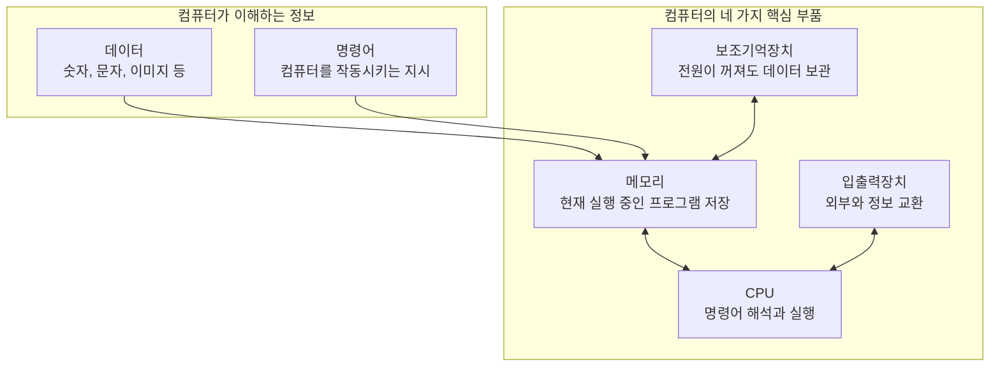
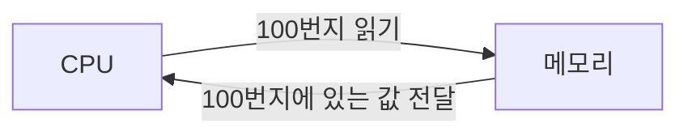
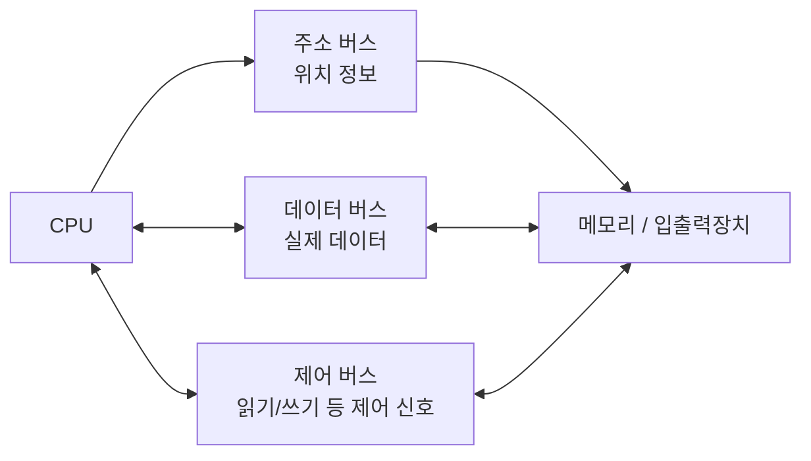
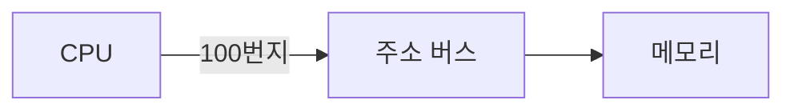
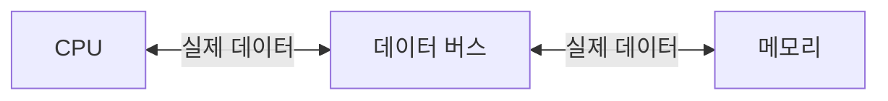
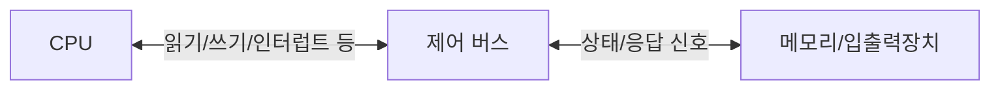
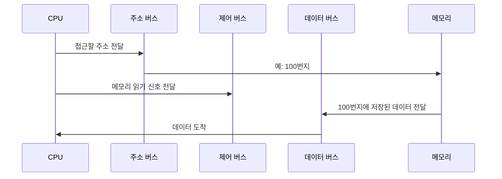
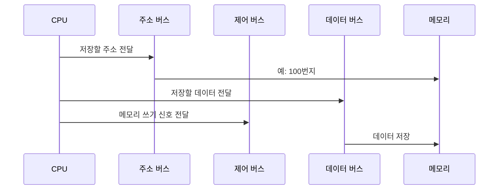

# 컴퓨터 구조의 큰 그림

## 이 장의 핵심 한 문장

컴퓨터 구조는 CPU, 메모리, 보조기억장치, 입출력장치가 어떻게 함께 움직이며 프로그램을 실행하는지 이해하는 공부입니다. 이걸 알면 서버가 느리거나 장애가 났을 때 "코드만" 보는 게 아니라 어떤 자원이 문제인지까지 추론할 수 있습니다.

## 내가 적은 핵심 요약

- 컴퓨터 구조는 실력 있는 개발자가 되려면 반드시 알아야 할 기본 지식이다.
- 컴퓨터 구조를 이해하면 문제 상황을 빠르게 진단할 수 있고, 문제 해결의 실마리를 다양하게 찾을 수 있다.
- 서버를 예로 들면 성능, 용량, 비용 등을 고려할 줄 알아야 한다.
- 컴퓨터 구조 지식은 크게 두 가지다.
  - 컴퓨터가 이해하는 정보
  - 컴퓨터의 네 가지 핵심 부품
- 컴퓨터가 이해하는 정보는 데이터와 명령어다.
- 컴퓨터의 네 가지 핵심 부품은 CPU, 메모리, 보조기억장치, 입출력장치다.
- 핵심 부품은 메인보드에 연결되고, 시스템 버스를 통해 정보를 주고받는다.

## 먼저 큰 그림부터 잡기

컴퓨터는 신기한 상자가 아니라, 역할이 나뉜 부품들이 약속된 방식으로 데이터를 주고받는 시스템입니다.



## 컴퓨터가 이해하는 정보

컴퓨터는 0과 1로 표현된 정보만 이해합니다. 이 정보는 크게 데이터와 명령어로 나눌 수 있습니다.

### 데이터

데이터는 컴퓨터가 다루는 값입니다. 숫자, 문자, 이미지, 동영상, 파일 내용, 네트워크 요청 본문 등이 모두 데이터가 될 수 있습니다.

백엔드 개발 관점에서는 아래가 전부 데이터입니다.

- 사용자가 보낸 JSON 요청
- DB에서 조회한 회원 정보
- 서버 로그 한 줄
- 업로드된 이미지 파일
- API 응답으로 내려가는 문자열

### 명령어

명령어는 컴퓨터를 실제로 움직이는 정보입니다. 데이터가 "대상"이라면 명령어는 "무엇을 하라"는 지시입니다.

예를 들면 이런 코드가 있다고 해봅시다.

```java
int result = 3 + 4;
```

사람은 이 코드를 보고 "3과 4를 더해서 result에 넣는구나"라고 이해합니다. 하지만 CPU는 Java 코드를 그대로 이해하지 못합니다. 결국 이 코드는 컴파일과 실행 과정을 거쳐 CPU가 처리할 수 있는 낮은 수준의 명령어들로 바뀌어야 합니다.

그래서 앞으로의 흐름은 이렇게 이어집니다.


## 컴퓨터의 네 가지 핵심 부품

### 1. 메모리

메모리는 현재 실행되는 프로그램의 명령어와 데이터를 저장하는 부품입니다.

여기서 "현재 실행되는"이 중요합니다. 프로그램이 실행되려면 보조기억장치에 있던 파일이 메모리로 올라와야 합니다.
CPU는 보조기억장치의 데이터를 직접 빠르게 처리하기 어렵기 때문에, 실행에 필요한 명령어와 데이터를 메모리에서 읽습니다.

메모리에는 주소라는 개념이 있습니다. 주소는 메모리 안에서 데이터가 어디에 있는지 찾기 위한 위치 정보입니다.



정리하면:

- 메모리는 실행 중인 프로그램을 담는다.
- 메모리는 명령어와 데이터를 저장한다.
- CPU는 주소를 이용해 메모리 위치를 찾아간다.
- 전원이 꺼지면 RAM에 있던 내용은 사라진다.

### 2. CPU

CPU는 메모리에 저장된 명령어를 읽고, 해석하고, 실행하는 부품입니다. 흔히 컴퓨터의 두뇌라고 부릅니다.

CPU 내부에서 특히 중요한 구성요소는 세 가지입니다.

| 구성요소 | 역할                           | 쉽게 말하면   |
| -------- | ------------------------------ | ------------- |
| ALU      | 산술 연산과 논리 연산 수행     | 계산기        |
| 레지스터 | CPU 내부의 작은 임시 저장 장치 | 초고속 메모장 |
| 제어장치 | 명령어 해석, 제어 신호 발생    | 지휘자        |

이 과정에서 프로그램 카운터는 다음에 실행할 명령어의 주소를 가리키고, 명령어 레지스터는 메모리에서 읽어 온 현재 명령어를 잠깐 보관합니다. 제어장치는 "무엇을 해야 하는지"를 해석하고, ALU는 실제 계산을 수행하고, 일반 레지스터는 계산에 필요한 값과 결과를 잠깐 보관합니다.

### 3. 보조기억장치

메모리는 빠르지만 약점이 있습니다.

- 가격이 비싸다.
- 저장 용량이 상대적으로 작다.
- 전원이 꺼지면 저장된 내용을 잃어버린다.

그래서 전원이 꺼져도 데이터를 보관하는 장치가 필요합니다. 이것이 보조기억장치입니다.

대표 예시는 다음과 같습니다.

- HDD
- SSD
- USB 메모리
- 외장하드

### 4. 입출력장치

입출력장치는 컴퓨터 외부와 정보를 교환하는 장치입니다.

예시는 다음과 같습니다.

- 키보드
- 마우스
- 모니터
- 마이크
- 스피커
- 프린터

## 메인보드와 시스템 버스

CPU, 메모리, 보조기억장치, 입출력장치는 따로따로 존재하는 것이 아니라 메인보드에 연결됩니다. 그리고 부품들은 버스를 통해 정보를 주고받습니다.

그중 핵심 부품을 연결하는 대표 통로가 시스템 버스입니다.



시스템 버스는 크게 세 가지로 나눠 이해하면 됩니다.

| 버스        | 이동하는 정보  | 예시                             |
| ----------- | -------------- | -------------------------------- |
| 주소 버스   | 읽거나 쓸 위치 | "100번지에 접근할게"             |
| 데이터 버스 | 실제 데이터    | "값 7을 보낼게"                  |
| 제어 버스   | 제어 신호      | "읽기 작업이야", "쓰기 작업이야" |

CPU가 메모리에서 값을 읽을 때는 주소 버스로 위치를 알리고, 제어 버스로 읽기 신호를 보내고, 데이터 버스로 실제 값을 전달받습니다.

### 시스템 버스를 조금 더 깊게 보기

시스템 버스는 CPU, 메모리, 입출력장치가 서로 정보를 주고받기 위해 사용하는 공통 통로입니다. 여기서 중요한 점은 "정보"라고 해서 전부 같은 종류가 아니라는 것입니다.

CPU가 메모리에서 데이터를 읽는 상황을 떠올려봅시다.

CPU는 메모리에게 이런 식으로 말해야 합니다.

1. 어디에 접근할지 알려줘야 합니다.
2. 읽을지 쓸지 알려줘야 합니다.
3. 실제 데이터를 주고받아야 합니다.

이 세 가지 역할이 섞이면 컴퓨터가 정보를 정확하게 해석하기 어렵습니다. 그래서 시스템 버스는 역할에 따라 주소 버스, 데이터 버스, 제어 버스로 나누어 이해합니다.

#### 1. 주소 버스

주소 버스는 CPU가 접근하려는 위치를 전달하는 통로입니다.

예를 들어 CPU가 메모리의 100번지에 있는 값을 읽고 싶다면, 주소 버스를 통해 "100번지"라는 위치 정보를 보냅니다.



주소 버스에서 오가는 것은 실제 데이터가 아닙니다. "어디를 볼 것인가"에 대한 정보입니다.

주소 버스의 특징은 다음과 같습니다.

- 보통 CPU에서 메모리나 입출력장치 방향으로 전달됩니다.
- 주소 버스의 폭이 넓을수록 더 많은 주소를 표현할 수 있습니다.
- 주소를 많이 표현할 수 있다는 것은 접근 가능한 메모리 공간이 커진다는 뜻입니다.

예를 들어 주소 버스가 8비트라면 표현 가능한 주소 개수는 `2^8 = 256`개입니다. 주소 버스가 32비트라면 `2^32`개의 주소를 표현할 수 있습니다.

정리하면 주소 버스는 "어디에 접근할 것인가"를 담당합니다.

#### 2. 데이터 버스

데이터 버스는 실제 데이터가 이동하는 통로입니다.

CPU가 메모리에서 값을 읽을 때는 메모리에서 CPU로 데이터가 이동합니다. 반대로 CPU가 메모리에 값을 저장할 때는 CPU에서 메모리로 데이터가 이동합니다.



그래서 데이터 버스는 보통 양방향으로 이해합니다.

데이터 버스의 특징은 다음과 같습니다.

- 실제 명령어와 데이터가 이동합니다.
- 읽기 작업에서는 메모리 또는 입출력장치에서 CPU로 데이터가 옵니다.
- 쓰기 작업에서는 CPU에서 메모리 또는 입출력장치로 데이터가 갑니다.
- 데이터 버스의 폭이 넓을수록 한 번에 더 많은 데이터를 주고받을 수 있습니다.

예를 들어 데이터 버스가 8비트라면 한 번에 1바이트를 주고받을 수 있고, 64비트라면 한 번에 8바이트를 주고받을 수 있습니다.

정리하면 데이터 버스는 "무엇을 주고받을 것인가"를 담당합니다.

#### 3. 제어 버스

제어 버스는 현재 작업이 어떤 작업인지 알려주는 제어 신호가 오가는 통로입니다.

주소 버스로 "100번지"를 보냈다고 해서 그것만으로는 부족합니다. CPU가 100번지의 값을 읽으려는 것인지, 100번지에 값을 쓰려는 것인지 구분해야 합니다. 이때 필요한 것이 제어 버스입니다.



제어 버스로 오가는 대표적인 신호는 다음과 같습니다.

| 제어 신호     | 의미                                             |
| ------------- | ------------------------------------------------ |
| 메모리 읽기   | 메모리에서 데이터를 읽겠다는 신호                |
| 메모리 쓰기   | 메모리에 데이터를 저장하겠다는 신호              |
| 입출력 읽기   | 입출력장치에서 데이터를 읽겠다는 신호            |
| 입출력 쓰기   | 입출력장치로 데이터를 보내겠다는 신호            |
| 인터럽트 요청 | 입출력장치 등이 CPU의 처리를 요청하는 신호       |
| 클럭 신호     | 부품들이 일정한 박자에 맞춰 동작하도록 돕는 신호 |

제어 버스는 주소 버스처럼 한 방향으로만 생각하면 안 됩니다. CPU가 제어 신호를 보내기도 하고, 입출력장치가 인터럽트 요청을 보내기도 합니다. 그래서 제어 버스는 여러 방향의 신호가 오가는 통로로 이해하는 편이 좋습니다.

정리하면 제어 버스는 "어떤 작업을 할 것인가"와 "지금 작업 상태가 어떤가"를 담당합니다.

### CPU가 메모리에서 데이터를 읽는 전체 흐름

세 버스를 함께 보면 흐름이 더 선명해집니다.



반대로 CPU가 메모리에 데이터를 쓸 때는 이런 흐름입니다.



이렇게 보면 시스템 버스의 세 종류는 각각 역할이 분명합니다.

| 질문                                   | 담당 버스   |
| -------------------------------------- | ----------- |
| 어디에 접근할 것인가?                  | 주소 버스   |
| 무엇을 주고받을 것인가?                | 데이터 버스 |
| 읽을 것인가, 쓸 것인가, 어떤 상태인가? | 제어 버스   |

초반에는 이 문장만 확실히 기억하면 됩니다.

> 주소 버스는 위치, 데이터 버스는 값, 제어 버스는 작업 종류와 상태를 전달한다.

## 백엔드 개발과 연결하기

컴퓨터 구조를 배우는 이유는 면접용 암기를 위해서만은 아닙니다. 서버가 실제로 움직이는 환경을 이해하기 위해서입니다.

예를 들어 API가 느리다고 해봅시다. 원인은 다양합니다.

| 의심 자원    | 가능한 원인                                      |
| ------------ | ------------------------------------------------ |
| CPU          | 계산이 많거나 요청 처리 스레드가 CPU를 많이 사용 |
| 메모리       | 메모리 부족, GC 증가, 캐시 과다 사용             |
| 보조기억장치 | DB 디스크 I/O, 로그 쓰기, 파일 읽기 지연         |
| 입출력       | 네트워크 지연, 외부 API 지연, DB 연결 대기       |

컴퓨터 구조를 알면 "서버가 느리다"를 더 구체적인 질문으로 바꿀 수 있습니다.

- CPU가 바쁜가?
- 메모리가 부족한가?
- 디스크 읽기/쓰기가 느린가?
- 네트워크나 외부 I/O를 기다리고 있는가?
- 비용을 더 쓰면 해결되는 문제인가, 구조를 바꿔야 하는 문제인가?

이 질문을 할 수 있게 되는 게 이 장의 진짜 목적입니다.

## 헷갈리기 쉬운 표현 정리

| 표현                              | 정확한 이해                                               |
| --------------------------------- | --------------------------------------------------------- |
| 컴퓨터는 0과 1만 이해한다         | 모든 정보가 최종적으로 이진 형태로 표현된다는 뜻          |
| CPU는 컴퓨터의 두뇌다             | 명령어를 읽고 해석하고 실행한다는 비유                    |
| 메모리는 프로그램을 저장한다      | 정확히는 현재 실행 중인 프로그램의 명령어와 데이터를 저장 |
| 보조기억장치는 내용을 읽지 않는다 | "잃지 않는다"가 정확한 표현. 전원이 꺼져도 보관한다는 뜻  |
| 버스는 통보다                     | "통로"가 정확한 표현. 부품 간 정보가 오가는 길            |

## 면접에서 말할 수 있는 문장

컴퓨터가 이해하는 정보는 데이터와 명령어로 나눌 수 있습니다. 데이터는 컴퓨터가 처리할 대상이고, 명령어는 컴퓨터를 실제로 작동시키는 지시입니다. CPU는 메모리에 저장된 명령어를 읽고 해석하고 실행하며, 메모리, 보조기억장치, 입출력장치는 시스템 버스를 통해 서로 정보를 주고받습니다.

## 복습 질문

1. 컴퓨터가 이해하는 정보는 왜 데이터와 명령어로 나눌 수 있을까?
2. 메모리와 보조기억장치는 어떤 차이가 있을까?
3. CPU 안의 ALU, 레지스터, 제어장치는 각각 어떤 역할을 할까?
4. 주소 버스, 데이터 버스, 제어 버스는 각각 어떤 정보를 전달할까?
5. API 서버가 느릴 때 컴퓨터 구조 관점에서 어떤 자원을 의심할 수 있을까?

## 다음 장과 연결

이번 장에서는 컴퓨터가 이해하는 정보가 데이터와 명령어라고 배웠습니다. 다음 장에서는 그중 데이터가 어떻게 0과 1로 표현되는지 배웁니다. 숫자, 문자, 이미지가 결국 어떻게 비트로 바뀌는지 이해하면 인코딩, 파일 처리, 네트워크 데이터 전송까지 훨씬 자연스럽게 이어집니다.
