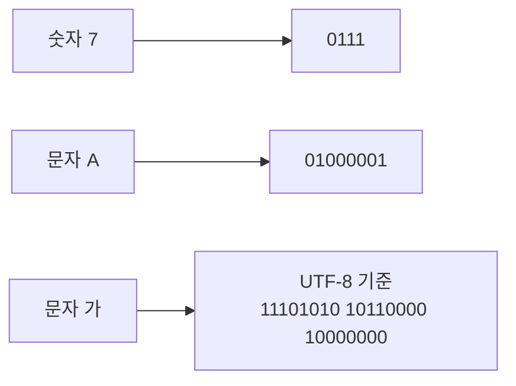
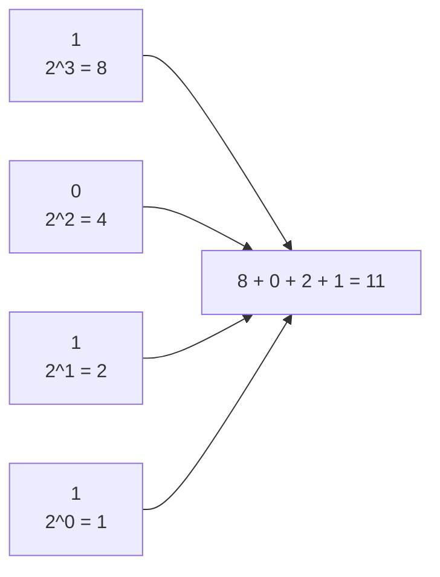
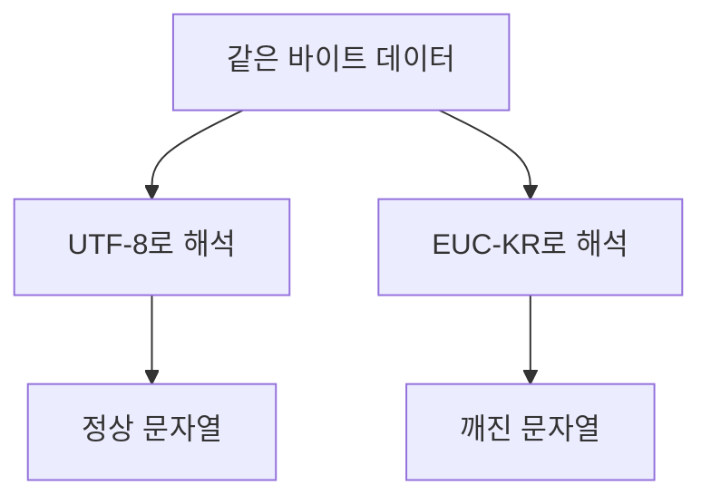

# 02. 데이터: 0과 1로 숫자와 문자를 표현하는 방법

이 장에서 잡아야 할 흐름은 두 가지입니다.

- 숫자는 `이진법`, `십육진법`, `2의 보수`로 이해한다.
- 문자는 `문자 집합`, `인코딩`, `디코딩`, `유니코드`, `UTF-8`로 이해한다.

---

# 0과 1로 숫자를 표현하는 방법

## 왜 0과 1인가?

컴퓨터는 전기 신호를 기반으로 동작합니다. 전기 신호는 세밀한 여러 상태로도 표현할 수 있지만, 실제 장치에서는 신호가 흔들릴 수 있습니다. 그래서 컴퓨터는 구분하기 쉬운 두 상태, 즉 `0`과 `1`을 기본 단위로 사용합니다.

쉽게 말하면 컴퓨터는 모든 데이터를 이렇게 바꿔서 다룹니다.



## 정보 단위

### 비트

비트(bit)는 0과 1을 나타내는 가장 작은 정보 단위입니다.

- 1비트는 `0` 또는 `1`, 총 2가지 정보를 표현할 수 있습니다.
- 2비트는 `00`, `01`, `10`, `11`, 총 4가지 정보를 표현할 수 있습니다.
- n비트는 `2^n`가지 정보를 표현할 수 있습니다.

| 비트 수 | 표현 가능한 경우의 수 |
| ------- | --------------------: |
| 1비트   |                 2가지 |
| 2비트   |                 4가지 |
| 3비트   |                 8가지 |
| 4비트   |                16가지 |
| 8비트   |               256가지 |

여기서 중요한 감각은 "비트가 1개 늘어날 때마다 표현 가능한 정보량이 2배가 된다"는 점입니다.

### 바이트

바이트(byte)는 8개의 비트를 묶은 단위입니다.

```text
1 byte = 8 bits
```

예를 들어 1바이트는 8비트이므로 `2^8 = 256`가지 값을 표현할 수 있습니다.

```text
00000000
00000001
00000010
...
11111111
```

### KB, MB, GB와 KiB, MiB, GiB

평소에는 `KB`, `MB`, `GB`라는 단위를 많이 씁니다.

| 단위 |        의미 |
| ---- | ----------: |
| 1 kB | 1,000 bytes |
| 1 MB |    1,000 kB |
| 1 GB |    1,000 MB |
| 1 TB |    1,000 GB |

하지만 컴퓨터 내부에서는 2의 거듭제곱 단위가 자주 쓰입니다. 이때는 `KiB`, `MiB`, `GiB`처럼 표기합니다.

| 단위  |        의미 |
| ----- | ----------: |
| 1 KiB | 1,024 bytes |
| 1 MiB |   1,024 KiB |
| 1 GiB |   1,024 MiB |
| 1 TiB |   1,024 GiB |

따라서 `1KB는 1024byte`라고 외우는 것은 엄밀히 말하면 부정확합니다. 정확히는 `1KiB = 1024 bytes`입니다.

## 이진법

이진법(binary)은 0과 1만으로 숫자를 표현하는 방법입니다. 우리가 일상에서 쓰는 십진법은 숫자가 9를 넘어가면 자리 올림을 하지만, 이진법은 숫자가 1을 넘어가면 자리 올림을 합니다.

| 십진수 | 이진수 |
| -----: | -----: |
|      0 |      0 |
|      1 |      1 |
|      2 |     10 |
|      3 |     11 |
|      4 |    100 |
|      5 |    101 |
|      6 |    110 |
|      7 |    111 |
|      8 |   1000 |

이진수와 십진수를 구분하기 위해 보통 아래처럼 표시합니다.

```text
1010(2)
0b1010
```

둘 다 "이 수는 이진수 1010입니다"라는 뜻입니다.

### 이진수를 십진수로 읽기

이진수 `1011(2)`를 십진수로 바꿔봅시다.

```text
1011(2)
= 1 * 2^3 + 0 * 2^2 + 1 * 2^1 + 1 * 2^0
= 8 + 0 + 2 + 1
= 11
```



## 이진수의 음수 표현

컴퓨터는 양수뿐 아니라 음수도 0과 1로 표현해야 합니다. 이때 가장 널리 쓰이는 방식이 `2의 보수(two's complement)`입니다.

2의 보수는 어렵게 생각하지 말고 이렇게 기억하면 됩니다.

```text
모든 0과 1을 뒤집고, 거기에 1을 더한다.
```

예를 들어 4비트에서 `5`는 `0101`입니다. `-5`를 표현하려면 `0101`의 2의 보수를 구합니다.

```text
  0101
  1010  모든 비트를 뒤집기
+ 0001  1 더하기
------
  1011
```

따라서 4비트 2의 보수 표현에서 `1011`은 `-5`로 해석될 수 있습니다.

### 왜 2의 보수를 사용할까?

2의 보수를 사용하면 덧셈 회로만으로 뺄셈을 처리할 수 있습니다.

예를 들어 `7 - 5`는 컴퓨터 입장에서는 `7 + (-5)`로 계산할 수 있습니다.

```text
  0111   7
+ 1011  -5
------
1 0010
```

4비트만 사용한다고 보면 앞의 넘친 `1`은 버리고, 결과는 `0010`입니다. 즉 십진수 `2`가 됩니다.

### 같은 비트라도 해석이 달라질 수 있다

여기서 중요한 질문이 생깁니다.

```text
0101
```

이 값은 양수 `5`일까요, 아니면 다른 의미일까요?

비트 자체만 보면 알 수 없습니다. 같은 `0101`이라도 어떤 규칙으로 해석하느냐에 따라 의미가 달라집니다.

- 부호 없는 정수로 보면 `5`
- 문자 인코딩 일부로 보면 특정 문자 코드의 일부
- 색상 데이터로 보면 색상 값의 일부
- 기계어 명령어 일부로 보면 명령어의 일부

컴퓨터 내부에서는 CPU 상태 레지스터의 플래그(flag), 자료형, 명령어, 프로그램의 해석 규칙이 이 비트들을 어떤 의미로 읽을지 결정합니다.

## 십육진법

이진법은 컴퓨터가 이해하기에는 좋지만 사람이 보기에는 너무 길어집니다.

```text
1111111111111111
```

이런 값을 매번 이진수로 읽으면 실수하기 쉽습니다. 그래서 개발자는 이진수와 잘 맞으면서도 더 짧은 `십육진법(hexadecimal)`을 자주 사용합니다.

십육진법은 숫자가 15를 넘어가는 시점에 자리 올림을 하는 표현 방식입니다.

| 십진수 | 십육진수 |
| -----: | -------: |
|      0 |        0 |
|      1 |        1 |
|      2 |        2 |
|      3 |        3 |
|      4 |        4 |
|      5 |        5 |
|      6 |        6 |
|      7 |        7 |
|      8 |        8 |
|      9 |        9 |
|     10 |        A |
|     11 |        B |
|     12 |        C |
|     13 |        D |
|     14 |        E |
|     15 |        F |
|     16 |       10 |

십육진수는 보통 아래처럼 표시합니다.

```text
1A2B(16)
0x1A2B
```

### 십육진수를 이진수로 변환하기

예를 들어 `1A2B(16)`을 이진수로 바꿔봅시다.

```text
1    A    2    B
0001 1010 0010 1011
```

따라서 결과는 다음과 같습니다.

```text
1A2B(16) = 0001101000101011(2)
```

### 이진수를 십육진수로 변환하기

이진수는 오른쪽부터 4비트씩 끊어서 십육진수로 바꿉니다.

```text
11010101(2)

1101 0101
  D    5

= D5(16)
```

개발할 때 십육진수는 메모리 주소, 색상 코드, 바이너리 데이터, 해시 값, 디버깅 로그 등에서 자주 만납니다.

```text
#FFFFFF
0x7ffeefbff5a8
E3 85 87 ED 95 9C
```

---

# 0과 1로 문자를 표현하는 방법

숫자는 진법으로 표현할 수 있습니다. 그렇다면 문자는 어떻게 표현할까요?

문자도 결국 숫자로 바꾸고, 그 숫자를 다시 0과 1로 저장합니다. 이 과정을 이해하려면 세 단어를 먼저 알아야 합니다.

- 문자 집합
- 인코딩
- 디코딩

## 문자 집합, 인코딩, 디코딩

정리하면 다음과 같습니다.

| 용어      | 의미                      | 방향                            |
| --------- | ------------------------- | ------------------------------- |
| 문자 집합 | 표현 가능한 문자들의 모음 | 어떤 문자를 다룰 수 있는지 결정 |
| 인코딩    | 문자에서 0과 1로 변환     | 사람 -> 컴퓨터                  |
| 디코딩    | 0과 1에서 문자로 변환     | 컴퓨터 -> 사람                  |

## 아스키 코드

아스키(ASCII)는 초창기 대표적인 문자 집합입니다. 영어 알파벳, 아라비아 숫자, 일부 특수 문자와 제어 문자를 포함합니다.

ASCII는 7비트로 하나의 문자를 표현합니다.

```text
2^7 = 128
```

즉 ASCII는 총 128개의 문자를 표현할 수 있습니다.

| 문자  | 십진수 코드 |   이진수 |
| ----- | ----------: | -------: |
| A     |          65 | 01000001 |
| B     |          66 | 01000010 |
| a     |          97 | 01100001 |
| 0     |          48 | 00110000 |
| Space |          32 | 00100000 |

여기서 `A`와 `a`가 다른 코드라는 점도 중요합니다. 컴퓨터 입장에서 대문자 A와 소문자 a는 완전히 다른 숫자입니다.

### ASCII의 한계

ASCII는 영어 중심의 문자 집합입니다. 그래서 한글, 한자, 일본어, 이모지 같은 문자는 표현할 수 없습니다.

이 한계 때문에 영어권이 아닌 나라들은 각자의 언어를 표현하기 위한 문자 집합과 인코딩 방식을 만들었습니다. 한국어 환경에서 사용된 대표적인 방식 중 하나가 `EUC-KR`입니다.

## 한글 인코딩과 EUC-KR

한글은 영어 알파벳보다 표현 방식이 복잡합니다. 한글 한 글자는 초성, 중성, 종성이 조합되어 만들어집니다.

```text
강 = ㄱ + ㅏ + ㅇ
민 = ㅁ + ㅣ + ㄴ
철 = ㅊ + ㅓ + ㄹ
```

한글 인코딩 방식은 크게 두 관점으로 이해할 수 있습니다.

| 방식   | 설명                             | 예시 감각                         |
| ------ | -------------------------------- | --------------------------------- |
| 완성형 | 완성된 글자마다 코드를 부여      | `가`, `각`, `간` 각각에 코드 부여 |
| 조합형 | 초성, 중성, 종성의 조합으로 표현 | `ㄱ + ㅏ + ㄴ`처럼 조합           |

EUC-KR은 완성형 인코딩 방식입니다. 많이 쓰이는 한글 음절에 코드를 부여해서 표현합니다.

### EUC-KR의 한계

EUC-KR은 모든 한글 조합을 표현하지 못한다는 한계가 있습니다. 또한 언어권마다 서로 다른 인코딩을 사용하면 다국어 프로그램을 만들 때 문제가 복잡해집니다.

예를 들어 같은 바이트열이라도 어떤 인코딩으로 디코딩하느냐에 따라 전혀 다른 문자로 보일 수 있습니다. 우리가 가끔 보는 `문자 깨짐`은 대개 이 지점에서 발생합니다.



## 유니코드와 UTF-8

나라별로 문자 집합과 인코딩 방식이 제각각이면 프로그램이 복잡해집니다. 그래서 전 세계 문자를 통일된 방식으로 다루기 위한 표준이 필요했습니다. 그 결과 등장한 것이 `유니코드(Unicode)`입니다.

유니코드는 전 세계 문자를 하나의 문자 집합 안에서 다루려는 표준입니다. 각 문자에는 고유한 코드 포인트(code point)가 부여됩니다.

예를 들면 다음과 같습니다.

| 문자 | 유니코드 코드 포인트 |
| ---- | -------------------- |
| A    | U+0041               |
| 가   | U+AC00               |
| 한   | U+D55C               |

하지만 유니코드 코드 포인트 자체가 곧바로 저장 방식은 아닙니다. 유니코드 문자를 실제 바이트로 저장하는 방식이 필요합니다. 그 대표적인 방식이 `UTF-8`입니다.


### UTF-8

UTF는 Unicode Transformation Format의 약자입니다. UTF-8은 유니코드 문자를 1바이트부터 4바이트까지 가변 길이로 인코딩합니다.

| 문자 종류              | UTF-8에서 주로 사용하는 크기 |
| ---------------------- | ---------------------------: |
| 영어 알파벳, 숫자      |                      1바이트 |
| 일부 유럽 문자 등      |                      2바이트 |
| 한글                   |                      3바이트 |
| 일부 이모지, 보조 문자 |                      4바이트 |

예를 들어 UTF-8에서 영문자 `A`는 1바이트로 표현됩니다.

```text
A
= U+0041
= 0x41
= 01000001
```

한글 `한`은 3바이트로 표현됩니다.

```text
한
= U+D55C
= ED 95 9C
= 11101101 10010101 10011100
```

여기서 기억할 점은 "한글은 무조건 2바이트"가 아니라는 것입니다. UTF-8 기준으로 한글은 보통 3바이트입니다.

# 헷갈리기 쉬운 포인트

## 1. 문자 집합과 인코딩은 같은 말일까?

정확히는 다릅니다.

- 문자 집합은 어떤 문자들을 다룰 수 있는지에 대한 목록입니다.
- 인코딩은 그 문자를 어떤 바이트로 바꿀지에 대한 규칙입니다.

다만 현실에서는 둘이 묶여서 이야기되는 경우가 많습니다. 예를 들어 ASCII는 문자 집합이면서 인코딩 방식처럼 설명되기도 합니다.

## 2. 유니코드와 UTF-8은 같은 말일까?

같은 말이 아닙니다.

- 유니코드는 전 세계 문자를 모아 코드 포인트를 부여한 표준입니다.
- UTF-8은 유니코드 문자를 실제 바이트로 저장하는 인코딩 방식입니다.

비유하면 유니코드는 "문자 번호표 체계"이고, UTF-8은 "그 번호표를 파일이나 네트워크에 저장하는 방식"입니다.

## 3. 한글은 몇 바이트일까?

정답은 "인코딩 방식에 따라 다르다"입니다.

- EUC-KR에서는 한글이 보통 2바이트입니다.
- UTF-8에서는 한글이 보통 3바이트입니다.

요즘 웹과 서버 환경에서는 UTF-8을 기본으로 많이 사용하므로, 한글은 UTF-8 기준 3바이트라고 기억해두면 실무 감각에 도움이 됩니다.

## 4. `-5`와 `5`는 비트만 보고 구분할 수 있을까?

비트만 보고는 항상 구분할 수 없습니다. 같은 비트열도 자료형과 해석 규칙에 따라 다르게 읽힙니다.

예를 들어 4비트에서 `1011`은 다음처럼 해석될 수 있습니다.

| 해석 방식               | 의미 |
| ----------------------- | ---: |
| 부호 없는 정수          |   11 |
| 2의 보수 signed integer |   -5 |

그래서 컴퓨터에서는 "비트열" 자체보다 "그 비트열을 어떤 규칙으로 해석하는가"가 중요합니다.

---

# 최종 요약

## 숫자 표현

- 컴퓨터는 모든 정보를 0과 1로 표현한다.
- 가장 작은 정보 단위는 비트이고, 8비트는 1바이트다.
- n비트는 `2^n`가지 정보를 표현할 수 있다.
- 이진법은 0과 1만으로 숫자를 표현한다.
- 음수는 주로 2의 보수 방식으로 표현한다.
- 십육진법은 긴 이진수를 사람이 읽기 쉽게 표현하는 방식이다.
- 십육진수 한 자리는 이진수 4비트와 정확히 대응된다.

## 문자 표현

- 문자 집합은 컴퓨터가 표현할 수 있는 문자들의 모음이다.
- 인코딩은 문자를 0과 1로 바꾸는 과정이다.
- 디코딩은 0과 1을 문자로 되돌리는 과정이다.
- ASCII는 영어 알파벳, 숫자, 일부 특수 문자를 7비트로 표현한다.
- EUC-KR은 한글을 표현하기 위해 사용된 완성형 인코딩 방식이다.
- 유니코드는 전 세계 문자를 통일해서 다루기 위한 표준이다.
- UTF-8은 유니코드 문자를 1~4바이트로 저장하는 대표적인 인코딩 방식이다.
- 문자 깨짐은 저장할 때의 인코딩과 읽을 때의 디코딩 규칙이 맞지 않을 때 자주 발생한다.

---

# 복습 질문

1. 1바이트는 몇 비트인가?
2. n비트로 표현할 수 있는 정보의 개수는 몇 개인가?
3. `1011(2)`을 십진수로 바꾸면 얼마인가?
4. 2의 보수를 구하는 가장 쉬운 절차는 무엇인가?
5. 십육진수 한 자리는 이진수 몇 비트와 대응되는가?
6. 문자 집합, 인코딩, 디코딩의 차이는 무엇인가?
7. ASCII가 한글을 표현할 수 없는 이유는 무엇인가?
8. EUC-KR의 한계는 무엇인가?
9. 유니코드와 UTF-8은 어떤 차이가 있는가?
10. UTF-8에서 한글은 보통 몇 바이트로 표현되는가?

# 내 말로 다시 설명하기

아래 문장을 직접 채워보면 이 장을 제대로 이해했는지 확인할 수 있습니다.

```text
컴퓨터는 모든 데이터를 결국 ________로 표현한다.
비트가 n개 있으면 총 ________가지 정보를 표현할 수 있다.
음수를 표현할 때 널리 사용하는 방식은 ________이다.
십육진수 한 자리는 이진수 ________비트와 대응된다.
문자를 0과 1로 바꾸는 과정을 ________이라고 한다.
0과 1을 문자로 되돌리는 과정을 ________이라고 한다.
전 세계 문자를 통일해서 다루기 위한 표준은 ________이다.
유니코드 문자를 바이트로 저장하는 대표적인 방식 중 하나는 ________이다.
```
